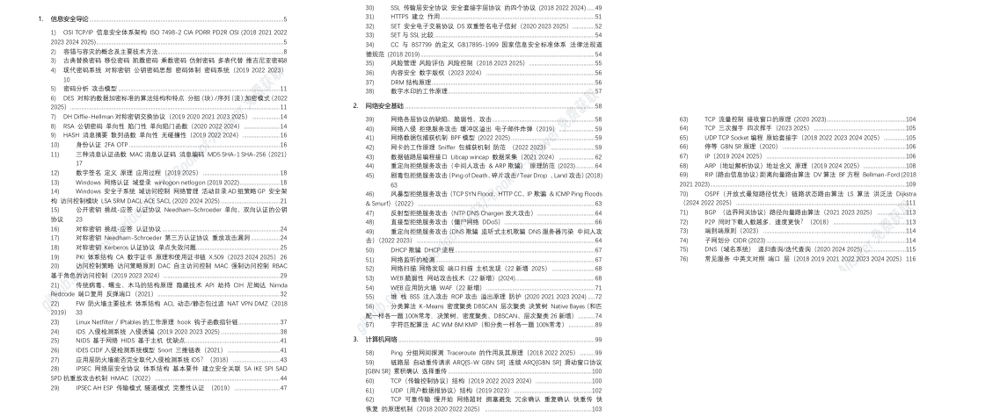
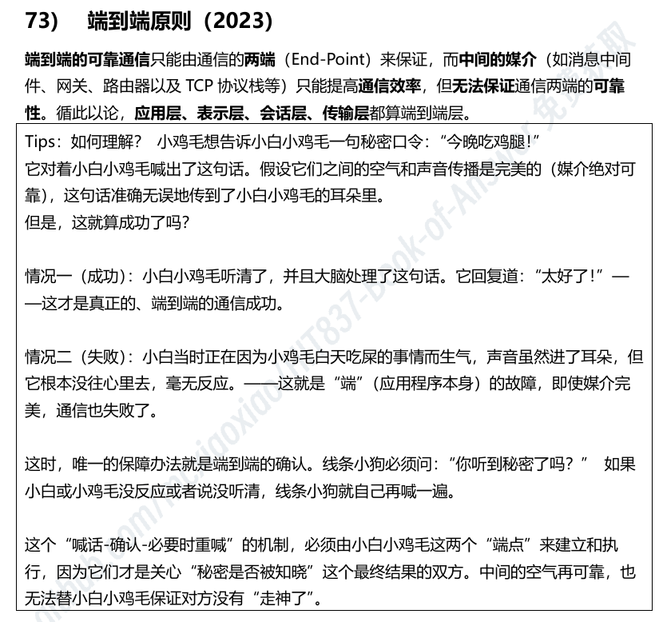
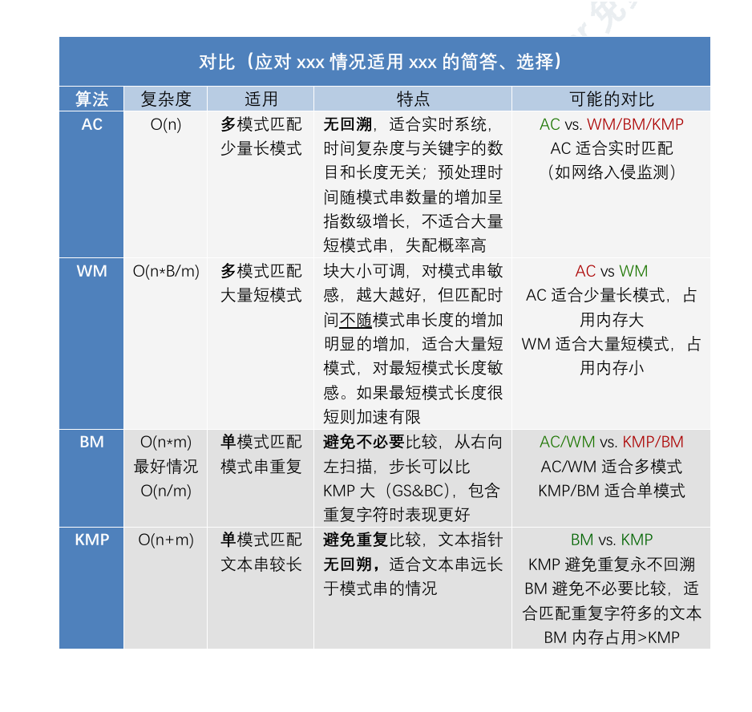
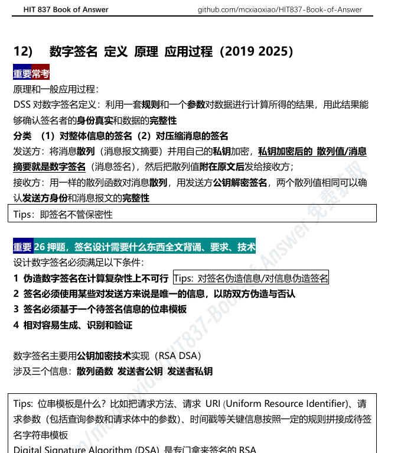

<div align=center>
<style>
button {
  /* Variables */
  --button_radius: 0.75em;
  --button_color: #f8f8f8ff;
  --button_outline_color: #00071fff;
  font-size: 16px;
  margin: 5px;
  font-weight: bold;
  border: none;
  cursor: pointer;
  border-radius: var(--button_radius);
  background: var(--button_outline_color);
 }
.button_top {
display: block;
box-sizing: border-box;
border: 2px solid var(--button_outline_color);
border-radius: var(--button_radius);
padding: 0.75em 1.5em;
background: var(--button_color);
color: var(--button_outline_color);
transform: translateY(-0.2em);
transition: transform 0.1s ease;
}
button:hover .button_top {
transform: translateY(-0.33em);
}
button:active .button_top {
transform: translateY(0);
}
</style>
<h1><b> HIT837 三科答题手册（在线版）</b></h1>

</div>

---

## 手册介绍

作为一个非本校的837跨考选手，我深知备考这样一个小众自命题的不易，我的备考历程完全是有赖于往届同学（感谢zyx学长）的帮助以及guoJohnny前辈的资料库[^1]才会如此顺利。我希望我也能一样以分享的形式给更多同学特别是跨考的同学一些帮助，这是我学生时代自愿整理的第一个笔记本也是我的一种尝试：仓库提供背题手册、课程PPT、相关题目、交流空间，其中手册部分集概念、个人见解、代码于一体，旨在帮所有网安自命题考生减少重复劳动，高效掌握哈工大网安837考研自命题全部核心内容和所需应试技能[^2]。


本仓库的目标是创建一个为实现以下目标的统一资源：

1. 在线知识库及仓库所有内容免费开源，由社区共同守护与更新，联合起来消灭837备考信息差，让考研机构无机可乘；
2. 提供恰到好处的知识深度，从而帮助读者，快速掌握各部分备考要点，有效应对考试挑战；
3. 包含可运行的代码，精选题目与知识点，覆盖信安、网安（共占90分）全部核心考察范围；
4. 通过社区力量快速迭代内容，从而紧跟仍不断变化发展的网安自命题考试；
5. 由包含有关应试备考细节问答的[开放论坛](https://github.com/mcxiaoxiao/wangan.online/discussions)作为补充，使大家可以相互答疑并交换经验。

<button id="randomButton"> <span class="button_top"> :material-book-open-variant: 随机翻页 </span></button>

作者26年哈理工数据科学专业网安小白跨考工大本部网安专硕，虽然希望这份手册能帮大家减轻点缺资料和自己整理笔记的痛苦（比如我就一向反感做笔记这种“形式主义行径”，但837资料的稀缺程度和这玩意很看重背书的现实迫使记性不好的我开始哐哐一顿抄题背题），但受限于本人的应试和专业能力，目前的这一版内容很可能存在错误，如有发现或者想补充欢迎提Pull Request。

分析考纲和历年真题，可知目前837包括计算机网络（60分）、 信息安全基础（45分）和网络安全基础（45分），一般其中选择30分（各10分，一题2分）填空10分（仅计网，一题2分）简答55-60分（计网信安各20分，一题5分）计算40-45分（信安一题≤计网一或两题≤网安两题，一题10-15分，计网【CRC/DV/LS-Dijkstra/时延/子网划分-CIDR/信道利用率】，信安【RSA/DH】，网安【AC/KMP/BM/WM×1+K-means/决策树/DBSCAN/层次聚类/Native-bayes×1】这类知识点也可能用简答/选择形式来考）。私以为对0基础同学来说记忆难度计网≈信安＞网安，答题手册配合思维导图一起使用效果很可能更佳。 

内容主要收集自遇到且觉得有价值的题目和知识点，大部分来自真题、考纲参考书正文、PPT和课后题（主要来自信安导论、攻防原理、自顶向下、入侵检测技术），少部分来自各路其它试卷和资料。信安网安部分的知识点很全面，计网部分由于市面上资料很多所以这里主要是历年837真题中出现的点，相对较少，不足以作为主要复习材料。括号标注在真题中出现的年份。信安和网安内容量差不多的重复知识点优先划到信安，因此只看了其中一本书时答案找不全是正常的。

-	`重要·常考` 代表在考试中至少两次复现，直接考到概率较大，背下来比较好；
-	`重要` 代表考试中不一定多次出现，建议理解；
-	`Tips` 部分帮大家理解，不背；
-	`其他部分` 若只求考<=120可以酌情放弃。
-	考试时会发8张大白纸，自己标题号作答，可以文字也可以画画，格式自由，很够写，有思路就请尽情发挥。大家也可以提前练练排版。


---

## 离线版下载

离线word文档包括在线知识库中所有有关837的内容，覆盖网安信安全部章节(1)；0基础/非科班友好，120+辅助理解的标注(2)和表格(3)；内容详略得当，约6万字，重点特别标记(4)。可以存在自己的设备里或打印出来，方便直接标注笔记和考前翻看。
{ .annotate }

1.  { loading=lazy }
2.  { loading=lazy }
3.  { loading=lazy }
4.  { loading=lazy }


此处提供三种获取方式[^4]：**投喂支持（132￥） / 参与修订（免费） / 以物易物（免费）** ，三种方式均会附赠复试补充资料，全程助力上岸！

<div class="grid cards" markdown>

-   :material-cash-check:{ .lg .middle } __投喂支持__

    ---

    扫描收款二维码支付 132 元，复制微信支付编号。
    
    [:material-qrcode-scan: 微信扫码支付](/img/132.jpg "点击后会打开二维码图片，扫码付款后微信搜索微信支付可以找到订单信息")
    
    发送邮件到orlosziming@163.com 标题为：`付费999999999999`（支付编号）1分钟内自动核验并发送文件，留意收件箱。

    [:octicons-arrow-right-24: 发送邮件](mailto:orlosziming@163.com)

-   :material-file-document-edit:{ .lg .middle } __参与修订__

    ---

    在 [:octicons-git-branch-16:`page`分支](https://github.com/mcxiaoxiao/wangan.online/tree/page) 提交PR，帮助优化或扩充在线知识库的内容。
    
    [:octicons-arrow-right-24: 提交 Pull Request](https://github.com/mcxiaoxiao/wangan.online/pulls)

    发送邮件到orlosziming@163.com 标题为：`参与修订#123`（您的PR编号）核验后发送文件。

    [:octicons-arrow-right-24: 发送邮件](mailto:orlosziming@163.com)


-   :material-file-document-plus:{ .lg .middle } __以物易物__

    ---
    在 [:octicons-git-branch-16:`HIT837-Book-of-Answer`分支](https://github.com/mcxiaoxiao/wangan.online/tree/HIT837-Book-of-Answer) 提交PR，上传您认为质量不错的备考资料。

    [:octicons-arrow-right-24: 提交 Pull Request](https://github.com/mcxiaoxiao/wangan.online/pulls)

    发送邮件到orlosziming@163.com 标题为：`以物易物#123`（您的PR编号）核验后发送文件。

    [:octicons-arrow-right-24: 发送邮件](mailto:orlosziming@163.com)


</div>


</br>

---

## 历年报考热度

观察一年内Star增量

<a href="https://www.star-history.com/#mcxiaoxiao/HIT837-Book-of-Answer&guoJohnny/-837-&type=date&legend=top-left">
 <picture>
   <source media="(prefers-color-scheme: light)" srcset="https://api.star-history.com/svg?repos=mcxiaoxiao/HIT837-Book-of-Answer,guoJohnny/-837-&type=date&legend=top-left" />
   
 </picture>
</a>

---

## 引用

如果本手册对你有帮助，请 Star🌟 本仓库或通过 BibTeX 引用：
```BibTeX
@book{guo2026hit,
    title={HIT837 Book of Answer},
    author={wangan.online Community},
    note={\url{https://wangan.online}},
    year={2026}
}
```


<script>
  // 随机跳转到：信安基础/1-38、网安基础/1-19、计算机网络/1-18
  const button0 = document.getElementById("randomButton");

  button0.addEventListener("click", function() {
    // 定义三个目录 + 对应最大页码
    const categories = [
      { name: "信安基础", max: 38 },
      { name: "网安基础", max: 19 },
      { name: "计算机网络", max: 18 }
    ];

    // 随机选一个目录
    const randCat = categories[Math.floor(Math.random() * categories.length)];
    // 随机生成页码（从1开始）
    const randPage = Math.floor(Math.random() * randCat.max) + 1;
    // 拼接最终路径
    const randomUrl = `/${randCat.name}/${randPage}`;

    // 打开新标签跳转
    window.open(randomUrl, '_blank');
  });
</script>

[^1]: 感谢guoJohnny学长惠泽无数后辈的对HIT网络空间安全考研专业课资料的整理与分享: [guoJohnny/-837-](https://github.com/guoJohnny/-837- "哈尔滨工业大学考研 网络与空间安全 837 初试资料库") 
[^3]: 
  多年来我相信并践行：通过自主学习和独立探索，同样能够扎实掌握学科知识，甚至还能培养出更强的批判性思维与问题解决能力。这种不依赖外部灌输、由内在驱动而达成的理解，因其深度与持久性，更贴近学习的本真——独立与自由。我在毕业之际整理这本手册，目的之一便是希望更多人能与我共同相信这一假设：无需盲从绩优导向，主动拒绝学科补课，同样能够实现学习目标。我期待我们能携手改善学风，让求知回归纯粹，让教育回归人本。您和您的家人可能正在经历——或曾经历过——占据人生近四分之一时光的幼儿园、小学、中学、大学阶段。我诚挚邀请您通过发声或切实行动，让这段漫长的求学岁月，也能有更多的获得感与幸福感。相关资源：[教育部办公厅关于印发《查处中小学违规办学行为典型案例》的通知_教育部](http://www.moe.gov.cn/srcsite/A06/s7053/202504/t20250407_1186364.html)；[各地中小学规范办学行为举报平台_中国教育在线](https://www.eol.cn/news/yaowen/202504/t20250411_2663298.shtml)； [人民群众留言入口_中国政府网](https://liuyan.www.gov.cn/hudong/atwls/rmqz.htm)； [向部委、地方、地方人大、地方政协提建议_人民网](https://liuyan.people.com.cn/rmjy)；[教育部巡视工作办公室巡视信息公开_教育部](https://hudong.moe.gov.cn/s78/A28/s7819/s8173/2025xsxxgk02/)
[^2]: 
  我反对升学和竞争导向，更反对一切以应试为目的的补习文化。从K12阶段直至大学，我们的公立教育体系不应该是一种贯彻始终的竞争导向的体系，而应是一个更强调发现自我、发展潜能的体系。应该提倡大家根据自己的兴趣和节奏来学习，而非要求所有人适应一个预制的、标准化的、单一的评价标准。公立教育系统应该提供一个支持性和包容性的环境，让学生在其中自由地探索、实验和学习。教育不是竞争，禁止以分数排名学生，强制执行双休，清理各种多余的学科类补习班的行动应在全国所有地区坚定有力地被落实，从制度层面确保类似衡水模式的时代悲剧不会再次发生，大家也应自觉反对任何有意强调分数和排名的行为。一个人民立场国家的教育的本质应当是帮助人建立自信，发扬人的个性，以及准备成为思想自由的终身学习者。人民满意是发展教育的根本尺度，从一个9年义务教育以及公立普通高中普通本科的体验者的视角来看，我深信以上这些是办好大部分学生或许也是人民满意的教育的必由之路。
[^4]:
  打破信息差，知识应为人人。 我们的网站内容始终免费开源，践行此志。离线手册保留版权，确保项目的可持续发展。837每年报考人数太少可能导致仓库断更，开源仓库信息收集不全反而会成全那些高价贩卖信息差的考研机构，这完全违背仓库的本意。我的手册docx文档就当抛砖引玉，希望同学们在受益的同时能考虑帮助这个仓库活下去（例如上传回忆版真题、勘误、共享笔记资料）。网站永久开源不收费，**离线文档在内容上大体与网站无异**，离线文档主要是方便编辑和打印，且离线版用软件自带Ctrl+F搜索关键词大概没有网站的模糊搜索能力。

  
