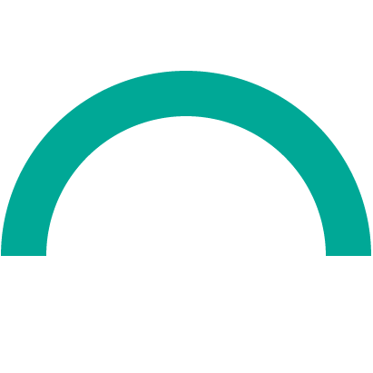

  <section class="home-hero home-hero--split" aria-labelledby="home-title">
    

      
wangan .online

      

        由社区维护的，专注于网安/信安相关硕士研究生考试应试的，自由、开放的 <strong>网安在线考研知识库</strong>。
      

      

        <a class="home-action home-action--primary" href="#home-path-title">
          Getting Started
        </a>
      

    

    

      

        

          

            
            
            
            <strong>~/wangan.online</strong>
          

          

            

              fork&nbsp;it
            

            

              commit&nbsp;it
            

            

              share&nbsp;it
            

            

              消灭一切
            

            

              网安考研信息差
            

            
              
            
          

        

      

    

  </section>

  <section class="home-section home-section--compact" aria-labelledby="home-path-title">
    

      Start here
      <h2 id="home-path-title">资料入口</h2>
      
按你当前阶段直接进入，不绕目录。

    

    

      <a class="home-path-card home-path-card--primary" href="https://github.com/mcxiaoxiao/wangan.online/discussions">
        01
        <strong>开放论坛</strong>
        
考研经验、资料共享、问题讨论、经验贴汇总。

      </a>
      <a class="home-path-card" href="初试/">
        02
        <strong>初试</strong>
        
按院校进入专业课资料、考点整理和自命题内容。

      </a>
      <a class="home-path-card" href="复试/">
        03
        <strong>复试</strong>
        
复试流程、机试、面试、历年真题和综合问题。

      </a>
      <a class="home-path-card" href="https://github.com/mcxiaoxiao/wangan.online/discussions/2">
        04
        <strong>考完</strong>
        
补资料、纠错、写经验，把信息差继续抹平。

      </a>
    

  </section>

  <section class="home-section" aria-labelledby="home-resource-title">
    

      Archive
      <h2 id="home-resource-title">当前收录</h2>
    

    

      <ul class="home-link-list">
        <li><a href="hit837/">哈工大网安837自命题 </a></li>
        <li><a href="复试/intro/">哈工大计算学部复试</a></li>
      </ul>
    

  </section>

  <section class="home-section home-section--split" aria-labelledby="home-about-title">
    

      README
      <h2 id="home-about-title">项目说明</h2>
    

    

      

        这里是由备考同伴共同维护的网安 / 信安考研知识库，内容随时间持续沉淀。首页只留核心入口，知识点、真题和经验都归在各院校专题里，不绕路。
      

      

        收录的资料经过整理、有人用过，可以溯源、可以纠错。AI 可以辅助，但每一条内容最终还是要靠人来把关。
      

      

        如果你想补充专题、修正错误，或者只是整理一份笔记，都欢迎来讨论区聊聊，或直接提 PR。结构和排版尽量保持一致，方便后来的人继续维护。
      

      

        <a class="home-action home-action--primary" href="https://github.com/mcxiaoxiao/wangan.online/discussions/2">提交 PR / 参与讨论</a>
        <a class="home-action home-action--text" href="https://github.com/mcxiaoxiao/wangan.online?tab=coc-ov-file#readme">Code of Conduct</a>
      

    

  </section>

---

## wangan.online 是什么

wangan.online 是一个由社区维护的，专注于网安/信安相关硕士研究生考试应试的，**自由、开放的知识库**，希望为考生提供：

- 初复试核心科目的复习资料
- 历年真题与练习
- 备考策略与经验分享
- 网络安全专业知识的系统梳理
- 网安考研开放论坛
- 经过整理、有人用过，AI 可以辅助，但内容还是要靠人把关的靠谱考研资料

致力于为网安考生提供足够全面且精准的备考资料，消灭网安考研信息差。

---

## wangan.online 不是什么

作为一个专注于网络安全考研的知识库，明确项目边界对保持内容质量和一致性至关重要。每位贡献者都应确保内容符合以下定位：

**我们不是原创研究的场所**

本知识库聚焦于**已被广泛认可的考研知识点和应试技巧**，不收录原创研究成果。例如：

- 不收录未被学术界或考研命题广泛认可的新理论
- 不收录个人独创的解题方法（除非已被证明在考研中有普适性）

**我们不是权威机构**

本知识库由**社区维护**，内容仅供参考，不能作为最终的权威标准。例如：

- 不能替代目标院校的官方考纲
- 内容可能存在疏漏，仅供复习参考
- 不对使用内容产生的后果负责

**我们不是百科全书**

本知识库**聚焦于考研相关内容**，不收录无关领域的知识。例如：

- 不收录与考研无关的网络安全前沿技术
- 不收录与考试内容无直接关联的理论知识

**我们不是教材替代品**

本知识库作为**考研复习的辅助工具**，不能替代系统的教材学习。例如：

- 提供知识点总结和答题技巧，而非完整的教材内容
- 建议结合官方教材进行系统复习

**我们不是考研机构也不是其推广平台**

本知识库继承自 [guoJohnny/-837-](https://github.com/guoJohnny/-837- )项目，秉持开放共享精神，致力于为广大网络安全考生搭建资料互通、经验互鉴的互助社区。因此，我们明确拒绝违背项目定位的行为，例如：

- 任何机构以引流为目的的课程推销
- 任何形式的制造考试焦虑的营销话术
- **我们理解并支持有偿分享资料，但开源部分不得低于总量的二分之一，以延续开放共享之精神**

---

## 项目架构

[wangan.online](https://mcxiaoxiao.github.io/wangan.online/) 是一个基于 GitHub Pages 的静态网站，所有内容均存储在 [GitHub 仓库](https://github.com/mcxiaoxiao/wangan.online)中，page 分支是主分支，用于存放网站的页面内容。网站使用 [Material for MkDocs](https://squidfunk.github.io/mkdocs-material/) 构建。CDN 由 [Cloudflare](https://www.cloudflare.com/) 提供，暂无中国大陆镜像和节点，有美国及中国大陆周边（香港、台湾、日本、新加坡、韩国等）加速节点。

---

## 贡献者列表

感谢以上同学的卓越贡献 :fontawesome-regular-hand-back-fist:

本项目受 guoJohnny/-837-、OI Wiki、CTF Wiki 等开源知识库的启发，由一群考研同伴共同维护，在编写过程中参考了诸多资料，在此一并致谢。

!!! Warning "Tips"

    - 参与者应宽容对待反对意见。
    - 参与者必须确保自己的言行不带人身攻击和诋毁性的个人言论。
    - 在解释他人的言行时，参与者应始终假定他人是出于善意。
    - 不能容忍可被视为骚扰的行为。

---

## 消灭一切网安考研信息差

> **“各尽所能，按需分配。”**
> ——马克思《哥达纲领批判》

我们倡导考研资源打破壁垒，由众人共创、为众人共享，助力备考民主化。

鼓励有能力者积极分享、有需要者便捷获取，减少信息差与不必要的中间环节，让知识与经验在社群中顺畅流转、彼此受益。一份笔记的共享，能降低他人的备考成本；一段经验的传递，能帮后来者少走弯路。

> **“星星之火，可以燎原。”**
> ——毛泽东《时局估量和红军行动问题》

一人之力有限，众人之举可成江海。本库专注考研资料整理与共享，推动信息透明、互助共进，让每一位备考者都能获得更平等的资源与支持。

 
开源共享，知识无界。
 
Fork it. Commit. Share it.

