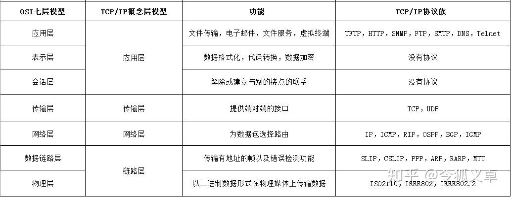
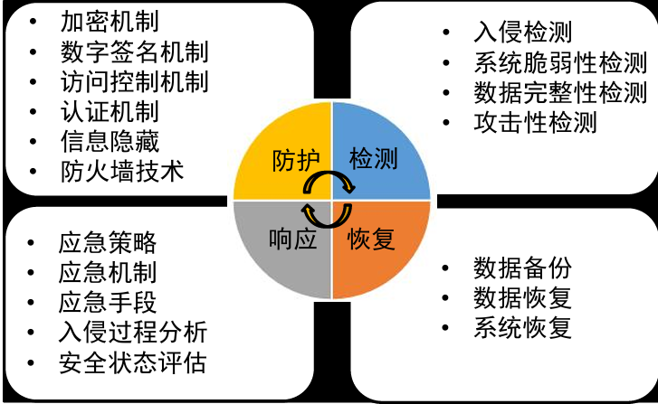
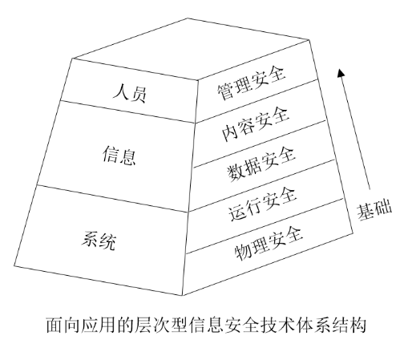
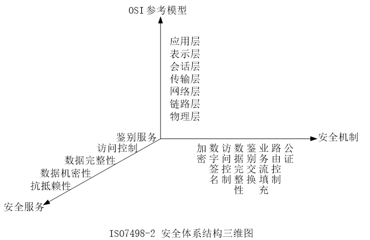

## OSI和TCP/IP作用、对应关系【重要·常考】

- **数据链路层**：管理两个相邻结点间数据传输（IP分组封装成以太网帧），提供成帧、差错检测、流量控制。
- **网络层**：源结点到目的结点（主机到主机）的传输，实现路由选择、分组转发、流量控制、拥塞控制、差错控制、异构网络互联。
- **传输层**：提供端到端（进程到进程）的传输服务，提供可靠或不可靠的数据传输服务（如TCP/UDP，面向连接/无连接）负责进程之间的通信服务，提供流量控制、差错控制、分用与复用。
- **会话层**：进程之间建立会话，管理主机间会话进程，用检查点（checkpoints）机制维持可靠会话，失效时从检查点恢复通信，即断点下载原理。
- **表示层**：处理通信系统交换信息的表示方式，压缩、加密、解密。

---

## 字母对应全称，作用，信安主要保证【重要·常考】

- 通信安全：保障信息传输安全
- 信息安全：主要保证：保护**机**密性 **完**整性 **可**用性 **可**控性 **不**可否认性
- 信息保障：包括PDRR动态全方位保护三要素：**人**（基础）**、管理**（关键）**、技术**（核心）
- 面向过程的信息安全保障体系：PDRR（P保护，D检测，R反应，R恢复）
- P2DR：以基于时间的安全理论为基础，核心是策略，P策略、P防护、D检测、R响应组成完整循环

---

## 挖空题，字母含义，判断行为对应哪个CIA【重要·常考】
- 面向目标的知识体系结构：CIA三元组（机密性，完整性，可用性）对立的是DAD三元组（泄露，篡改，破坏）

### 信息安全的三个基本方面
- **机密性(Confidentiality)**：信息在存储、传输、使用过程中，不会泄漏给非授权用户或实体。
- **完整性(Integrity)**：信息在存储、使用、传输过程中，不会被非授权用户篡改或防止授权用户对信息进行不恰当的篡改。
- **可用性(Availability)**：确保授权用户或实体对信息资源的正常使用不会被异常拒绝，允许其可靠而及时地访问信息资源。

---

## 各个安全保护什么简答【重要·常考】

- 面向应用的层次型技术体系架构：人员（管理安全），信息（内容安全，数据安全），系统（运行安全，物理安全）
- 信息安全：在技术上和管理上为数据处理系统建立的安全保护，保护系统的硬件、软件以及相关数据不因偶然或恶意原因遭泄露、篡改、破坏 (DAD)
- 管理安全：对人的信息行为的规范约束
- 内容安全：根据信息具体内容判断其是否违反安全策略并采取措施
- 数据安全：数据收集、处理、存储、检索、传输、交换、显示、扩散过程的保护
- 物理安全：对网络及信息系统物理装备的保护
- 运行安全：对网络及信息系统的运行过程、运行状态的保护

!!! Warning "Tips"
    后面还有一个专题的内容安全。对合法的信息内容加以安全保护；对非法的信息内容实施监管。

---

## 安全威胁辨别【重要·常考】
### 安全威胁
1. 信息泄露 → 破坏机密性（加密算法保护）
2. 完整性破坏 → 破坏完整性（签名技术保护）
3. 业务否决 → 破坏可用性（DDoS）
4. 未经授权访问 → 破坏可控性
5. 信息伪造 → 破坏不可否认性（签名技术保护）

---

## 背诵·填空【重要·常考】

### OSI开放系统互连安全体系结构
- **安全服务【5】**：数据机密性，数据完整性，鉴别服务，访问控制，抗抵赖（即不可否认）
- **安全机制【8】**：加密，数据完整性，鉴别交换，访问控制，数字签名，公证，业务流填充，路由控制

### 机制对应作用
- 加密 → 机密性
- 数字签名 → 完整性+不可否认性
- 访问控制 → 认证
- 数据完整性 → 防未授权修改
- 鉴别交换 → 双方身份鉴别
- 业务流填充 → 防流量分析
- 路由控制 → 指定可信路径
- 公证机制 → 第三方确保完整性/来源/时间/目的

!!! Warning "Tips"
    - 安全服务是服务，安全机制是用来实现服务的措施、设备、系统、技术；安全服务通过安全机制反制攻击
    - 流量填充机制：通过发送额外的数据来平滑流量，从而提供一定程度的网络窃听保护
    - TCP在网络层提供无连接的服务；在传输层提供有连接/无连接的服务，OSI相反
    - 通信实体之间一旦完成握手就算有连接