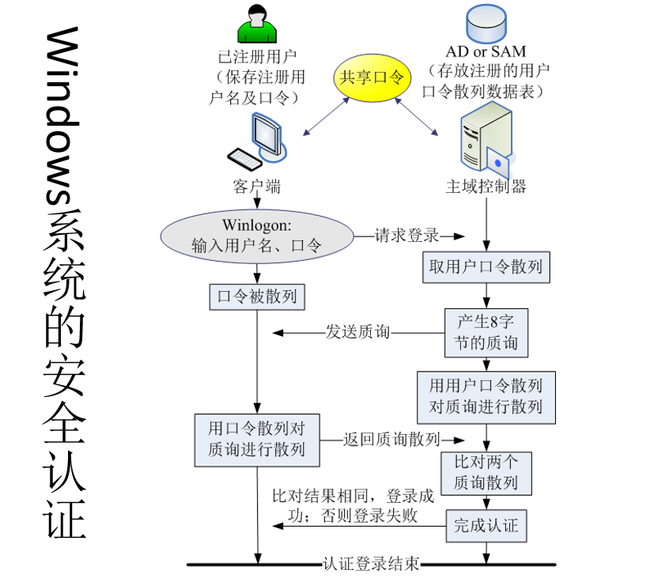
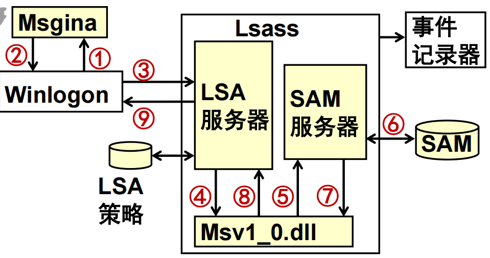
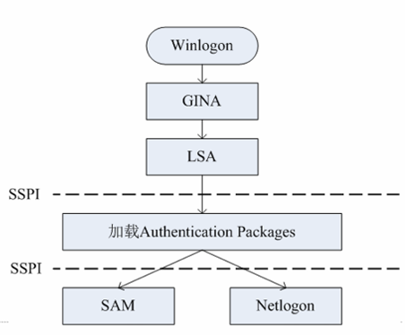

## Windows 网络认证 域登录 winlogon netlogon【重要·常考】

Windows 网络认证采用**对称密钥加密**完成。登录用户必须是在**主域控制器**上注册的合法用户，用户与主域控制器共享口令，域控制器的**安全用户管理（SAM）数据库**中保存用户名、口令散列等信息。

---

### Win 的域登录认证流程

1.  **用户端**：激活 `Winlogon` 窗口，输入用户名与口令，向**主域控制器**发送登录请求，同时计算**口令散列**（口令及其散列不随请求发送）。
2.  **主域控制器**：收到请求后生成一个**8字节的质询**发送给客户端，同时从 `SAM` 取出该用户的**口令散列**，用此口令散列对质询进行散列计算，得到**质询散列**。
3.  **客户端**：收到 8 字节质询后，使用之前计算的口令散列对质询进行散列计算，得到质询散列，并将其作为应答发送给控制器。
4.  **主域控制器**：对比自身计算的质询散列与用户应答的质询散列，**相同则登录认证通过，否则失败**。

!!! Warning "Tips"
    即用**口令散列散列质询**出质询散列，优点：**保护口令安全（不传输口令本体）**。

---

### 调用关系
系统启动后加载 `Winlogon` 进程，调用关系如下：
- `Winlogon` → `gina`
- `gina` → `LSA`（加载认证包）
- 认证包 → 向 `SAM` 发送账号信息请求

如果进行**域网络登录**，认证包会调用 `Netlogon`，通过**安全通道**与域控制器建立连接，再通过安全信道向 `SAM` 发送账号信息请求。

!!! Warning "Tips"
    - 非域管理方式登录（如工作组）**不需要启动 `Netlogon` 服务**。
    - 无论是否加入域，`Winlogon`、`LSA`、`SAM` 服务都是必需的，存在于所有 Windows 版本中。
    - 本地登录向**本地 LSA、SAM** 发请求，而非主域控制器。