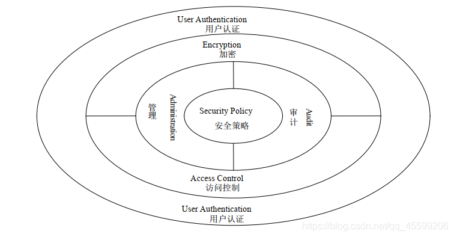
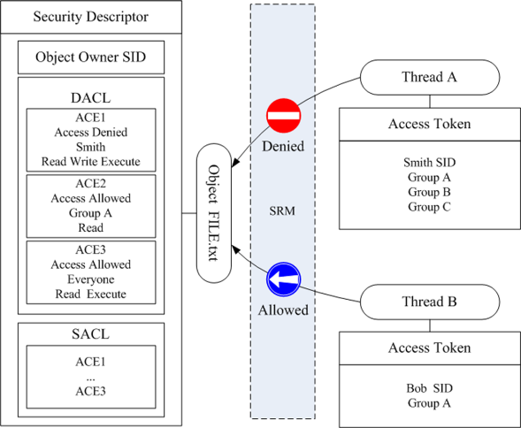
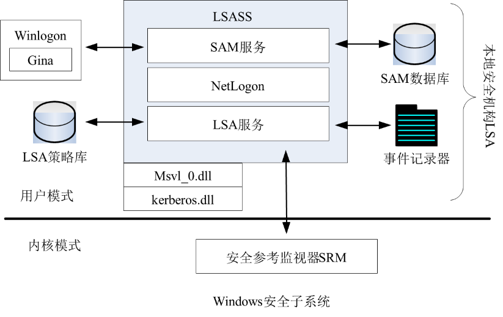
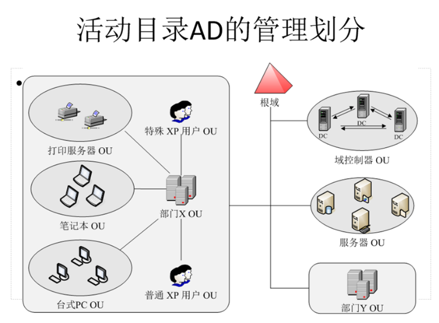

## Windows 安全子系统 域访问控制 网络管理 活动目录 AD 组策略 GP 安全架构 访问控制模块 LSA SRM DACL ACE SACL  :blueberries:【重要·常考】

Windows 系统采用**层次性安全架构**，核心是**安全策略**，安全策略决定系统安全性，协调各安全组件工作：
- **用户认证**：最外层，是其他安全机制的基础
- **加密**：保证通信与数据存储的机密性
- **访问控制**：维护用户访问授权原则
- **审计和管理**：内核层，负责安全配置与事故追查

!!! Warning "Tips"
    微软官方 AD 教程：[https://learn.microsoft.com/zh-cn/windows/win32/ad](https://learn.microsoft.com/zh-cn/windows/win32/ad)
    Windows 的域访问控制是**访问控制层面**的控制，不强调数据传输层面的保密性。

---

### Windows 访问控制模块  :pear:【重要】
访问控制模块由两个核心部分组成：**访问令牌**、**安全描述符**。

1.  **访问令牌**：每个账户和组都有一个访问令牌，包含账户/组的 **SID**（安全标识符）和特权信息。
2.  **安全描述符**：与每个客体对象关联，描述对象属性与安全规则，包含 **SID** 和 **ACL（访问控制列表）**。

#### 访问控制流程
- 账户登录时，**LSA（用户模式）** 读取数据库信息生成访问令牌。
- 用户访问资源时，向 **SRM（内核模式）** 提供访问令牌副本。
- SRM 检查 ACL，根据 **DACL（自主访问控制列表）** 中的 **ACE（访问控制项）** 允许/拒绝账户执行特定操作。
- **SACL（系统访问控制列表）**：为审计服务，决定特定操作是否计入日志。

!!! Warning "Tips"
    Linux 中的 `netfilter/iptables` 与 Windows 的 `SRM/LSA` 设计哲学相似：内核负责 enforcement（执行），用户层负责 policy（策略），但 `SRM/LSA` 是**系统访问控制 gate**，`netfilter/iptables` 是**网络 gate**，分属不同领域。

---

### 活动目录（AD）与组策略（GP）  :pear:【重要】
#### 活动目录（AD）
- 面向**网络对象管理**的综合目录服务，可看作**数据存储的视图（view）**。
- 域模式要求用户网络登录，之后可在整个域网络中漫游。
- AD 将域划分为若干 **OU（组织单元）**，管理员为 OU 定制 **GP（组策略）**，并将 GP 存储在 AD 相关数据库中。

#### 组策略（GP）
- 存储在**注册表**中，依据特定用户/计算机的安全需求制定的**安全配置规则**。
- 管理员可通过配置 GP 限制用户运行特定程序或执行特定任务。

!!! Warning "Tips"
    注册表也算数据库。

#### AD GP 与本地 GP 的区别
- **基于 AD 的 GP**：实施对象是**整个域**。
- **基于本地计算机的 GP**：仅负责本地计算机。
- 登录时，**AD GP 会强制推送到客户机，覆盖本地 GP**。