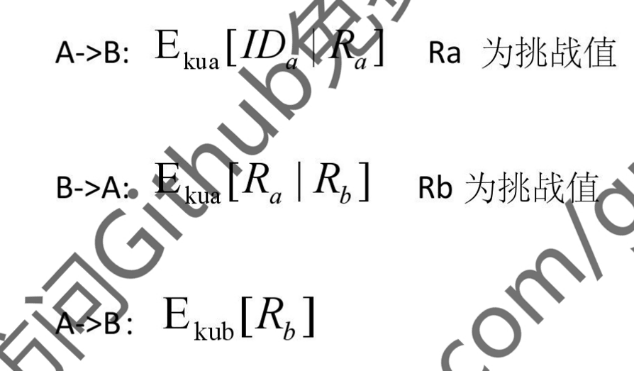

## 公开密钥 挑战-应答 认证协议 Needham–Schroeder 单向、双向认证的公钥协议

### 挑战-应答认证的两种方式

#### 方式一：私钥加密挑战因子
A 将挑战因子发送给 B，**B 用自己的私钥将挑战加密**发送给 A，A 使用 B 的公钥将该因子解密从而验证合法性。
!!! Warning "Tips"
    攻击：利用这个协议让 B 签名，相当于攻击者可以用 B 的私钥加密。

#### 方式二：公钥加密挑战因子
**A 使用 B 的公钥将该因子加密**发送给 B，B 用自己的私钥将挑战解密并发给 A，A 根据挑战因子的真伪核实 B 的身份。
!!! Warning "Tips"
    攻击：利用这个让 B 自己解密并发给 A，相当于可以用 B 的私钥解密。

---

### Needham–Schroeder 双向认证的公钥协议
双方都拿对方公钥加密发送和应答挑战，**无明文传输**，通过三步交互完成双向身份验证：

1.  **A → B**：\( E_{KUb}[ID_a \| R_a] \)
    - A 使用 B 的公钥加密 A 的标识 \(ID_a\) 和挑战值 \(R_a\)，确保只有 B 能用私钥解密。

2.  **B → A**：\( E_{KUa}[R_a \| R_b] \)
    - B 使用 A 的公钥加密 A 的挑战 \(R_a\) 和自己的挑战 \(R_b\)，确保只有 A 能用私钥解密。

3.  **A → B**：\( E_{KUb}[R_b] \)
    - A 还原出 \(R_b\) 后，用 B 的公钥加密 \(R_b\) 作为应答，完成对 B 的验证。