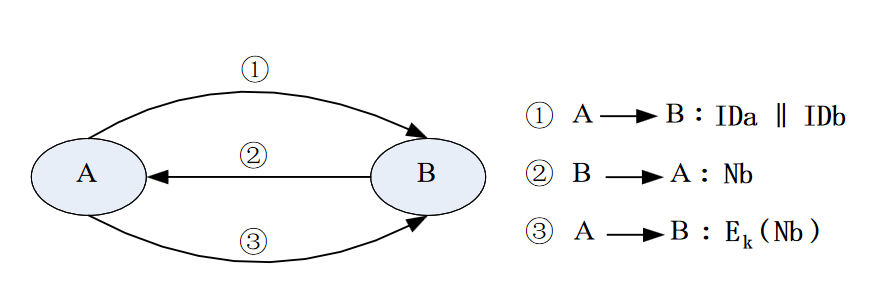

## 对称密钥 挑战-应答 认证协议

### 核心原理
验证方生成大随机字符串（即**挑战**）发给示证方，示证方使用**共享密钥**加密挑战后返回给验证方，验证方解密密文验证正确与否，以此完成身份认证。

### 协议流程（三步交互）

1.  **① A → B：IDa || IDb**
    A 向 B 发送自己和对方的身份标识，发起认证请求。

2.  **② B → A：Nb**
    B 作为验证方，生成大随机数 **Nb**（挑战），发送给 A（示证方）。

3.  **③ A → B：E_k(Nb)**
    A 使用共享密钥 **k** 加密挑战 **Nb**，将密文发送给 B。B 解密后对比得到的 Nb 是否与自己生成的一致，一致则认证通过。