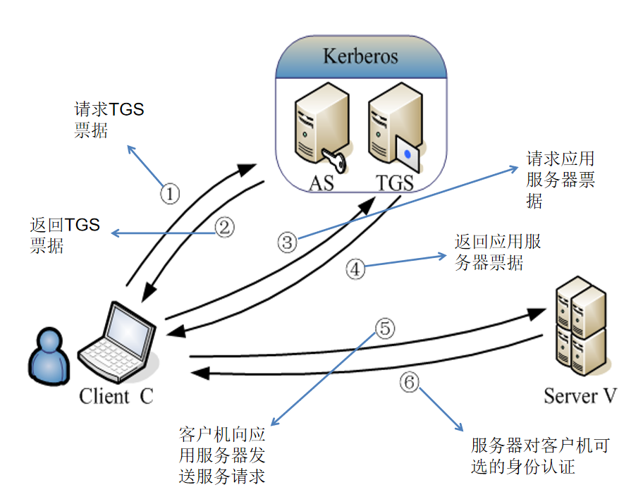

## 对称密钥 Kerberos 认证协议 单点失效问题  :pear:【重要】

第三方认证服务，通过传统的共享密码技术来执行认证服务，每个用户或应用服务器均与 Kerberos 分享一个对称密钥。Kerberos 由两个部分构成，分别是 **AS** 和 **TGS**。Kerberos 提供的认证服务，允许一个用户通过交换加密消息在整个网络上与另一个用户或应用服务器互相证明身份，一旦身份得以认证，Kerberos 向通信双方提供对称密钥，对方进行安全通信对话。

在 Kerberos 体系中，票据 Ticket 是客户端访问服务器时，提交的用于证明自己的身份，并可传递通信会话密钥的认证资料。**AS** 负责签发访问 **TGS** 服务器的票据，**TGS** 负责签发访问其他应用服务器的票据。

**身份验证服务交换**：和 **AS** 完成身份验证，获得**访问 TGS 的票据**。

**票据授予服务交换**：从 **TGS** 获得**访问应用服务器的票据**。

**客户与服务器身份验证交换**：请求服务，身份认证

!!! Warning "Tips"
    缺陷：

    - 一旦 TGS 宕机，所有用户、服务无法获取或验证票据，全网认证中断

    - 票据（TGT 或服务票据）本身是加密但**可复制的**，比如攻击者从内存导出票据后，可在任意主机上复用（**单点失效**）