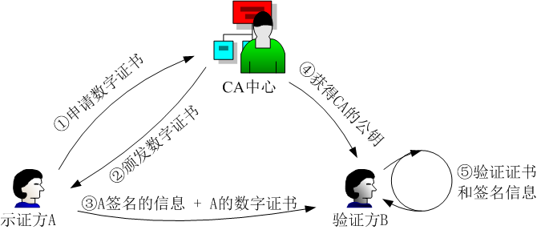
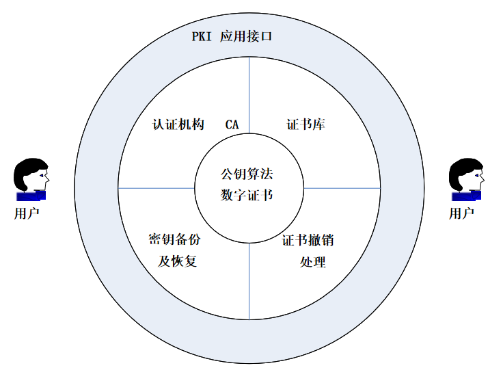
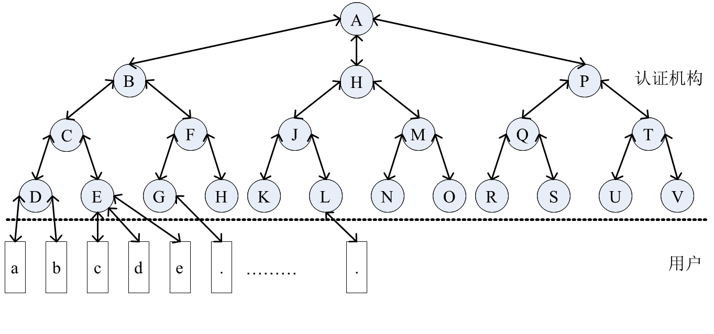
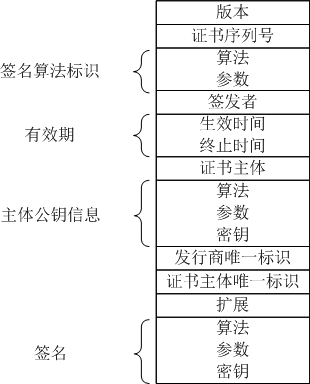
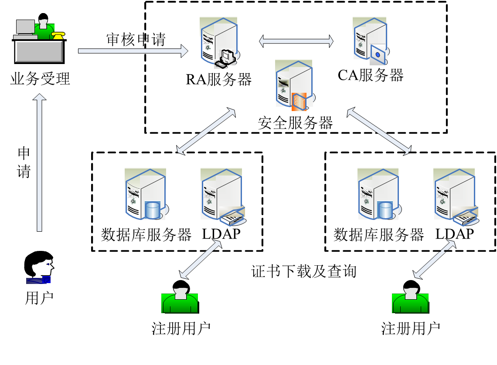

## PKI 公开密钥基础设施 CA 数字证书 原理和使用证书链 X.509【重要·常考】

### 原理及使用
1.  示证方 A 向 CA 申请数字证书
2.  CA 颁发**用 CA 私钥签名**的数字证书（主要内容即签发机构的签名）
3.  示证方 A 向验证方 B 发送**私钥签名的信息和数字证书**
4.  验证方 B 用 CA 公钥验证 A 的证书和签名信息

!!! Warning "Tips"
    签名字段是签发者的签名，不是证书主体（如网站）自己的签名。签名算法标识同样属于签发者（Issuer）的范畴，而不是证书主体（Subject）自己选来用的算法

---

### PKI 平台【重要】
核心技术：**公钥算法、数字证书**（PKI 公钥基础设施 Public Key Infrastructure 是提供这俩的服务平台）

此技术的基础上实现的 PKI 平台包括四个基本功能模块和一个应用接口模块。

- **认证机构 CA**
- **证书库**（LDAP 搭建，开放式查询，查询目的：**获得 CA 的公钥、证书是否在黑名单**）
- **密钥备份及恢复**（密钥**丢了**）
- **证书撤销处理**（私钥**被盗、CA 签发出错、员工离职**）
- **PKI 应用接口**（**交互**途径）

CA 机构服务器包括：**RA 服务器（业务受理）、CA 服务器（核心）、安全服务器、LDAP 服务器（发布）**、**数据库服务器（存储）**。

---

### X.509 标准与证书链【重要·常考】
ISO X.509 标准的 CA 目录是层次结构，最坏情况是用户需要下载安装根证书，认证路径是起点为根证书终点为用户的证书链，KRA《CAB》KRB《CAC》KRC《CAD》KRD《CAa》

!!! Warning "Tips"
    在 SSL/TLS HTTPS 中作为 SSL 握手协议的 certificate 字段，在步骤 2（服务器认证与密钥交换）和步骤 3（客户端认证与密钥交换）发送 X.509v3 证书链。
    
    KR 代表 Key Repository（也写作 Keying-material Repository）。
    
    它并不是 PKI 标准 RFC 里的强制术语，而是很多厂商/文档给存私钥、证书包或 PKCS#12 的文件/目录起的惯用缩写

X.509 的数字证书**证实了**实体**声明的身份**和**其公钥**的**匹配关系**，是非对称密钥管理的媒介，提供：**身份认证、完整性、保密性、不可否认性**

证书包含：
**版本 有效期 序列号 <u>证书主体 主体公钥信息</u> 签名算法标识 <u>签发者 签发者的签名</u>**

!!! Warning "Tips"
    CA 证书涉及两组私钥公钥：
    
    - CA（证书颁发机构）拥有自己的私钥，它用这个私钥来对证书进行签名。这个签名是 CA 对证书内容真实性的保证。CA 的公钥是公开的，任何人都可以使用它来验证 CA 的签名。这个公钥包含在 CA 的证书中，并且 CA 会将其分发给信任它的主体。
    - 证书持有者（如网站、个人或组织）也有自己的一对公钥和私钥。证书持有者使用自己的私钥来对数据进行签名，这个签名证明了数据是由持有者发送的，并且自签名以来数据未被篡改。证书持有者的公钥包含在由 CA 签发的数字证书中，接收方可以使用这个公钥来验证持有者的签名。
    
    也就是说：证书里的签名是发行者的签名（公钥从 CA 处得到，来验证**证书**是**真实完整**的，其身份与证书中声称的公钥是可信的），证书里的公钥是发送者主体的公钥（用来解密发送信息的数字签名，来验证**信息**是**真实完整**的）

---

### PKI 系统中多个 CA 间建立信任的方法
1.  **有层次**：建立树形模型，证书链
2.  **非层次-双向交叉认证**：**CA 间互相**签发证书、**用户控制**交叉认证、**桥接 CA 控制**交叉认证
3.  **非层次-以用户为中心的信任模型**：用户决定信任哪些用户

---

### PKI 系统功能【重要】
1.  接收/审核证书申请；
2.  颁发或拒绝数字证书；
3.  处理证书更新、撤销、查询；
4.  发布证书有效期、归档管理；
5.  证书与密钥归档、历史数据保存

