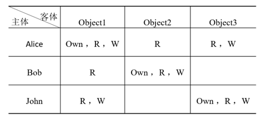
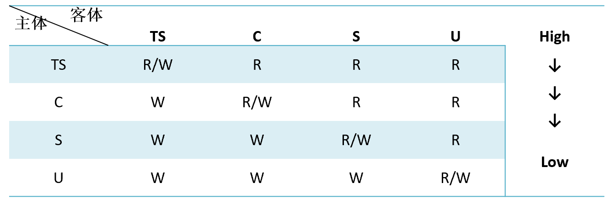
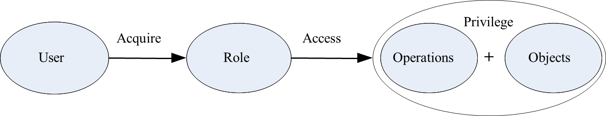

## 访问控制策略 访问策略原则 DAC 自主访问控制 MAC 强制访问控制 RBAC 基于角色的访问控制  :blueberries:【重要·常考】

访问控制三要素：**主体 客体 访问控制策略**

---

### 自主访问控制（DAC）  :blueberries:【重要·常考】
自主访问控制（DAC）允许合法用户以用户或用户组的身份来访问系统许可的客体，同时**阻止非授权用户**访问客体，某些用户还可以**自主**的把自己所拥有的客体的**访问权限授予**其他用户。

- 优点：DAC 直观**灵活**，**主体可以赋予和收回**其它主体对客体的**访问权限**
- 缺点：允许用户**任意传递权限**，安全防范较低，**安全需求变化**时**繁琐**，**敏感信息容易扩散**

- **访问控制表 ACL**：客体为中心建立的访问权限表
- **访问能力表 ACCL**：主体为中心建立的访问权限表
- **访问控制矩阵 ACM**：访问控制矩阵表示主客授权关系

---

### 强制访问控制（MAC）  :blueberries:【重要·常考】
强制访问控制（MAC）是一种多级访问控制策略，系统事先给访问**主体和受控客体**分配**不同的安全级别属性**，在实施访问控制时，系统先对访问主体和受控客体的**安全级别属性**进行**比较**，再决定访问**主体是否访问该受控客体**。

#### MAC 模型形式化描述
- 主体集：S
- 客体集：O
- 安全类：SC(x) = ⟨L, C⟩
  - X：特定的主体或者是客体
  - L：**有层次**的安全**级别**（Level）
  - C：**无层次**的安全**范畴**（Category）

- 访问规则：
  - 向下读(RD)，向上读(RU)，向下写(WD)，向上写(WU)
  - 向上：SC(s) ≤ SC(o)
  - 向下：SC(s) ≥ SC(o)
  - Bell-lapadula：**下读上写**，保护机密性
  - Biba：**上读下写**，保护完整性

特点：信息**单向流动**，不适用于规则复杂的系统

!!! Warning "Tips"
    **安全范畴**划分**实体归属**，**安全级别**是**同一安全范畴**下的级别，只有安全级别能比较。
    
    例如：从前有个线条小狗王国，这个王国被划分为不同的“安全范畴”，每个范畴都有不同的安全级别。
    
    1.  安全范畴划分：
        - 范畴A：这是王国的“档案公园”。这里存放着包括小白偷吃王国储备零食的证据在内的各种公开非公开档案信息。
        - 范畴B：这是王国的“便民公园”，的小白和小鸡毛都可以自由进出。这里存放着一些公共信息，比如每日菜单和天气预报。
    
    2.  安全级别：
        - 在范畴A（档案公园）内，有两道门：
          - 级别1的门：这是最里面的一道门，只有对国王唯一、彻底、无条件的忠诚的小狗才能进。这里存放着最机密的信息，比如国王的小金库流水档案和小白偷吃零食的证据。
          - 级别2的门：这是外面的一道门，所有小狗都能进入。这里存放着一些文件，比如王国的庭审记录、小鸡毛的狗狗简历、法律和考研复习资料。
        - 在范畴B（便民公园）内，只有一个安全级别：
          - 级别1：这是公园的入口，所有小狗都可以自由进出。

---

### 基于角色的访问控制（RBAC）  :blueberries:【重要·常考】
基于角色的访问控制（RBAC）将访问权限分配给一定的角色，用户通过饰演不同的角色获得角色所拥有的访问许可权。

- **组**：是具有相同特质的**用户集合**，是**权限分配**的单位或载体
!!! Warning "Tips"
    相当于好几个人一起用的用户单位

- **角色**：是某些**能力**和**属性**的**主体的抽象**，只有管理员可以定义分配角色
- 授权应该**给予角色而非用户或组**，用户可以**继承组**的权限

综合了**DAC**和**MAC**的特点，既有**身份策略**（而非多级安全，比 MAC 更灵活）又有**规则策略**（而非用户自主授权，避免了规则变化时 DAC 繁琐的授权工作）

---

### 访问策略原则  :blueberries:【重要·常考】
访问策略制定必须遵守以下原则：

- **最小特权原则**：按照主体**所需权力最小化**原则分配权力
- **最小泄露原则**：按照主体**所需知道信息最小化**原则分配访问权限
- **多级安全策略**：主客体**间数据流方向**收到**安全等级约束**，防止敏感信息扩散

!!! Warning "Tips"
    对于网站用户输入遵循最小特权原则——尽量不要使用动态拼装的 SQL
    
    对于 iptable 的策略制定遵循最小特权原则——凡是没有明确允许的就禁止（最后一条规则拒绝任协议任何端口任何 ip 进出）