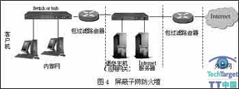
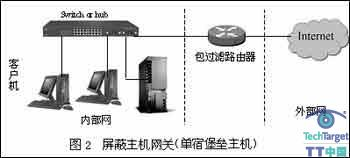
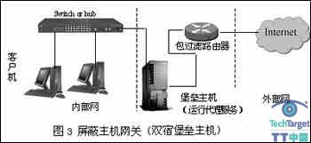
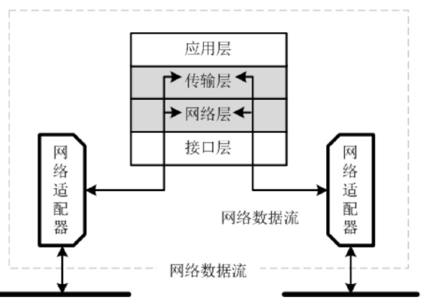
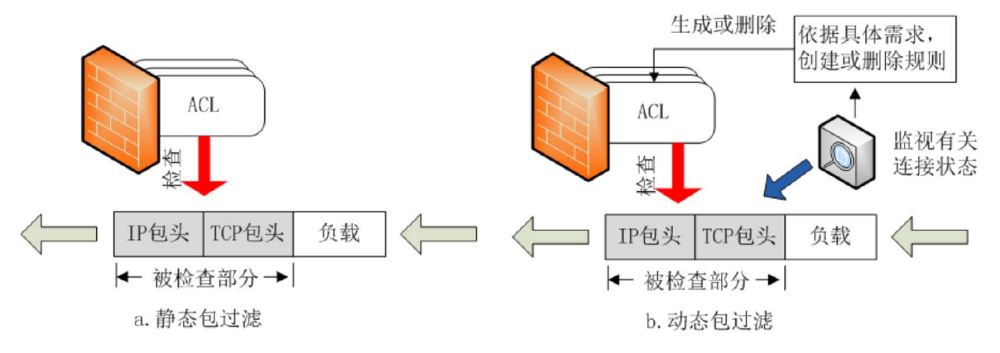

## FW 防火墙主要技术 体系结构 ACL 动态/静态包过滤 NAT VPN DMZ  :pear:【重要】

### 定义与目的
- **定义**：防火墙是由**硬件和软件**组成的安全屏障，**部署**在**内**部网络与**外**部网络**之间**，用于执行访问**控制策略**（网络通信层面的**访问控制**），**保护内部网络免受外部攻击**。
- **目的**：有效控制内外网数据流，确保只允许**符合安全策略的数据通过**，同时提供审计、管理、可扩展性和健壮性。

### 分类与部署
- **按技术特征分类**：**包过滤**防火墙、**代理**防火墙、**个人**防火墙
- **部署方式**：**透明（桥接）模式**、**网关（路由）模式**、**NAT模式**

### 按体系结构分类
- **屏蔽路由**：就是一个**包过滤防火墙路由器**
- **屏蔽主机**（单/双宿堡垒主机，位于包过滤防火墙之后，外网只能访问堡垒主机）
- **屏蔽子网**（<u>最安全</u>，堡垒主机+两个包过滤路由器隔离出DMZ）
- **双宿主机**（双宿堡垒主机，堡垒主机运行代理服务，可以直接连接外网）

!!! Warning "Tips"
    路由器就是典型的多宿主机，这里的双宿主机同时担当了包过滤防火墙和路由器的功能。
    代理 Proxy 是一种服务器或软件，它充当客户端和服务器之间的中介。代理的主要作用是代表客户端向服务器请求服务、转发请求或提供服务，同时可以提供额外的安全服务。

---

### DMZ（非军事区）
放公开服务器设施，解决安装防火墙后外网不能访问内部服务的问题，可以**连接两个防火墙**（一个保护内部网络，一个保护DMZ和内部网络）。

!!! Warning "Tips"
    前情提要——“路由器”是硬件实体，“网关”是逻辑功能。当一台设备要访问“非本网络”的目标时，必须将数据包发送给网关，充当网关的可以是一台路由器也可以是包含路由功能（或者路由器功能）的一套防火墙。

#### 各体系结构模式说明
- **屏蔽子网模式**：内外网都能访问DMZ，但是禁止穿过屏蔽子网直接通信，中间用堡垒主机转发，外部包过滤防火墙和堡垒主机都被控制时仍然有内部包过滤防火墙保护内部网。
  
- **单宿堡垒主机**：一块网卡的防火墙堡垒主机安装在内部网络上，通常在路由器上设立规则，并使这个堡垒主机成为从外部网络唯一可直接到达的主机。
  
- **双宿堡垒主机**：两块网卡的防火墙（可以隔离内外网）。
  
- **三宿堡垒主机**：三块网卡的防火墙（建立DMZ）。

---

### 防火墙局限性
- 无法检查**不经过防火墙的流量**（如通过内部拨号接入公网）
- 无法防范**内部人员**恶意攻击
- 无法阻止**病毒木马文件**进入
- 无法防止**数据驱动**的攻击（缓冲区溢出）

!!! Warning "Tips"
    统计表明，网络安全威胁主要来自内网。

---

### ACL（访问控制列表）
一系列允许和拒绝匹配规则的集合，利用这些规则来告诉防火墙哪些数据包允许通过，哪些数据包被拒绝。

---

### 包过滤防火墙  :pear:【重要】
工作在**网络层和传输层**（主要工作在网络层），只检测包头信息（**源、目的IP地址；源、目的端口号；协议**），对应用层内容无法深入检测。

- **静态包过滤**：根据**定义好的包过滤规则**审查每个数据包，以便确定其是否与某一条包过滤规则匹配。
- **动态包过滤**：会话跟踪，**基于会话动态**建立和删除规则，采用**动态配置包过滤规则**的方法。防火墙审核合法用户访问外网请求，向ACL添加放行该用户的规则，接收到结束访问通知或者会话结束或者超时时自动删除。
  
- **有状态的包过滤防火墙（状态检测防火墙）**：能详细记录网络连接状态信息，基于**连接状态表**依据包过滤规则判断是否允许数据包通过，能比普通的无状态包过滤防火墙更有效地保护网络安全和提供更详细的日志。

---

### 应用代理网关防火墙
主要在**应用层**，基于**代理技术**，需要**理解应用层用户协议**，进/出数据包**还原**审查后**封装**转给内部/外部节点。

- **优点**：
  1.  是**最安全**的，所有通信都需要**应用层代理软件**转发，可**防止数据驱动攻击**
  2.  可以对用户身份做认证
- **缺陷**：
  1.  必须理解**应用层协议**和不断产生的**新协议**
  2.  性能不如包过滤，**还原封装**网络连接到应用层工作量大，影响性能成为**网络瓶颈**
  3.  贵，管理复杂

### 电路级网关
检查**传输层**（TCP UDP）数据，在内外网建立**虚拟电路**（传输层）进行访问控制，不对应用层数据审计。

!!! Warning "Tips"
    - 包过滤防火墙：网络层 传输层（知道：源、目的IP地址，源、目的端口号，协议）
    - 代理防火墙：应用层（理解：应用层协议）
    - 电路级网关：TCP传输层、OSI会话层（检查TCP UDP数据，建立传输层虚拟电路）
    - 物理层的交换方式中有电路交换/报文交换/分组交换，分组交换在网络层实现的方式有数据报/虚电路，而这里的传输层的虚拟电路非彼虚电路。
    - SOCKS系统也是这种内外网建立虚拟电路，日用的Clash/V2Ray类似于SOCKS的代理，在应用层接收流量，然后通过传输层将流量转发到目标服务器，**工作在传输层**，实现网络流量的加密和转发，绕过防火墙和网络审查。

---

### NAT（网络地址转换）  :pear:【重要】
私有地址→合法公网IP地址的技术。

!!! Warning "Tips"
    NAT是精确到端口号的，由于能看到端口和ip并且会修改TCP/UDP报文所以**在传输层**，同理arp只看到了ip和mac所以算**网络层**，包过滤防火墙检查包头中的ip和port所以在**传输层和网络层**。
    但是完全可以说NAT和网关（屏蔽路由）模式的包过滤防火墙主要是在网络层工作的。
    RFC 3022（Traditional NAT）第4.2节：“NAT修改是逐包进行的，可能非常消耗计算资源，因为它们涉及一个或多个校验和的调整以及简单字段转换。”随后给出了**增量重算TCP/UDP/IP校验和**的算法与示例代码 RFC3022。
    如果需要从外部网络访问内部网络的服务（如Web服务、Minecraft服务器等），需要添加端口转发规则，NAT是白名单机制，只有明确允许（即在NAT规则中明确指定）的出入站流量才能通过NAT设备。

- **静态NAT**：一一映射私有IP转换到真实IP
- **动态NAT**：随机选IP
- **作用**：**缓解IP地址不足**、**隐藏内部主机ip**、**过滤ip地址**、**流量均衡**
- 对于TCP/IP，NAT修改**IP头和修改TCP/UDP校验和**（考虑伪首部共有12字节，包含IP首部的一些字段，由于IP头部被修改，NAT设备需要重新计算新的校验和）

!!! Warning "Tips"
    IPv6技术上仍然有NAT，但设计理念是去NAT，只在特定过渡/运维需求里小范围出现，不会像IPv4那样成为普遍刚需。

---

### VPN（虚拟专用网络）  :pear:【重要】
通过**公用网络**建立一个临时的，安全的连接。

- **应用服务类型**：**Access**远程用户、**intranet**分支机构、**extranet**商业伙伴
- **依赖隧道技术**：用一种协议完成对另一种协议数据报文的**封装 传输 解封**

!!! Warning "Tips"
    VPN的隧道协议主要有三种，PPTP，L2TP和IPSec，其中PPTP和L2TP协议工作在数据链路层，又称为二层隧道协议；IPSec是第三层（网络层）隧道协议，也是最常见的协议。实现VPN连接的技术和设备（如防火墙、路由器）可以工作在不同的网络层。
    隧道应用：IPv6数据报作为IPv4数据报的载荷进行封装，穿越IPv4网络。