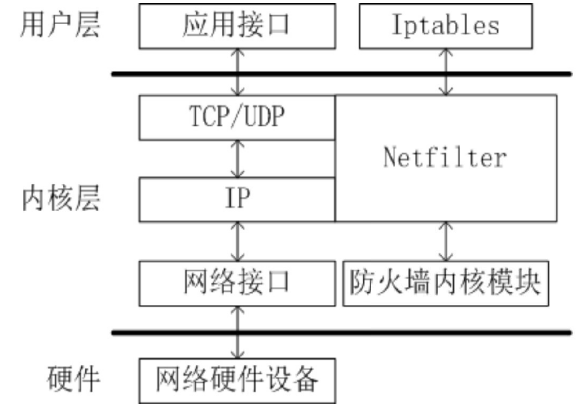
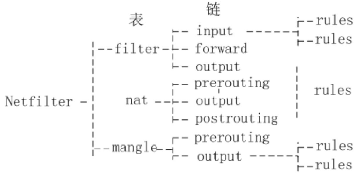

---

title: Linux Netfilter / Iptables 的工作原理 hook 钩子函数指针链

tags:

---


## Linux Netfilter / Iptables 的工作原理 hook 钩子函数指针链 :blue_circle:【重要】

### 设计思想与架构
设计思想是采用两层结构：

- **Netfilter**：处于**内核层**，是内核的一部分，由一些信息包过滤表组成，这些表包含内核用来控制信息包过滤的规则集。
- **Iptables**：位于**用户层**，是一种管理包过滤规则的工具，可以完成插入、修改和删除包过滤规则的操作。



### Netfilter 核心原理
Netfilter 依靠在**网络处理流程**的**若干位置**放置一些**钩子（Hook）**来实现包过滤。

- 每个钩子允许注册**若干个处理函数**，系统根据这些**钩子函数的优先级**形成**钩子函数指针链**。
- 当数据包到达钩子点时，会被**依次**提交给**指针链上的钩子函数**处理。

### IPtables 规则与匹配
IPtables 按**“自上而下”**的顺序匹配规则，每个钩子函数对应一张包过滤表，依据表对数据包进行检查处理。



#### 核心概念与组成
每个表包含 **0 或多个规则**，每条规则由 **匹配条件** 和 **目标动作** 组成：

| 组成部分 | 说明 |
| :--- | :--- |
| **表（Table）** | 表是规则的集合，常见表有：<br>- **filter**：默认表，用于包过滤（INPUT/FORWARD/OUTPUT链）<br>- **nat**：网络地址转换<br>- **mangle**：修改数据包头部 |
| **链（Chain）** | 链是规则的容器，内置链包括：<br>- **INPUT**：处理进入本机的数据包<br>- **OUTPUT**：处理本机发出的数据包<br>- **FORWARD**：处理转发的数据包 |
| **匹配条件** | 过滤数据包的依据，如：源IP、目的IP、源端口、目的端口、协议类型等 |
| **目标动作** | 匹配成功后执行的操作，如：<br>- **ACCEPT**：允许数据包通过<br>- **DROP**：丢弃数据包<br>- **REJECT**：拒绝并返回报错信息 |

### 命令结构与语法
```bash
iptables -t <表名> -A <链名> <匹配条件> -j <目标动作>
```

- **-t <表名>**：指定要操作的表，默认是 filter 表
- **-A <链名>**：在链的末尾添加一条规则
- **<匹配条件>**：指定过滤条件（如 `-s 192.168.0.2` 源IP）
- **-j <目标动作>**：指定匹配后的动作（如 `-j ACCEPT` 允许）

### 规则操作符

- **-A**：添加规则
- **-I**：插入规则
- **-D**：删除规则
- **-R**：替换规则
- **-L**：列出规则
- **-F**：清空规则
- **-Z**：清空计数器

### 典型操作示例
```bash
# 允许192.168.0.2的SSH连接
iptables -t filter -A INPUT -p tcp -s 192.168.0.2 --dport 22 -j ACCEPT
```

!!! Warning "Tips"
    二者关系：**iptables 是管理工具，netfilter 是内核框架**。iptables 负责配置规则，netfilter 在内核中执行这些规则进行数据包过滤。
    缺省表为 **filter**，可以直接指定 `iptables -t filter ...`，不指定 `-t` 时默认就是 filter 表。
