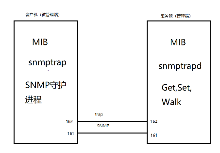

## IDS 入侵检测系统 入侵诱骗  :pear:【重要】

### 工作过程与定义
- **工作过程**：**信息收集** → **信息分析** → **模式匹配** → **结果处理**
- **定义**：实时**监视网络传输**，发现可疑行为时**报警或响应**。
- **定位**：
  - 防火墙 = 门禁（**静态防范**）
  - IDS = 监控（**动态防范**），是防火墙的补充
- **优势**：IDS 可以发现**内部攻击事件**和**合法用户越权访问**，而边界防火墙对此无能为力。

!!! Warning "Tips"
    分析在匹配之前：分析指**去重、去噪、补齐、归一化、提取关键字段/向量**，清洗后才方便模式匹配。
    统计表明，网络安全威胁主要来自**内网**；IDS 对内部已发生流量做**被动分析**，FW 依据访问控制策略**主动隔离**内外网数据流。

---

### 入侵检测系统的数据源
- **HIDS（主机型）**：以主机数据为信息源，包括系统运行状态、记账信息、主机日志、C2级安全审计。
- **NIDS（网络型）**：以网络数据为信息源，包括 SNMP 信息、网络数据包、路由器/交换机/防火墙日志。
- **应用数据**：以应用层数据为信息源。

!!! Warning "Tips"
    - **C2级**：国际安全标准中“受控访问保护”级别，要求记录用户操作、权限变更，支持事后追溯；国标 GB17895-1999 分五个等级。
    - **SNMP**：C/S 结构，默认端口 161（管理通信）、162（Trap 报警）。被管理端运行 `snmpd` 守护进程，管理端用工具包（get/set/translate 等）管理节点；`SNMPTrapd` 监听 162 端口，接收被管理端故障报警的 `snmptrap` 报文。
    

---

### 检测技术分类
#### 基于误用检测（入侵特征）  :pear:【重要】
- **原理**：事先定义**已知入侵特征**，与数据库中已知攻击匹配，判断是否发生误用攻击。
- **优点**：**准确率高、误报率低**。
- **缺点**：**漏报率高**，无法检测未知攻击；将入侵手段抽象为知识困难；**特征库需要持续维护**。

**常用方法**：
  1.  **模式匹配法**：将数据与模式数据库匹配。
  2.  **专家系统法**：使用 IF/then 规则实现，简单但处理慢、维护复杂，不适合大数据。
  3.  **状态转移法**：用状态转换图描述已知入侵模式，状态为系统状态，转换为用户操作。
  4.  **有色 Petri 网**：用 CP-Net 表示入侵，令牌颜色模拟上下文，IDIDIOT 系统基于此实现。

#### 基于异常检测（活动轮廓）  :pear:【重要】
- **原理**：以**正常状态下的标准特征/行为模式**为基准，比较当前活动与正常状态的偏差，偏差超过阈值则判定为异常。
- **优点**：**通用性强、漏报率低**。
- **缺点**：**误报率高、准确率低**，无法准确报告攻击类型；阈值确定困难。

**常用方法**：
  1.  **统计分析法**：基于统计理论建立用户/系统正常行为模型。
  2.  **神经网络法**：用神经网络监控活动，与正常模型比较判断异常，不定位原因。
  3.  **聚类分析法**
  4.  **人工免疫系统**
  5.  **KNN 算法**
  6.  **Denning 模型**：包含可操作模型、平均和标准差模型、多变量模型、Markov 模型。

---

### 误用检测 vs 异常检测 对比

| 维度 | 基于误用 | 基于异常 |
|------|----------|----------|
| **性能** | 准确率高、误报低、漏报多 | 准确率低、误报高、漏报少 |
| **未知攻击** | 无法检测 | 可以检测 |
| **维护** | 需抽象入侵手段，维护特征库 | 需训练模型、确定阈值 |
| **实时性** | 快 | 慢 |
| **依据** | 与已知入侵行为特征的匹配程度 | 与正常状态/活动轮廓的偏差 |
| **方法** | 模式匹配、状态转移、专家系统、有色 Petri 网 | 统计分析、神经网络、KNN、人工免疫系统、Denning 模型 |

!!! Warning "Tips"
    人工免疫系统：模拟生物免疫系统的抗原识别、细胞分化、记忆和自我调节功能的算法。
    评价 IDS 性能三大指标：**误报率、漏报率、准确率**；评价网络性能两大指标：**速率、带宽**。

---

### 入侵诱骗
- **核心概念**：蜜罐、蜜网、蜜场（发展为**网络欺骗防御**），目的是**吸引攻击者**，保护核心系统。

### 响应方式
- **主动响应**：立即阻塞或影响攻击，改变攻击进程，在入侵后立即采取措施。
- **被动响应**：仅报告和记录问题，向用户提供信息，由用户采取下一步措施。