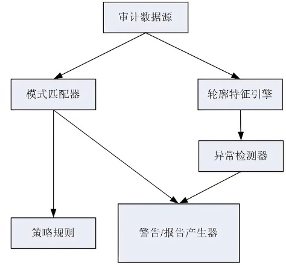
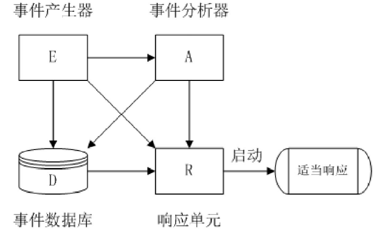
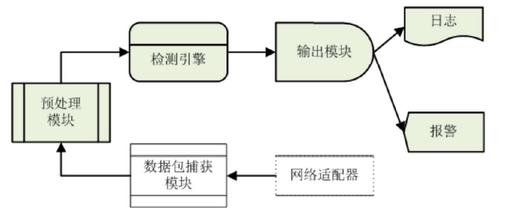

## IDES CIDF 入侵检测系统模型 Snort 三维链表

### IDES 模型（误用模式匹配 + 异常检测）
IDES 是入侵检测专家系统模型，结合了**误用模式匹配**与**异常检测**：

- **模式匹配器**：根据**策略规则集**内容报警。
- **异常检测器**：通过**轮廓特征引擎**分析抽取活动轮廓，判断异常并报警。
- 其他组件：审计数据源、策略规则、警告/报告生成器。

---

### CIDF 模型（EADR 四组件）
CIDF（通用入侵检测框架）将系统划分为 **E-A-D-R** 四个核心组件：

- **E（Event Generator，事件产生器）**：收集事件（数据包、日志等），传递给 AD。
- **A（Event Analyzer，事件分析器）**：检测误用模式或异常行为。
- **D（Event Database，事件数据库）**：存储来自 AE 的数据，提供分析依据。
- **R（Response Unit，响应单元）**：从 AED 提取数据，触发响应（如阻断、修改配置等）。

- **通信方式**：基于 **GIDO（通用入侵检测对象）** + **CISL（通用入侵规范语言）**。
- **规格文档**：包含体系结构、规范、语言、内部通讯、程序接口四部分。
- **互操作层次**：配置（发现并交换）、语法（识别交换数据）、语义（理解内容）。

---

### Snort 系统（基于 CIDF 的 NIDS）  :pear:【重要】
Snort 是一款经典的**基于网络的入侵检测系统（NIDS）**，遵循 CIDF 模型，由四大模块组成：

1.  **数据包捕获模块**：通过 LIBPCAP/WINPCAP 从网络适配器捕获原始数据包，提交给预处理模块。
2.  **预处理模块**：对数据包进行解码、检查和相关处理。
3.  **检测引擎**：核心部件，对处理后的数据包进行规则匹配，判断是否存在入侵。
4.  **输出模块**：根据检测结果，执行写日志或报警等操作。

#### 检测引擎：三维链表规则库
Snort 将已知入侵行为存储在**三维链表结构**的规则库中，每条规则由**规则头**和**规则选项**组成：

- **规则头（RTN）**：对应**规则树节点（RTN）**，包含规则行为、协议、源/目的IP、子网掩码、源/目的端口。
- **规则选项（OTN）**：对应**规则选项节点（OTN）**，包含报警信息和匹配内容等。

**三维链表结构**：

- **RLN（规则链表节点）**：按 5 类规则动作选项，对应 5 个 RLN 节点。
- **RLH（规则链表头）**：每个 RLN 指向 4 个 RLH 指针，分别对应 `IPLIST`、`ICMPLIST`、`TCPLIST`、`UDPLIST` 四种协议树。
- **RTN（规则树节点）**：每个协议树包含一个 RTN 链表。
- **OTN（选项树节点）**：每个 RTN 连接一个 OTN 链表，包含匹配函数指针。

**匹配流程**：
Snort 启动时建立三维规则链表。数据包到达检测引擎后，**从左至右遍历三维链表**：

1.  根据协议选择对应的 RLH 指针，进入相应协议树。
2.  在 RTN 链中查找匹配的规则头。
3.  进入 OTN 链表，匹配规则选项。
4.  若与某个 OTN 匹配成功，则判定为攻击数据包，执行规则动作并停止遍历。

#### 输出模块

- **三种处理方式**：`alert`（报警）、`log`（记录日志）、`pass`（放行）。
- **实现子模块**：报警子模块、日志子模块。

---

### 补充知识点
!!! Warning "Tips"
    - **Snort vs iptables 匹配顺序**：Snort 是**从左至右**遍历三维规则链表；iptables 是**自上而下**顺序匹配包过滤表，匹配到第一个规则即结束。
    - **IDS 与防火墙互动**：IDS 响应发起控制命令，防火墙执行指令。
    - **主流检测模型**：截至 2026 年，多数商业 IDS 采用**误用检测模型**，典型代表如 Snort，通过检测引擎实现网络流量特征匹配。
