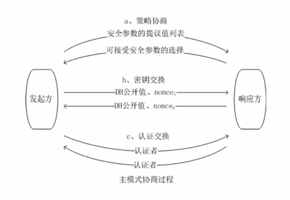
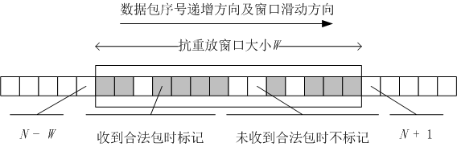

## IPSEC 网络层安全协议  :pear:【重要】

### 基本定位

- **IPv4 可选，IPv6 强制**，工作在**传输层之下（网络/IP 层）**，对终端用户和应用透明。
- 包含两个核心安全协议：

  - **AH（Authentication Header，认证头协议）**：提供数据源认证、完整性校验、抗重放，**不加密**。
  - **ESP（Encapsulating Security Payload，封装安全载荷协议）**：提供加密 + 认证 + 完整性 + 抗重放。

### 基本要件

- **加密算法**：ESP 至少支持 DES 的 CBC 模式（分组密码，需填充至长度倍数）。
- **认证算法**：AH/ESP 均支持，基于 HMAC（带密钥的哈希，同时提供完整性和身份认证）。
- **解释域（DOI）**：定义协议参数与字段含义。
- **密钥管理（IKE）**：负责分配加密/认证密钥。

### 提供的安全服务

- 数据保密性、有限数据流保密性
- 数据源认证、无连接完整性
- 抗重放攻击、中间人攻击、IP 欺骗

!!! Warning "Tips"

    - **HMAC-MD5/HMAC-SHA-1**：在普通哈希前混入密钥，同时实现**完整性校验**和**身份认证**。
    - DES/CBC 是分组密码，因此 ESP 载荷后需填充字段，使明文长度为分组长度的倍数。

---

## IKE（Internet 密钥交换协议）  :pear:【重要】
IKE 是 ISAKMP、Oakley、SKEME 三协议的混合体，分**两阶段**建立安全关联：

- **第一阶段**：协商建立 **IKE SA**（单向），完成身份认证、密钥交换。
- **第二阶段**：用 IKE SA 建立 **IPSEC SA**（通常两条，收/发各一条，SA 单向）。

### 第一阶段 建立IKE SA

1.  **主模式**：6 条消息，3 轮交互

    - ① 策略协商（加密算法、散列算法、认证方法、DH 组）
    - ② 密钥交换（DH 公开值、防重放随机数 Nonce）
    - ③ 认证交换（交换认证者，即散列值）

2.  **野蛮模式**：3 条消息

    - ① 发送方：参数提议、DH 公开值、身份信息
    - ② 接收方：参数选择、DH 公开值、身份信息、验证载荷
    - ③ 发送方：验证载荷（散列）

###  第二阶段 建立IPSEC SA
1.  **快速模式**：交换IPSEC SA信息建立IPSEC SA（三条消息：认证者1、SA参数提议 Nounce DH公开值；认证者2 、SA参数选择 Nounce DH公开值；认证者3）
2.  **新组模式**：协商新的DH组单发一条消息无需确认
3.  **ISAKMP 信息交换**：错误/状态提示消息，无需确认。

!!! Warning "Tips"
    验证载荷/认证者：对接收信息加密散列（HMAC）计算得出的可验证信息。

---

## SA（安全关联）与 SPI/SAD/SPD  :pear:【重要】

### SA（安全关联）

- 定义：IPSec **单向**连接的安全参数与策略集合，分**隧道模式**和**传输模式**。
- **SPD（安全策略库）**：保存处理策略（SP），每条记录与 SAD 中 SA 记录互相指向。
- **SAD（安全关联数据库）**：保存所有已建立的 SA。

#### 数据包处理流程

- **发送方向**：IP 数据包 → SP → SA
  1.  查 SPD 确定安全策略（丢弃/绕过/应用 IPsec）。
  2.  若应用 IPsec，获取指向 SAD 中 SA 的指针。
  3.  SA 有效则取参数执行 ESP/AH；SA 未建立/无效则丢弃。
- **接收方向**：IP 数据包 → SA → SP
  1.  查 SAD，若有有效 SA 则还原数据包。
  2.  获指向 SPD 中 SP 的指针，验证安全保护是否符合策略。
  3.  相符则交上层/转发；不符则丢弃。

#### SA 唯一标识三元组（SAD 定位 SA）

- **SPI（安全参数索引）**：与 SA 关联的位串，IKE SA 建立时生成伪随机数。
- **IP 目的地址**
- **安全协议标识**（ESP/AH）

#### SP 选择因子（SPD 定位 SP）
- 从网络层/传输层提取：**源/目 IP 地址、协议、端口**。

!!! Warning "Tips"
    IPsec SA 传输所需的加密/验证密钥，由第一阶段生成的密钥、SPI、协议等参数**衍生**，保证每个 SA 密钥唯一。
    SA 仅支持单向连接，多个 SSL 连接可共享一个 SSL 会话以节省协商成本。

---

## 完整 IPSec 应用流程（如 VPN）

1.  **启动**：根据 SPD 安全策略，确定需应用 IPsec 的数据流。
2.  **IKE SA 建立**：主模式或野蛮模式协商 IKE SA。
3.  **IPSEC SA 建立**：快速模式协商建立 IPSEC SA。
4.  **数据传送**：根据 SA 指针从 SAD 获取参数/密钥，执行 ESP/AH 处理。
5.  **IPSEC SA 终止**：删除或超时结束。

!!! Warning "Tips"
    类似流程对比：

    - BGP：先建 TCP 会话，再交换可达性信息。
    - SSL：4 阶段建立安全能力、身份认证、密钥交换，最后建立会话。
    - HTTPS：先建 SSL 会话，再传输应用数据。

---

## 抗重放攻击机制  :pear:【重要】
IPSec 实现两种核心抗重放机制：**序列号计数器** + **抗重放窗口**。

### 1. 序列号计数器

- 每个 ESP/AH 头部携带**单调递增的 32 位序列号**。
- 新 SA 建立时序列号初始为 0，发送端每发一包序列号 +1。
- 序列号达到 `2^32 - 1` 时，原 SA 终止。

### 2. 抗重放窗口

- 接收端为每个 SA 维护固定大小的**滑动窗口**（如大小 32）。
- 规则：

  - 序列号在窗口**左侧**：直接丢弃。
  - 序列号在窗口**内部**：MAC 验证通过后，若未标记则接收并标记位置，窗口不变。
  - 序列号在窗口**右侧**：MAC 验证通过后，标记位置，窗口**向右滑动**，以新序号为右界。

!!! Warning "Tips"

    - ESP/AH 头部**自带抗重放功能**。例：窗口 `[1024, 1055]` 收到序号 1060，窗口右滑 5 位变为 `[1029, 1060]`。
    - 与 SR（选择重传）区别：SR 只接受窗口内帧，IPSec 窗口可由右侧序号扩展右界。
    - 类比：IP 有 16 位标识，TCP 有 32 位序号。
