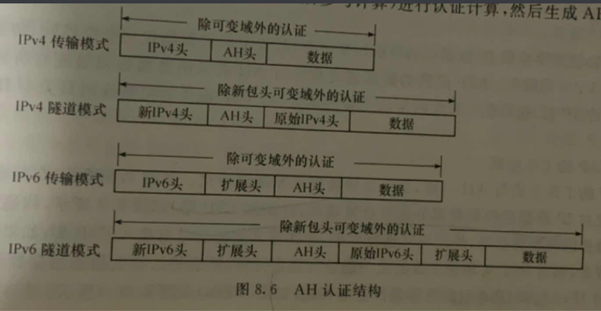
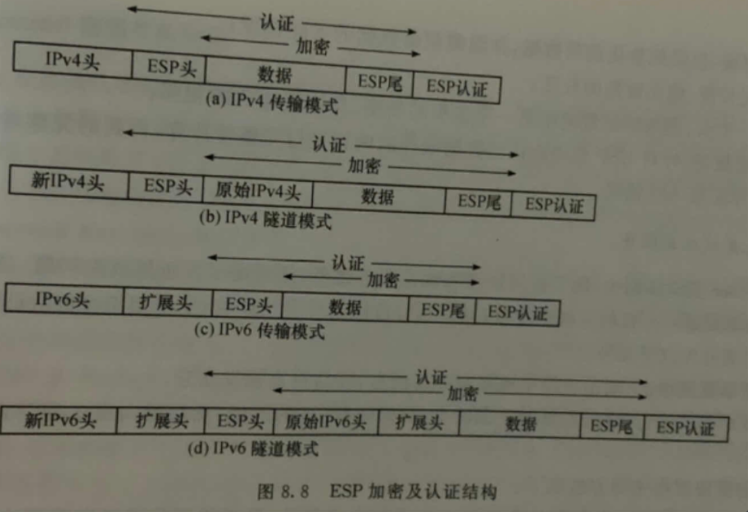
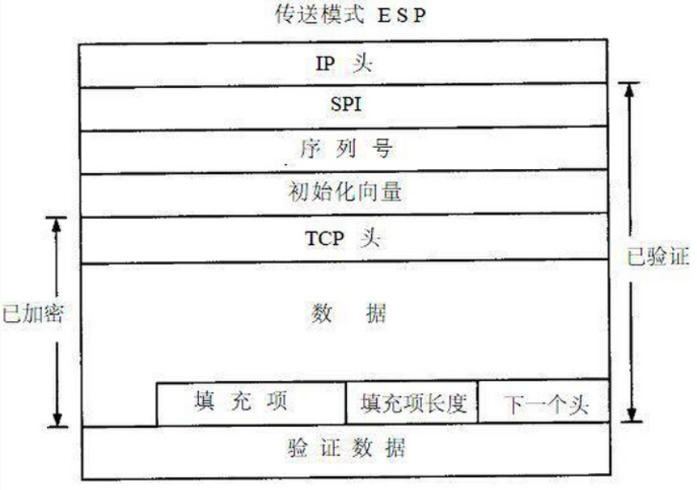

## IPSEC AH ESP 传输模式 隧道模式 完整性认证 :red_square: :blue_circle:【重要·常考】
在**传输模式**下，AH和ESP主要对**传输层及上层报文**提供保护（即不保护原IP头），只对IP数据包的**有效负载**进行加密或认证：此时继续使用之前的**IP头部**，只对**IP头部的部分**域进行**修改**，而**IPSec协议头**部插入到**IP头部和传输层头部之间**；

在**隧道模式**下，AH和ESP则用于封装**整个IP数据报文**，对整个IP数据报进行加密或认证：此时需要**产生新的IP头部，IPSec头部被放置在**新产生的**IP头部和**以前的**IP数据包之间**，从而组成一个新IP头部。

### 作用域

无论隧道还是传输模式，**AH**提供对**整个IP包**包括IP头和内容做完整性认证；

**ESP**的完整性认证只提供**IP包内容部分**。

所以AH的认证服务安全性高于ESP的认证服务

因此在NAT-T下：**AH** 验证范围包括 **IP 报文头**，而 NAT 设备会修改 IP 地址和 校验和（伪首部共有12字节，包含IP首部的一些字段，由于IP头部被修改，NAT设备需要重新计算新的校验和），导致完整性校验失败。**ESP** 的完整性校验不包含外部IP头，NAT 需要修改IP报 IP 地址和 TCP/UDP 校验和但校验和作为IP报的数据内容被ESP保护，**因此只有隧道模式的 ESP 可以穿透NAT**

### 工作模式

#### AH

传输模式：算AH头

隧道模式：新IP头，算AH头

#### ESP

传输模式：填充ESP尾、加密、加ESP头、加ESP认证

隧道模式：填充ESP尾、加密、加ESP头、加ESP认证、加新IP头

(ESP尾巴藏起来 伸出ESP头 伸出人尾巴)

!!! Warning "Tips"

    - AH只认证不加密 ESP认证且加密
    - **AH**不认证IP头或新IP头的可变域
    - **ESP**不加密ESP头但加密ESP尾
    - **载荷长度**：以 4 字节（32bit）为单位，AH 固定 3 字长，认证数据也需为 32bit 整数倍。
    - **验证数据域**：AH/ESP 均使用 **HMAC**（基于哈希的消息认证码），默认取前 96 位（3 字）。
    
        
    
!!! Warning "Tips"

    - IP校验和只校验自己的头
    - TCP UDP校验和校验范围包括伪头、自己的头、数据

    - TCP 用**四元组**（源/目 IP + 源/目端口）唯一标识 socket 连接。首部总长度为 20 字节。
    - UDP 用**二元组**（目的 IP + 目的端口）即可标识连接。首部总长度为 8 字节。

