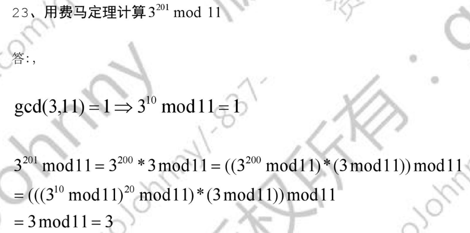
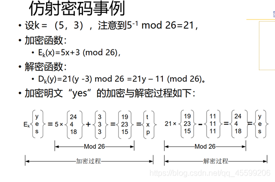

## 古典替换密码：移位密码、凯撒密码、乘数密码、仿射密码、多表代替、维吉尼亚密码【重要·常考】

!!! Warning "Tips"
    837 各种和 mod 相关题目必须掌握的前置知识：辗转相除求逆元、费马定理（例：指数特别大时求 mod，数一也有区间内最值点的费马定理）

### 移位密码（凯撒密码）
基础单表移位替换密码，字母按固定位数循环移位。

---

### 乘数密码
- 加密：$E_k(m) = K \times m \mod q$
- 解密：$D_k(c) = c \times K^{-1} \mod q$
- 约束：$K$ 与 $q$ 必须互素，$K=1$ 无加密意义

---

### 仿射密码（移位 + 乘数）
- 加密变换：$E_k(m) = (k_1 m + k_2) \mod q$
- 密钥：$(k_1,k_2)$，$k_1$ 与 $q$ 互素
- 解密算法：$D_k(c) = k_1^{-1}(c - k_2) \mod q$

!!! Warning "Tips"
    仿射/乘数密码中，英文 $q=26$，俄文 $q=32$。
    例如：$C = m \times k \mod 32$，$k$ 取小于 32 且互素的数：1,3,7,11,13,15,17,19,21,23,25,27（$k=1$ 无意义）

!!! Warning "Tips"
    必须互素的原因：只有互素，明文与密文才一一对应；不互素会出现映射重复。

!!! Warning "Tips"
    本部分相关习题：[Johnny 笔记](https://github.com/mcxiaoxiao/837/blob/master/%E4%BF%A1%E6%81%AF%E5%AE%89%E5%85%A8%E5%AF%BC%E8%AE%BA/%E4%BF%A1%E6%81%AF%E5%AE%89%E5%85%A8%E5%AF%BC%E8%AE%BA%E7%AC%94%E8%AE%B0%E6%80%BB%E7%BB%93/%E4%BF%A1%E6%81%AF%E5%AE%89%E5%85%A8%E5%AF%BC%E8%AE%BA%E7%AC%94%E8%AE%B0%E5%9F%BA%E7%A1%80_3.pdf)

---

### 维吉尼亚密码
- 基于**移位代替**密码
- 核心：**一个密钥字符对应一个明文字符**
- 密钥循环使用，属于**周期多表代替密码**