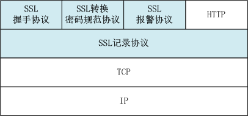
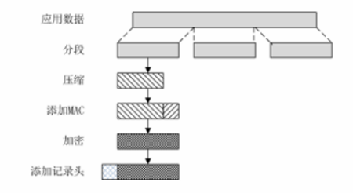

## SSL 安全套接字层协议 【重要·常考】
SSL/TLS（安全套接层 Secure Socket Layer 协议/传输层安全规范协议）是位于 TCP 与应用层之间的安全协议，包含四个核心子协议。

### 四个核心协议（应用层视角）

- **记录协议**（应用层与传输层间）：提供**完整性、通信加密**服务。
- **握手协议**（应用层）：提供**点对点身份认证**。
- **转换密码规范协议**（应用层）：协商密码套件与密钥规范。
- **报警协议**（应用层）：传输异常警报信息。

---

## 1. SSL 记录协议（核心底层协议）【重要·常考】
SSL 记录协议（8B 主版本 8B 从版本 16B 压缩长度 0/16/20/MAC）为会话中的连接提供两大核心服务：

### 提供的服务

- **保密性**：利用握手协议定义的共享密钥，对有效载荷进行常规加密。
- **消息完整性**：利用握手协议定义的共享 MAC 密钥，生成报文摘要，确保数据未被篡改。

### 处理流程（5个步骤）
SSL 记录协议处理数据包分为五个严格顺序的步骤：

1.  **分段**：将上层数据分割成合适的记录片段。
2.  **压缩**：对数据进行压缩（可选）。
3.  **添加 MAC**：计算消息认证码（基于 MAC 密钥）。
4.  **加密**：使用加密密钥对数据（含 MAC）进行加密。
5.  **加记录头**：添加 SSL/TLS 记录协议头部，形成最终数据包。

!!! Warning "Tips"

    - **加密密钥 vs MAC 密钥**：二者**不是同一把**，它们是由握手协议中的**主密钥（master secret）** 通过 KDF（密钥派生函数）一次性派生出来的两组独立密钥，握手结束后各自独立工作。
    - **MAC 特性**：MAC 侧重于**防止消息被篡改**，但**不涉及身份认证**（身份认证由握手协议完成）。
    - 对比：DS（数字签名）/双重签名使用公钥加密和验证（可直接验证身份），而 MAC 是基于对称密钥的认证函数。

---

## 2. SSL 握手协议（最核心部分）【重要·常考】
SSL 握手协议（类型 1B，长度 3B，内容 >=1B）是建立 SSL 会话的关键，用于协商建立安全能力：

### 核心功能
用于建立会话、协商压缩方法、鉴别方法、加密算法、加密密钥、初始化操作。
最终目标：使服务器和客户端能**相互鉴别对方身份**，并**协商共享的 MAC 密钥和载荷加密密钥**。

### 四个协商阶段

1.  **建立安全能力**（Hello & 算法协商）：交换 ClientHello / ServerHello，协商版本、加密套件、随机数等。
2.  **服务器认证与密钥交换**：服务器发送证书、公钥，完成服务器身份验证。
3.  **客户端认证与密钥交换**：客户端验证服务器证书后，发送客户端证书及预主密钥（可选）。
4.  **结束**：双方验证协商参数，生成会话密钥，握手完成。

!!! Warning "Tips"

    - **顺序**：先服务器，后客户端。
    - **防重放**：SSL 使用**时间戳**和**随机数**来防止重放攻击。握手过程中交换的随机数和时间戳不仅用于生成会话密钥，也用于检测重放攻击。

---

## 3. SSL 转换密码规范协议【重要】
SSL 转换密码规范协议（1B，值为 1 时更新）用于动态更新加密规范：

### 功能
通知对方将已挂起（或新协商）的密码状态复制到当前状态中，用于**更新当前连接使用的密码规范**。

!!! Warning "Tips"
    该机制支持**会话内重协商**，无需重新建立完整 SSL 会话即可更新加密套件，类似 IPsec 的新组模式。

---

## 4. SSL 报警协议【重要】
SSL 报警协议（2B，警报级别 1B+类型 1B）用于传输传输过程中的异常警报：

### 功能
将 SSL 传输过程中的警报信息传送给对端（例如：无证书时发送 `no_certificate` 警报）。

!!! Warning "Tips"
    警报协议/报警协议功能一致，类似于 IPsec 的 ISAKMP 协议，用于传递交互过程中的错误与状态信息。