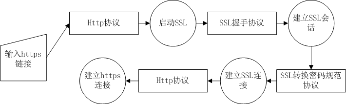

## HTTPS 建立 作用

客户端与服务器协商一个 **SSL 会话**，启动 **SSL 连接**，在 SSL 通道中传输 HTTPS 数据（默认端口 **443**）。

HTTPS 服务器必须申请证书，**客户端验证 CA 证书后**，才能信任服务器身份。

作用：**SSL 建立安全通道 + CA 证书认证确认真实性**。

### 建立流程

先后顺序：

1.  **SSL 握手**（协商方法、参数、密钥，经过四个阶段）→ 建立 SSL 会话

2.  **SSL 转换密码规范协议**（把新协商的状态复制到当前状态）→ 建立 SSL 连接

---

!!! Warning "Tips"
    - 先握手建立 **SSL 会话**，后应用新密码规范建立 **SSL 连接**
    - 提供 **机密性、完整性、服务真实性**，但**不能确保可靠性**
    - 下层 TCP 可保障可靠性（重传、确认、流量控制、拥塞控制），但应用层可靠性无法保证（端到端原则）
    - **一个 SSL 会话可以承载多个 SSL 连接**
    
    HTTPS 通过 SSL/TLS 各细分协议实现安全通信的细节：

    - 客户端使用服务器提供的、由可信证书颁发机构（CA）签发的证书，验证服务器身份（属于 **SSL 握手协议的一部分**），确保服务器是预期通信实体
    - 双方通过 SSL/TLS **转换密码规范协议**协商加密算法和对称密钥
    - 建立**安全SSL连接**，进行数据传输

---
