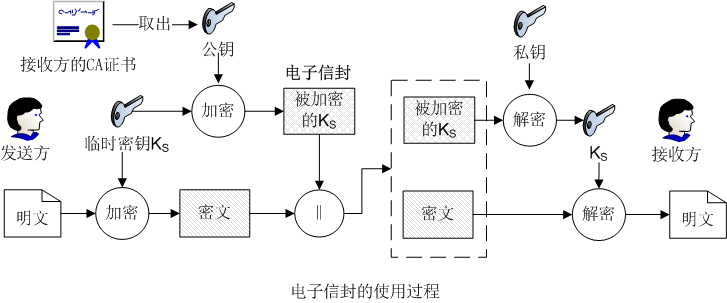
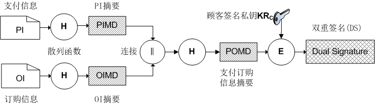

## SET 安全电子交易协议 DS 双重签名 电子信封  :blueberries:【重要·常考】

### 协议概述
SET (Secure Electronic Transaction，安全电子交易协议) 运行在 **应用层**，结合了对称密钥（$K_s$）与公钥密码技术，利用对称密钥的高效性和非对称密钥的灵活性，实现了安全的电子支付。

### 核心技术与安全服务

- **核心技术**：对称密钥（$K_s$）、公钥密码、电子信封（封装更新对称临时密钥 $K_s$）、数字签名、消息摘要、电子信封、数字证书、**双重签名（DS）**。
- **提供服务**：**机密性、完整性、身份认证、不可否认性**。
- **协议特点**：必须通过 **CA 证书认证**，实现 **数据隔离、多方认证、安全通信**。

### SET 角色与生态
| SET 角色 | 解释 | 举例（Visa / Mastercard 生态） |
| :--- | :--- | :--- |
| **持卡人 (Cardholder)** | 刷卡的人 | - |
| **商家 (Merchant)** | 提供商品/服务的在线商店 | 淘宝、京东、Apple 在线商店 |
| **发卡机构 (Issuer)** | 签发银行卡的机构 | 招行、工行、建行等银行 |
| **支付网关 (Payment Gateway)** | 连接商家与银行的网关 | VisaNet、Mastercard Gateway（转接商户请求给银行） |
| **清算机构 (Acquirer / Processor)** | 处理资金清算/收单 | 网关常兼任，或收单行（如 Chase Paymentech、Stripe，支付宝这种不算） |
| **认证中心 (CA)** | 签发证书的权威机构 | Visa SET Root CA（签发证书） |

---

### 电子信封（Electronic Envelope）  :blueberries:【重要·常考】
SET 用电子信封来传递更新的密钥，**这个被加密的密钥就是电子信封**。

#### 工作流程

1.  **发送方**：生成专用对称临时密钥 **$K_s$** 加密原文；同时用 **接收方的公钥** 加密临时密钥 **$K_s$**。
2.  **传输**：将“加密后的原文”与“加密后的 $K_s$（电子信封）”两部分密文**连接**在一起传送给接收方。
3.  **接收方**：先拿 **私钥解密 $K_s$**，再用 **$K_s$ 解密出原文**。

#### 工程原则与设计要点
!!! Warning "Tips"

    - **机密性托付**：密文只用临时密钥 $K_s$ 加密，**未经公钥加密**。协议将“机密性”完全托付给速度更快的对称算法。
    - **非对称使命**：公私钥对的使命仅为“把陌生人之间的一次性会话密钥安全地送过去”。一旦完成，不再触碰明文数据。
    - **工程收益**：既节省 CPU 资源，也减少代码路径和侧信道攻击面，体现了“**快的非对称算法用在最必要的地方，慢的对称算法用在最划算的地方**”的工程原则。
    - **加密规则**：电子信封必须用**接收方公钥加密**（而非发送方私钥）。原因：① 发送方私钥已用于双重签名（DS）；② 电子信封会被商家转发，为了信息隔离，**商家不可解开**，只能由银行用私钥解开。

---

### 双重签名（DS - Dual Signature）  :blueberries:【重要·常考】
SET 采用双重签名和加密技术，保证顾客给商家和银行的信息相互隔离，同时确保信息一致性，杜绝任意一方伪造。

#### 顾客生成 DS 步骤

1.  顾客对 **PI (支付信息)** 散列生成 **PIMD**。
2.  顾客对 **OI (订购信息)** 散列生成 **OIMD**。
3.  **连接**：PIMD || OIMD 连起来变成 **PO (支付订购信息)**。
4.  散列：PO 经过散列得到 **POMD**。
5.  签名：顾客用 **私钥加密 POMD**，得到 **DS**。

#### 交互流程与验证

##### 1. 顾客 -> 商家

- 发送内容：**DS || OI || PIMD**。
- 商家验证：
  1.  拿顾客证书**公钥**验证 DS 真伪并解密，得到 **POMD'**。
  2.  自己计算：$POMD = H(H(PIMD) || H(OI))$。
  3.  比对：判断 $POMD$ 是否等于 $POMD'$。
- 结果：相同则批准进一步交易。

##### 2. 顾客 -> 商家 -> 银行

- 发送流程：
  1.  顾客生成 $K_s$（电子信封），用**银行公钥**加密 $K_s$。
  2.  用 $K_s$ 加密 **DS || PI || OIMD**。
  3.  通过商家转发给银行。

- 银行验证：
  1.  用**顾客公钥**解开 **DS**，验证顾客身份。
  2.  用**银行私钥**解开电子信封（获取 $K_s$）。
  3.  合并 OIMD 与 PI 计算 POMD，验证一致性。

!!! Warning "Tips"
    - **顾客->商家**：商家验证 DS 确认顾客身份，批准转发电子信封。
    - **顾客->商家->银行**：银行必须验证 DS 确认顾客身份，且**由银行解密电子信封确认银行身份**（不可被商家解密）。

    

    SET 在 2003 年后被 Visa/Mastercard 官方弃用。目前线上支付主流采用「SSL/TLS + 3-D Secure + 令牌化」组合，SET 现实流量≈0，被业界认定为“复杂且失败”的方案，仅留存于教科书与考古文档。

    837 答题纸**可以画图**直观展示电子信封与双重签名的流程。