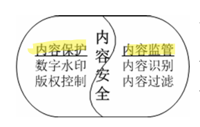

## 内容安全 数字版权  :blueberries:【重要·常考】

信息内容安全包含两大方向：

- **内容保护**：对**合法**的信息内容加以安全保护
- **内容监管**：对**非法**的信息内容实施监管

---

### 版权保护技术

- **数据锁定**
- **隐匿标记**
- **数字水印**
- **数字版权管理（DRM）**

---

### 内容监管

- **静态信息**：如网页等静态内容
- **动态信息**：如邮件等动态交互内容

---

### 信息加密与信息隐藏

- **信息加密**：利用对称密钥密码或公开密钥密码将明文转换为密文，保护信息的**内容**。
- **信息隐藏**：将秘密信息嵌入到表面无害的宿主信息中，使攻击者无法直观判断监视的信息是否包含秘密信息。