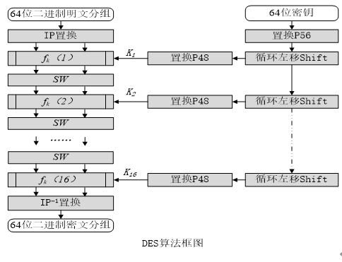
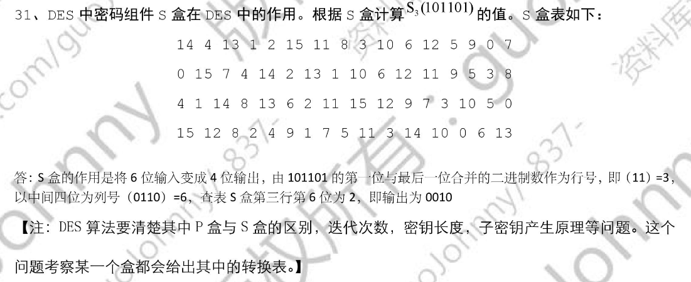

## DES 对称加密标准【重要·常考】
DES 是一种对二进制数据进行**分组加密**的算法，它以**64 位为分组对数据（明文）**，DES 的**密钥也是长度为 64 位**的二进制数，其中**有效位数为 56** 位（因为**每个字节的第 8 位**都用作**奇偶校验**），加密算法与解密算法很相似，唯一的区别在于子密钥的使用顺序正好相反。

DES 的整个密码体制是公开的，系统的**安全性**完全依赖于**密钥的保密性**。

### 核心原理
核心：DES 通过 **S 盒**（唯一的非线性部件），使得密文与明文/密钥之间的关系高度非线性，迭代变化提供雪崩效应让明文变动导致密文大变动（安全性实现主要依赖 S 盒实现非线性替换，然后再送入 P 盒做线性的置换）。

## DES 算法结构

DES 的算法的过程是在一个初始置换 IP 后，**明文组被分成左半部分和右半部分**，输入到复合函数 fk 中，**重复 16 轮迭代变换**，将数据与每次的密钥结合起来。16 轮后，左，右两部分在连接起来，经过一个初始逆置换 IP⁻¹ 算法结束。

在密钥的使用上，将 64 位密钥中的 56 位有效位经过循环位移和置换产生 16 个 48 位子密钥，用于 16 轮复合函数 fk 的变换。
 Shift 左移:56->48
 S 盒:48->32
 P 盒:32->48bit

## S-DES/DES 涉及函数
 密钥相关：**置换函数**（P10 P8/P56 P48）、**循环移位函数 shift**

 加密相关：**初始置换 IP**  **复合函数 f()**  **转换函数 SW** (这个是转换不是 s 盒)  **末尾置换 IP⁻¹**

**解密算法**和加密算法的唯一区别：**子密钥使用顺序相反**

明文 IP 置换输入 复合函数 fk（k1~16 的所用子密钥不同）的结果经过交换函数 SW 后再次输入到 复合函数 fk 中 多轮重复后 IP⁻¹ 形成密文

### 规格对应
**SDES/DES: 10/64 位密钥 8/48 位子密钥 8/64 位明密文**

## 加密模式
### 分组密码（块加密）
明文按**固定长度分组**，**相同密钥**下加密/解密**逐组进行**。

### 序列密码（流加密）
输入**种子密钥**，**密钥序列产生算法**产生**密钥流**，与**明文流逐位运算**得出密文，**强度**源于密钥序列的**随机**和**不可预测性**，加密解密双方要保持密钥序列精准同步

!!! Warning "Tips"
    与伪随机数发生器和其他物理随机数发生器不同，量子随机数发生器利用量子力学内禀的概率性（如单光子分束、真空涨落等不可逆且无法被预测的测量结果）作为熵源，直接输出服从玻恩统计分布的纯随机比特。量子随机数发生器（QRNG）正是为了给流加密提供“一次一密”式、信息论安全的密钥流而生的

## 四种工作模式对比

|  | ECB | CBC | CFB | OFB |
| :--- | :--- | :--- | :--- | :--- |
| 加密规则 | 同密钥加密不同明文块 | 后一个**明文与前一个密文块异或**后同一个密钥加密 先与上一个向量异或后加密 | 初始化向量进入**移位寄存器**，输出结果取出**S 位加密后与明文异或**，产生的密文移入**移位寄存器** 先加密寄存器输出后异或 适用分组或流密码 | 同 CFB，就是加密后的的 S 位和明文异或前就送回移位寄存器 先加密寄存器输出后异或 适用分组或流密码 |
| 隐藏明文模式 | 不能隐藏明文模式 | **能隐藏明文模式** | **能隐藏明文模式** | **能隐藏明文模式** |
| 并行性 | **可以并行** | 没有已知并行实现 | 没有已知并行实现 | 没有已知并行实现 |
| 明文密文对应 | **同明文同密文**（不能隐藏明文模式） | 同明文不同密文 | 同明文不同密文 | 同明文不同密文 |
| 错误传播 | **密文块损坏只对应明文损坏** | 可涉及两个明文块无法恢复 | 可涉及两个明文块无法恢复 | **密文块损坏只对应明文损坏** |
| 所需参数 | 共享密钥 | 共享密钥**+**初始向量 | 共享密钥**+**初始向量 | 共享密钥**+**初始向量 |

!!! Warning "Tips"
    注意，CBC CFB 若在加密过程中某块明文错误对于解密只是解出来的这块明文不对后续没问题；若在传输过程中密文出错则导致此后每次解密异或出来的结果全部出错
    CBC 应用于 ESP 加密、CBC-MAC 消息认证码

## DES 特点与缺点
缺点：密钥长度仅 56bit，短，易受**穷举攻击**

特点：加密**快**、密文不可逆，密钥不可泄露

!!! Warning "Tips"
    56 不算长，通常隔壁非对称加密的密钥为 512、1024、2048 位

三重 DES 级联分组密码，不同密钥连续多次对明文加密，扩展密钥长度

AES 安全性≥三重 DES，分组长度 128bit

## S 盒

!!! Warning "Tips"
    S 盒 