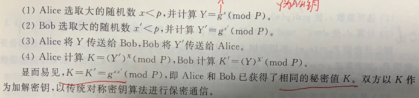

## DH Diffie-Hellman 对称密钥交换协议【重要·常考】

### 对称密钥基础
对称密钥原理：**加密解密密钥相同、解密是加密的逆运算**
特点：开信道传输密钥，加密快

### DH 协议核心
- 数学基础：**离散对数问题**
- 应用：**HTTPS 的 TLS**、**IPSEC 的 IKE**
- 可能受到：**中间人攻击**（解决方案：数字签名，避免密钥交换时中间人伪造，类似 IPSEC、SSL 密钥交换过程的验证载荷散列/认证者）
- **P 是一个大素数**

### DH 密钥交换步骤

1. Alice 选取大的随机数 \(x < p\)，并计算 \(Y = g^x \pmod{P}\)
2. Bob 选取大的随机数 \(x' < p\)，并计算 \(Y' = g^{x'} \pmod{P}\)
3. Alice 将 \(Y\) 传送给 Bob，Bob 将 \(Y'\) 传送给 Alice
4. Alice 计算 \(K = (Y')^x \pmod{P}\)，Bob 计算 \(K' = (Y)^{x'} \pmod{P}\)

显而易见，\(K = K' = g^{x x'} \pmod{P}\)，即 Alice 和 Bob 已获得了相同的秘密值 \(K\)。双方以 \(K\) 作为加解密密钥，以传统对称密钥算法进行保密通信。

!!! Warning "Tips"
    - 例题参考：[CSDN](https://blog.csdn.net/feixs1/article/details/109667521)
    - \(g\) → generator（生成元）
    - \(P\) → prime modulus（素模数）