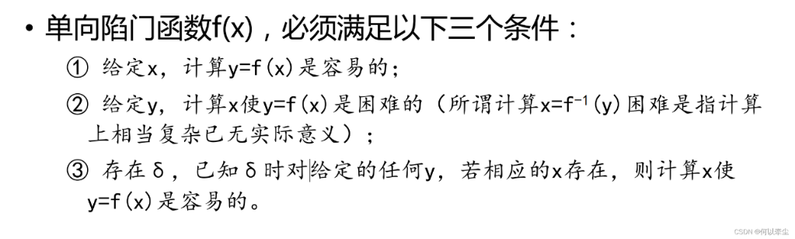

## RSA 公钥密码 单向性 陷门性 单向陷门函数  :blueberries:【重要·常考】

### RSA 密钥生成步骤
选择两个互异的素数 p 和 q，计算 n=pq, φ(n)=(p-1)(q-1)。

选择整数 e，使 gcd(φ(n),e)=1, 且 1<e<φ(n)。

计算 d，使 d=e⁻¹mod φ(n), 即 d 为模 φ(n) 下 e 的乘法逆元。（掌握辗转相除法求模的逆元 [知乎](https://zhuanlan.zhihu.com/p/608777570)）

!!! Warning "Tips"
    同理，计算 e 就是 e=d⁻¹mod φ(n) 或 e*d mod φ(n) =1
    m → message（明文）
    c → ciphertext（密文）
    e → public exponent / encryption key（公钥指数/加密钥）
    d → private exponent / decryption key（私钥指数/解密钥）

则公钥 Pk={e,n}，私钥 Sk={d,n,p,q}。当明文是 m，密文为 c，加密时使用公开密钥 Pk，加密算法 c=m^e mod n; 解密时使用私用密钥 Sk，m=c^d mod n。

故 **e 为加密指数，d 为解密指数**。

### RSA 理论基础
RSA 的理论基础是**单向陷门函数**，数学基础是**欧拉定理**和**大整数因子分解**问题。

欧拉函数 φ(n)：小于 n 且与 n 互素的数的个数。若 n=pq，则 φ(n)=(p-1)(q-1)。

大整数分解：给定 N=pq，分解 N 极难

!!! Warning "Tips"
    隔壁 DH 是**离散对数问题**，离散对数求解困难
    RSA/DH 例题在《攻防原理与技术》[答案](https://github.com/mcxiaoxiao/wangan.online/blob/main/%E4%B9%A0%E9%A2%98/%E3%80%8A%E7%BD%91%E7%BB%9C%E6%94%BB%E9%98%B2%E5%8E%9F%E7%90%86%E4%B8%8E%E6%8A%80%E6%9C%AF%E3%80%8B%EF%BC%88%E7%AC%AC3%E7%89%88%EF%BC%89%E8%AF%BE%E5%90%8E%E4%B9%A0%E9%A2%98%E5%8F%82%E8%80%83%E7%AD%94%E6%A1%88.pdf) P65、《信息安全导论》P47

如果函数 f(x) 被称为单向陷门函数，必须满足以下三个条件。

**单向：**给定 x，计算 y=f(x) 是容易的，给定 y，计算 x 使 y=f(x) 不可行

**陷门：**存在 σ，已知 σ 时对给定的任何 y，若相应的 x 存在，则计算 x 使 y=f(x) 是很容易的。

!!! Warning "Tips"
    所谓计算 x=f⁻¹(y) 困难是指计算上相当复杂，已经无实际意义

其安全依赖于**私钥的保密**