# 关系模型

## 🧱 数据库系统基础

🎯 __题型__：

1. __DBMS 功能：__
    + __从用户角度看__
    + __从系统角度看__
2. __DBS 语言__

---
🏗 **数据库系统的构成：** DB数据库、DBMS数据库管理系统、DB应用程序、DBA数据库管理员、计算机/网络基本系统。

👩​ **用户角度看 DBMS：** 通过 **数据库语言** 提供数据库 **定义、操纵、控制** 功能的系统，同时提供一系列 **程序** 对数据库维护。

⛓ **系统角度看 DBMS：** 功能不仅包含 **查询实现、查询优化、事务处理、数据存储、索引** 功能，还包括 **其他功能**。​

。
2. 数据库的发展：**第一代：基于网状模型、层次模型的DBS**，**第二代：关系数据库**，第三代：对象关系DB、面向对象DB。关系数据库对第一代数据库的改进有：
   - 形成了较为完善的数据库理论；
   - 支持记录集合的操作。
3. 数据库系统的数据独立性是指 **逻辑数据独立性** 和 **物理数据独立性**：不会因为 **系统数据存储结构** 与数据 **逻辑结构** 的变化而影响应用程序。

4. 几个概念的抽象关系 **数据模型>模式>数据**
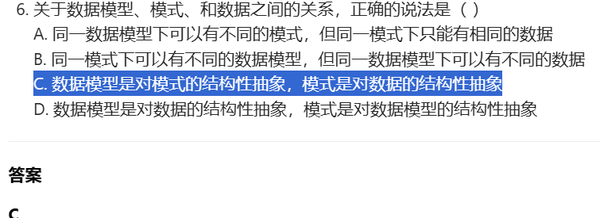

5. <mark>哪个独立就是哪个数据变了尽可能不影响到外模式</mark>
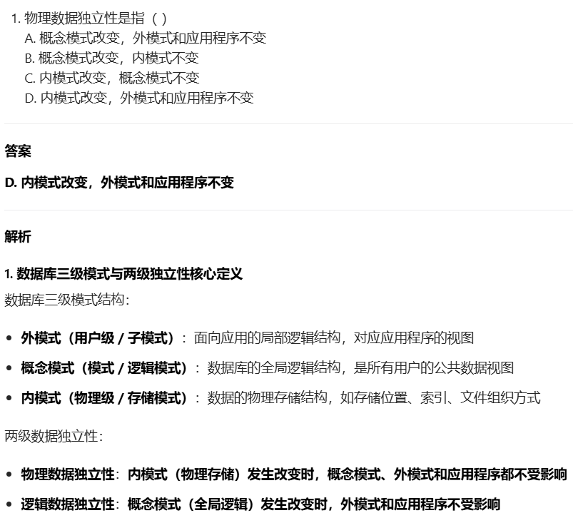</mark>

6. 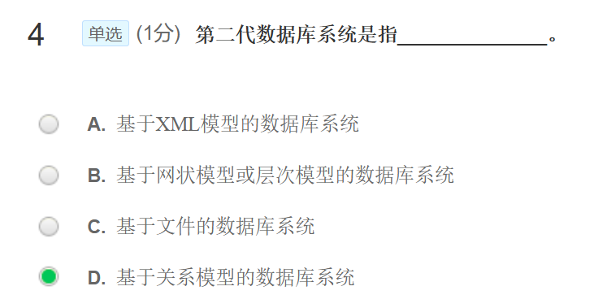

---

## 🧮关系模型

🎯 __题型__：

1. __三级模式/两级映像(各个模式的名字/别名)__
2. __数据独立性__
3. __数据库系统的演变：__
    + 层次/网状数据库系统
    + 关系数据库系统
    + 面向对象数据库系统
4. __候选键、外键的概念。__
5. __关系模式/关系/关系模型概念。__
6. __完整性规则。__

---
💎 **重要概念**

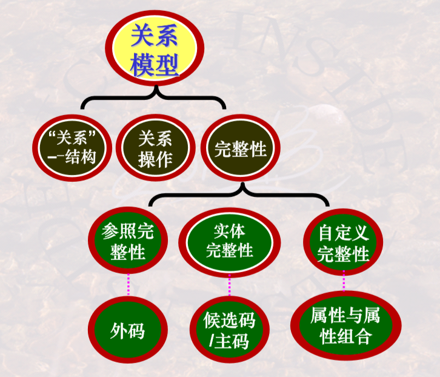

💎 **关系** 中的 **重要概念**：

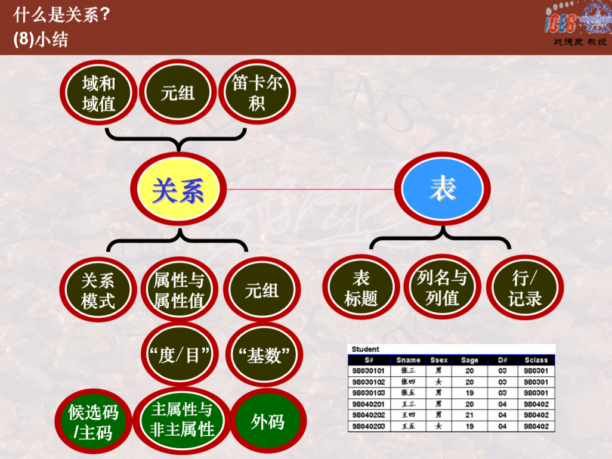

🎨 **关系模型的组成部分：** 关系模型就是 **处理表** 的，有三部分组成：

- 📅 **表** ——描述数据的基本结构形式。
- 🧮 **关系运算** —— 描述表与表之间的各种可能操作。
- 🔗 **完整性约束** ——描述表与表之间操作要遵守的约束。

💎 **重要概念**

- **域** 的概念：描述 **一组相同类型值的集合**，集合中元素个数（行数）叫做域的 **基数**。

- **笛卡尔积** 的概念：描述几个 **元组的所有可能组合**。**笛卡尔积的基数(元组个数)=各个域的基数的乘积。**

- **关系** 的概念：**笛卡尔积的** 一个具有某种意义的 **子集**。可用 <mark>R(A1:D1, A2:D2, …, An:Dn)</mark> 表示，这种描述又称为 **关系模式** 或 **表标题**，其中 Ai 表示 **属性值**，Di 表示对应的 **域(列名)**，n 是关系的 **度** 或 **目**（列数）。**关系模式和关系的区分：**关系模式是关系的结构，关系是关系模式在 **某一时刻的值**，随时间变化。（表不变，但是表中的数据随时变化。）
- **码**，也称 **键**，它的核心使命是 唯一标识 表中的一行记录
- **候选码**（候选键）：能 **唯一标识一个元组** 的 **属性组**。
- **主码**（主键）：有多个候选码时，从中选出一个称为主码。主码是一个码但是码可以是含有多个属性的属性组。
- **主属性**：属于任何一个候选码的属性叫做主属性。
- **外码**（外键）：关系 R 中的一个属性组，如果它不是 R 的候选码，在另一个关系 S 中却是候选码，则称该属性组是 R 的外码。两个关系通常通过外码相关联。

✨ **关系的特性：**

- 关系的任意两个元组不能完全相同（不能有重复行）。
- 行、列的顺序无关紧要，可以任意交换
- 属性不可再分性（**关系第一范式**）。
- 关系的 **每个属性** 都必须是 **域** 的一个元素，不能是 **集合** 或 **元组**。

🔗 **完整性：**

- 🔑 **实体完整性：** 实体通过主码来唯一标识，所以 **主码不能为空**。
- 🔐 **参照完整性：** 外码的值要和相应 **主码对应** 或为 **空**。
- 👨‍🔧 **用户自定义完整性**。

实体完整性、参照完整性，不用程序员自己写判断、写代码，数据库（DBMS）自己会帮你检查、自动挡住错误数据。

> 看某个元组是否可以归入某个关系，要看是否满足这三个完整性。

---

## 🔢 关系代数

🎯 __题型__：

1. __五种基本运算：并、差、选择、投影、乘积。__
2. __选择、投影运算。__
3. __自然连接、θ-连接。__
4. __笛卡尔积。__

---
📝 **主要内容** 

交运算 Intersection INTERSECT ∩
并运算 Union UNION ∪

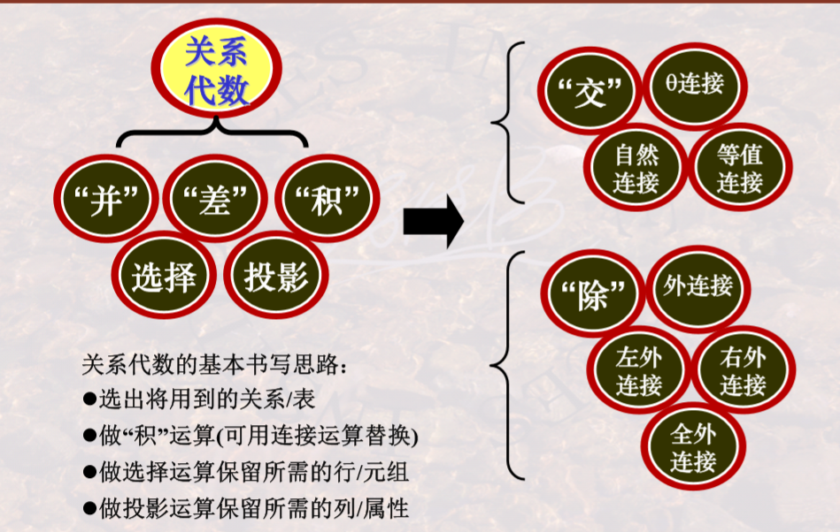

🧩 **并相容性：**并、交、差等操作需要两个关系满足并相容性——**属性数相同**，且对应位置 **属性的域相同**。(并非任意两个关系都能运算)

🎥 **投影和选择：** **投影(πA(R))** 是从关系中选出指定的(A) **列**，**选择(σCon(R))** 是选出符合条件的(Con) **行**。

🎫 **θ-连接**：从两个关系的 **笛卡尔积中选取** 符合指定条件的元组组成，条件写作 <mark>A θ B</mark>，表示 R 中属性 A 和 S 中属性 B 满足 θ 关系。当 θ 为等号时，叫做 **等值连接**。

🧬 **自然连接：** 也是笛卡尔积的子集，由其中 **相同属性组上值相等的元组** 构成。

👇 **关系运算表达式** 举例：

- 查询学习 **课程号** 为002的学生 **学号和成绩** ：<mark>πS#, Score(σC#=“002”(SC))</mark>
- 查询学习 **课程号** 为001的学生 **学号、姓名**：<mark>πS#, Sname(σC#=“001”(Student ▷◁SC)</mark>，或者 <mark>πS#,Sname(σC#=“001” ^ Student.S#=SC.S#(Student x SC))</mark>

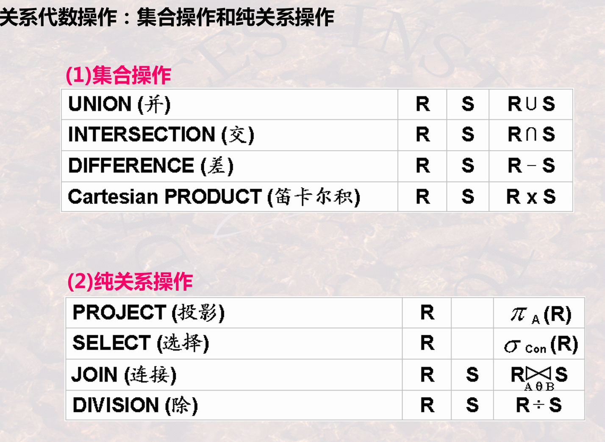
🔔 **关系代数表达式书写思路：**

1. 是否涉及多个表？如果不是则可直接用并、差、交、选择、投影，只需注意 **条件** 的书写。

2. 涉及多个表，则检查：✅ 能否使用 **自然连接** ✅ 能否使用 **θ连接** ✅ 都不能则使用 **笛卡尔积**，注意条件书写。

3. 连接之后，可以继续使用 **选择、投影** 运算。

➗ **除操作**： 给定关系 **R(A1,...,An)** 和 **S(B1,...,Bm)**，R ÷ S 的结果为关系T，则 T 的 **属性集为{A1,...,An} - {B1,...,Bm}**，**元组集满足条件：每一个元组与 S(除数) 中每一个元组组成的新元组都是 R(被除数) 中的一个元组。**

🖐 **除操作例子**：

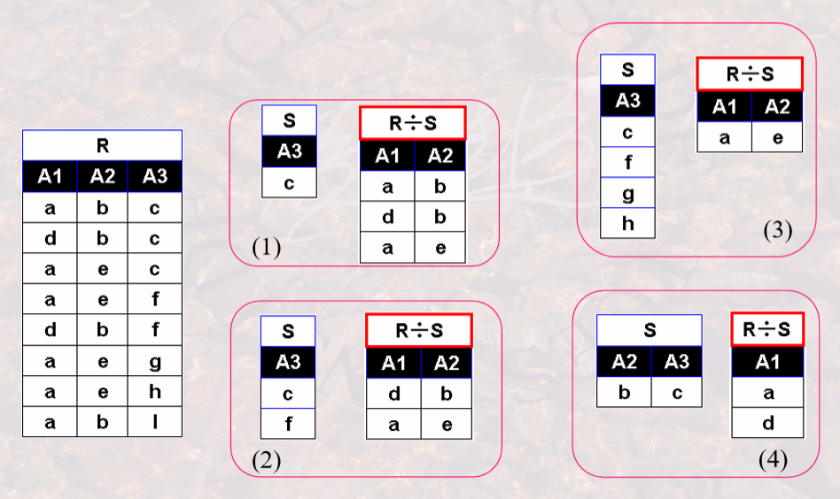
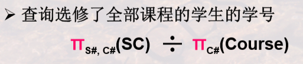
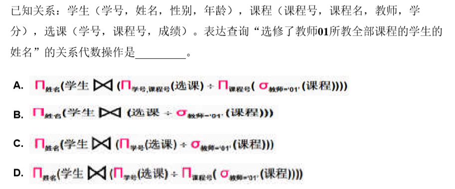
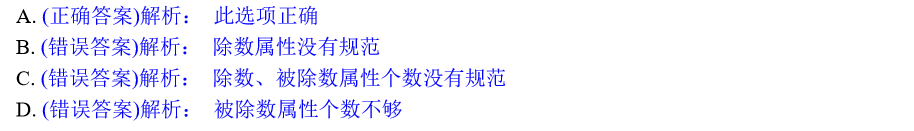

🔗 **外连接**：两个关系 R 和 S 进行连接时，如果 **R 中的元组在 S 中找不到匹配的元组**，这时为了避免该元组信息丢失，将该元组和 **S中假定存在的全为空值的元组相连接**，这种连接叫做外连接。**外连接=自然连接(或 θ-连接)+失配的元组。**外连接有三种形式：

- 左外连接：自然连接(或 θ-连接)+左侧表中失配的元组。
- 右外连接：自然连接(或 θ-连接)+右侧表中失配的元组。
- 全外连接：自然连接(或 θ-连接)+两侧表中失配的元组。

- <mark>大多数数据库系统中，OUTER JOIN 关键字必须与 LEFT、RIGHT、FULL 明确搭配使用，单独写 OUTER JOIN 语法上是错误的或不完整的。</mark>

- <mark>自然连接</mark> ➜ 默认 内连接只保留两边都能匹配上的元组，丢弃所有失配元组。

📑 **习题：**

1. 五种基本运算：**并、差、选择、投影、乘积**。
2. 多个关系的 **笛卡尔积** 的运算结果也是一个关系，其 **属性个数** 为所有关系属性个数的和。
3. 自然连接要求 R 和 S 有 **共有属性**。
4. **θ-连接不要求将公共属性合并**，而自然连接需要。
5. πS#, Sname(Student) - πS#, Sname(σC#=“001”(**Student x C**)) 结果为空，因为乘积运算结果会包含所有学生。

---

## 🧮 关系演算

🎯 __题型：__

1. __元组演算。__
2. __域演算。__
3. __关系演算安全性。__

---
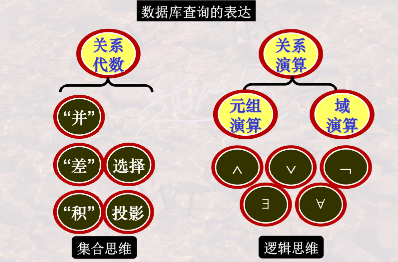

### 元组演算 {t|P(t)}

**与或非例子**：

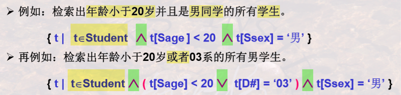

🧭 解释：在第一个例子中，**t∈Student** 表示要 **检索的范围**，后面 ^ 符号链接的两个句子表示 **要满足的条件**。

🚥 注意：**优先级顺序**：θ > 存在 > 任意 > 非 > 与 > 或。 

⭐ **存在和任意** 量词：

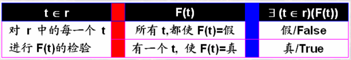
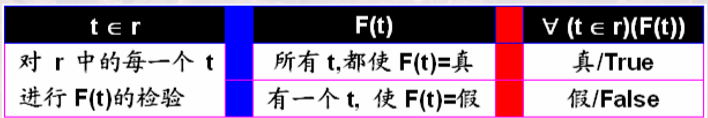
例子：

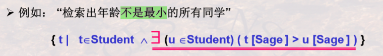
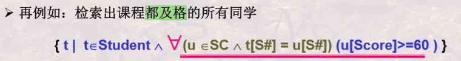
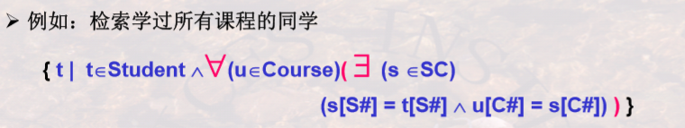
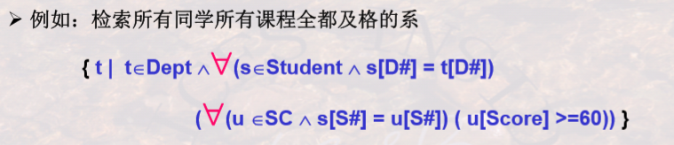

🧭 解释：在第一个例子中，划线子句表示 **在 Student 表中存在一个元组 u，满足条件 t[Sage]>u[Sage]**。和之前一样，u∈Student 还是表示检索范围，从中选出符合条件的元组。（**遍历指定范围的每一个元组**）

### 域演算 {<x1,...,xn>|P(x1,...,xn)}

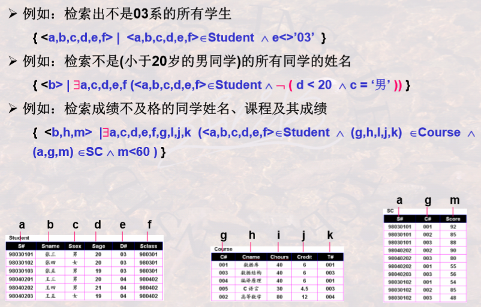

⚖ __域演算 & 元组演算的比较：__

- 元组演算——以元组为变量和基本单位，先找到元组，然后根据某个元组分量进行谓词判断；
- 域演算——以域为变量和基本单位，先有域变量，再根据这些域变量组成的元组进行谓词判断。
- 运算符(五个)相同，只是变量形式不同。
- 可以等价互换。

### QBE 语言和关系演算的安全性

__QBE 操作框架__ 由四部分组成：
1. 关系名区
2. 属性名区
3. 操作命令区
4. 查询条件区

__关系演算安全性__

- 关系代数是一种集合运算，集合是有限的，所以安全。
- 关系演算不一定安全，所以需要保证任何公式都在某个有限范围内操作。

📑 **习题：**
1. __关系运算__ 包括三种：关系代数、关系元组演算、关系域演算。
2. __非过程性__：域演算 > 元组演算 > 关系代数。(过程性，就是语言需要人为指定查询执行的步骤和运算顺序，关心怎么做得出结果而非结果要什么)
3. __运算符优先级__：与 > 或。
4. 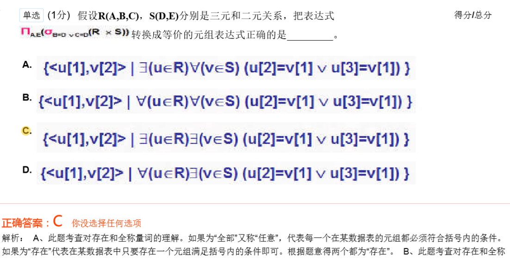
5. 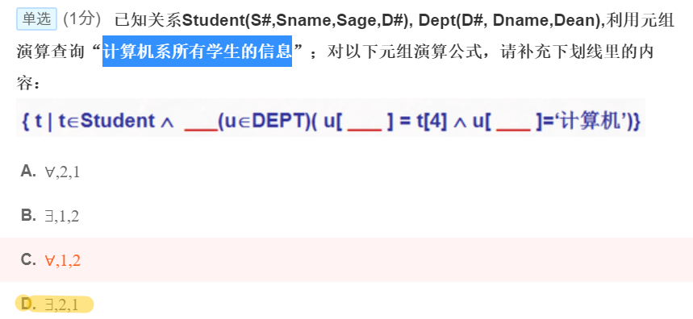
    
    正确的选项是 B. ∃,1,2，只要存在一个叫 “计算机” 的院系，且该学生属于这个院系，就符合要求

6. 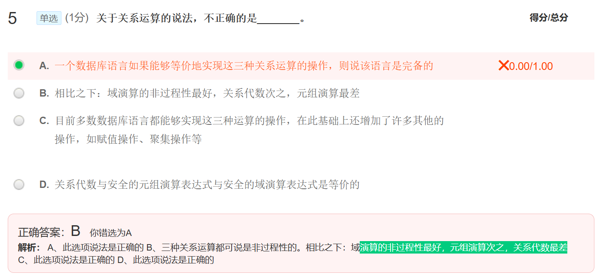

    过程性：域演算（以域变量为基本处理单位，不一定安全） > 元组演算（以元组为基本处理单位，不一定安全） > 关系代数（集合运算，安全）
    分别举例：
    域演算：{S#|S#∈Student ∧ Sname∈{“张三”,”李四”}}
    元组演算：{t|t∈Student ∧ t[Sname]=“张三” ∨ t[Sname]=“李四”}
    关系代数：πS#(σSname=“张三” ∨ Sname=“李四”(Student))

7. 
- 安全的元组演算公式和安全的域演算公式是等价的，可以相互转换。
- 关系代数运算和关系演算在表达能力上是**等价**的，并非“互补”，不存在彼此不能解决的问题。
- 关系代数是基于集合的运算，天然是安全的；而关系演算不一定安全，需要额外约束。
- 关系演算分为元组演算（以元组为基本处理单位）和域演算（以域变量为基本处理单位），并非以属性为基本单位（这是因为属性是关系的基本组成部分，而元组和域变量是更高级的概念）。

8. 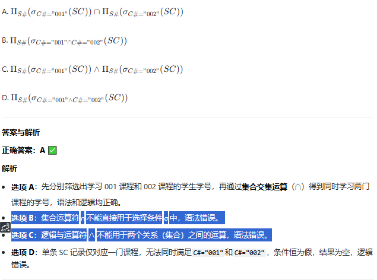

9. 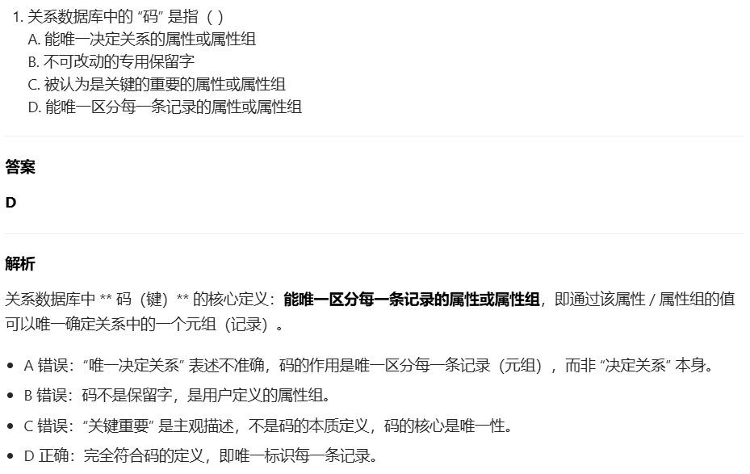

10. 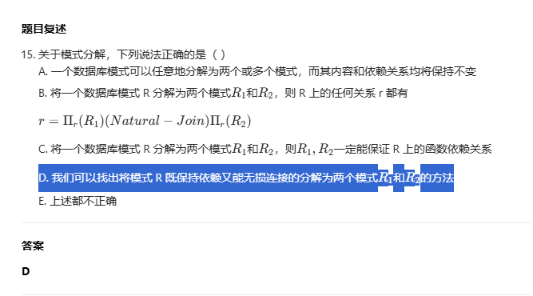

11. 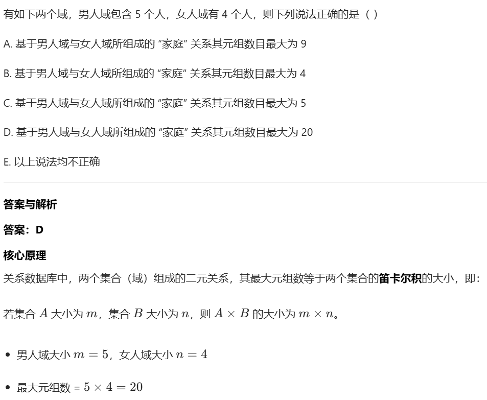
（不用考虑LGBTQ，只是笛卡尔积）

12. 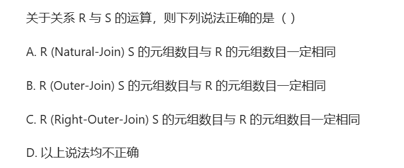D

13. 关系数量不是元组数量 
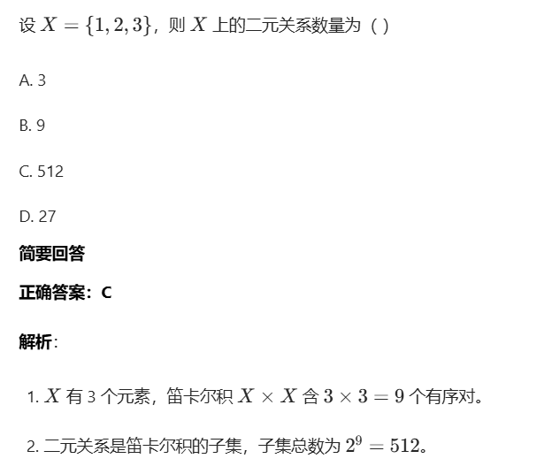

14. 主码可能是一个或多个元素组成的组，主码只能从候选里挑有一个。
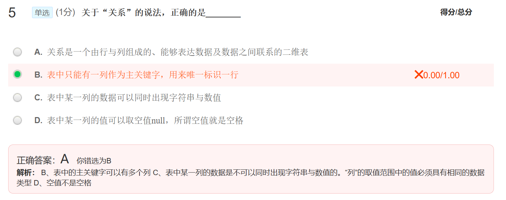

15. 外键是可以为 NULL 的，是其它关系的候选键，可以是当前关系中的主属性或非主属性
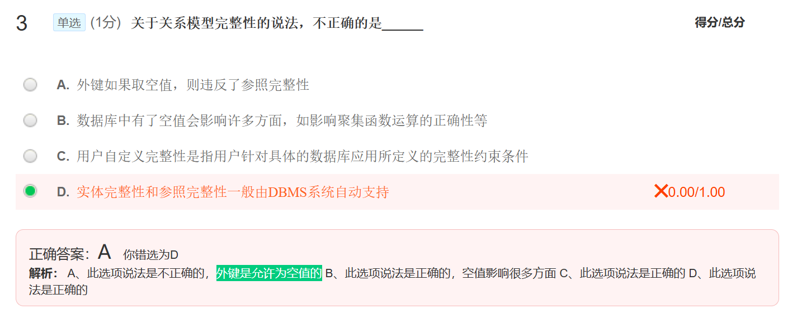

15. QBE组成：关系名、属性名、操作命令、查询条件