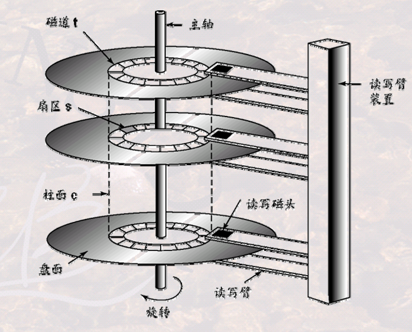
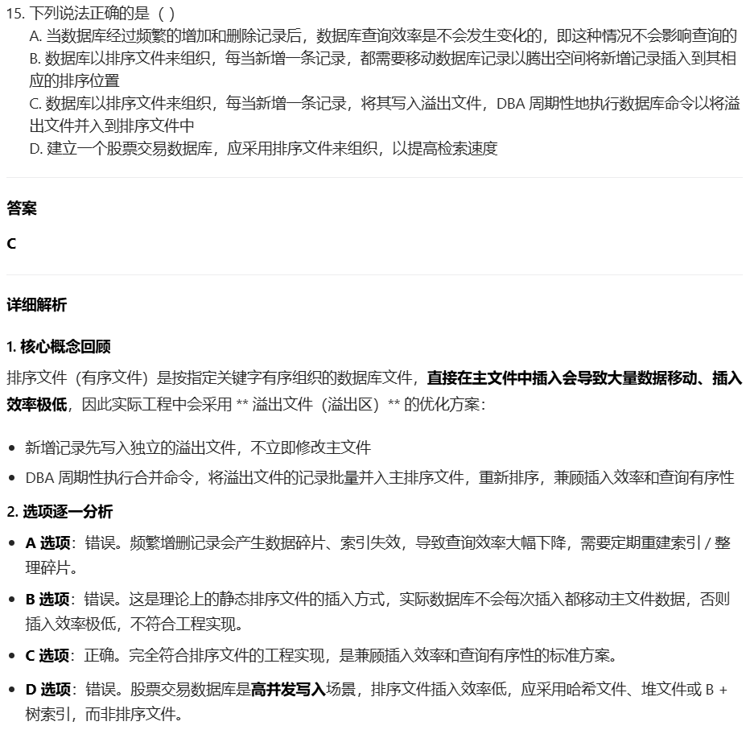
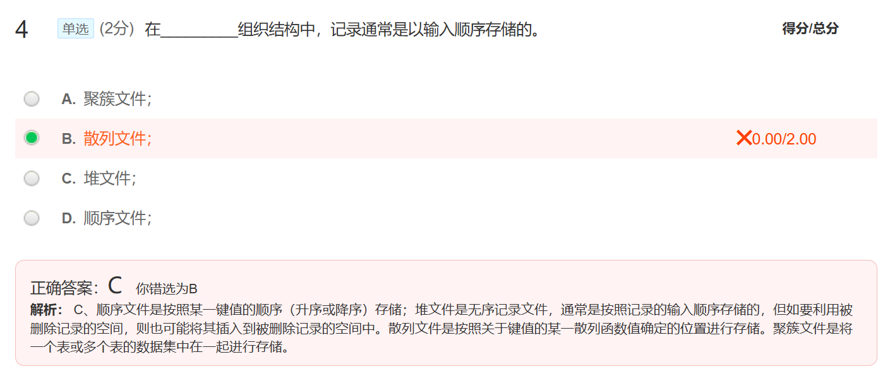

# 数据库物理存储

[TOC]

---

**磁盘数据读写时间**：寻道时间+旋转时间+传输时间。

- 最小时间：忽略寻道时间和旋转时间，只看传输时间。
- 最大时间：最大寻道时间(磁头经过所有磁道)+最大旋转时间(旋转一周)+传输时间。
- 平均时间：移动 1/3 磁道的时间 + 旋转半周的时间 + 传输时间。

**降低寻道/旋转延迟的方法：** 同一磁道连续块存储；同一柱面不同磁道并行块存储；不同磁盘并行块存储。

**提高磁盘读写效率和存储可靠性的方法**：RAID 技术：实现并行 + 可靠，所用技术：

- 比特级拆分：一个字节被拆成八个比特位，每个位存储于不同磁盘。
- 块级拆分：一个文件分成多个块，每个块存储于不同磁盘。
- 扇区/块读写校验。
- 磁盘间读写校验。

**文件组织方法：**

- **无序记录文件**（堆文件）：记录无序存储于任意位置，**更新效率高，检索效率低**。频繁增删记录时会造成空间浪费，所以需要 **重组数据库**——通过移走被删除的记录使有效记录连续存放，是对物理存储的调整（物理顺序）。
- **有序记录文件**（顺序文件）：按某属性值的顺序插入新纪录，按排序字段进行检索时，**检索效率高。更新效率低**。增加一条记录是将其 <mark>**直接写入溢出文件中**</mark>，而不是 直接写入排序文件。也需要周期性 **重组数据库**——将溢出的文件合并到主文件中，并恢复主文件中的记录顺序，是对物理存储的调整（物理顺序）。
- **散列文件**：按属性值根据散列函数来计算存放位置，**检索效率和更新效率都有提高。**散列文件组织具有将一批记录**均匀存储**在n个数据块中的特性
- **聚簇文件**：聚簇是指将 **具有相同或相似属性值的记录** 存放于连续的磁盘簇块中；多表聚簇是指将 **若干个相关的表** 存放到一个文件中，提高多表查询速度。聚簇文件组织具有将 **相关记录** 物理上 **存储在一起** 的特性，**提高检索效率**。

📑 **习题**：

1. **存储表数据为文件**： DBMS既可以将 **若干个“表”的数据存储在一个文件中**，又可以将 **一个“表”的数据存储在多个文件中**。

2. 相同柱面不同盘面的扇区可以一次性读写。

3. 顺序文件的检索效率高；堆文件的更新效率极高，但检索效率极低。

|     特性    |   **堆文件** (Heap)  |   **顺序文件** (Sequential)  |       **哈希文件** (Hash)      |
| :-------: | :------------------: | :-------------------------: | :---------------------------: |
|  **物理顺序** |      无序，按插入顺序堆积      |           按主键有序排列           |           按哈希函数散列存储           |
|  **插入效率** | $O(1)$ 极高 直接追加到末尾 |   $O(n)$ 低 需保持有序，移动大量数据  |    $O(1)$ 平均 计算哈希地址直接存放    |
|  **点查效率** |   $O(n)$ 必须全表扫描   |     $O(\log n)$ 二分查找     | $O(1)$ 平均 哈希定位（冲突时+$O(k)$） |

4. **数据库重组** 是指对 **物理存储** 的调整。

5. “一次磁盘操作可读写一个磁道的所有信息”不正确，一个磁道的所有扇区不能一次性读写出来，只能顺序读写每个扇区。（正确说法应该是：**一次磁盘操作可读写多个盘面上相同磁道位置的扇区，即一次性读写多个扇区；** 或者 **一次磁盘操作读写一个盘面相同磁道上顺序读取不同扇区**，这是因为虽然磁盘有多个盘片（Platter），每个盘片表面都有独立的磁头（Head），但所有磁头都固定在同一根磁头臂（Actuator Arm）上，磁盘的一次I/O操作严格受限于一个柱面（Cylinder）。跨磁道访问必须通过多次独立的I/O操作完成，每次都要付出寻道时间的代价。）

|             场景            |   能否同时读写  | 原因           | 时间开销                             |
| :-----------------------: | :-------: | :----------- | :------------------------------- |
|  **相同磁道，不同盘面 的扇区** （同一柱面）  |  ✅ **可以** | 磁头已对准，只需旋转磁盘 | 旋转延迟 + 传输时间                      |
|   **相同磁道，同一盘面 不同扇区**   |  ✅ **可以** | 顺序读取，磁头不动    | 少量旋转延迟                           |
| **不同磁道（不同柱面） 无论是否同盘片** | ❌ **不可以** | 磁头臂需移动寻道     | **寻道时间**（Seek Time） 通常 3-10ms |

6. 
7. **散列文件**：按属性值根据散列函数来计算存放位置;堆是按照输入顺序存储；**散列可以实现均匀分布**。
