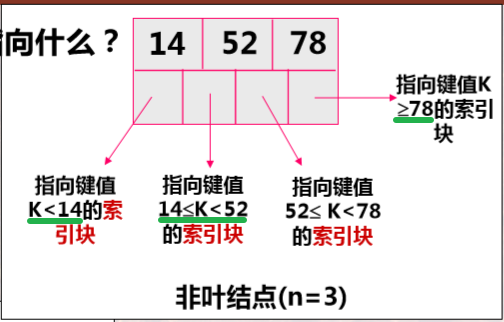
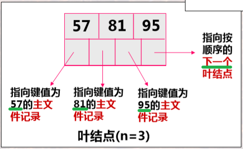
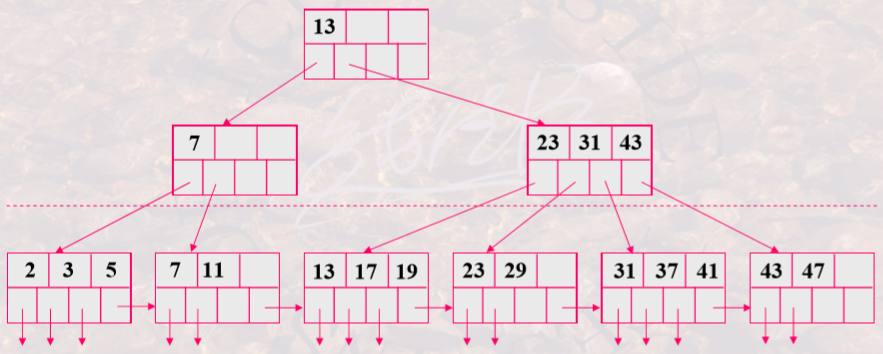
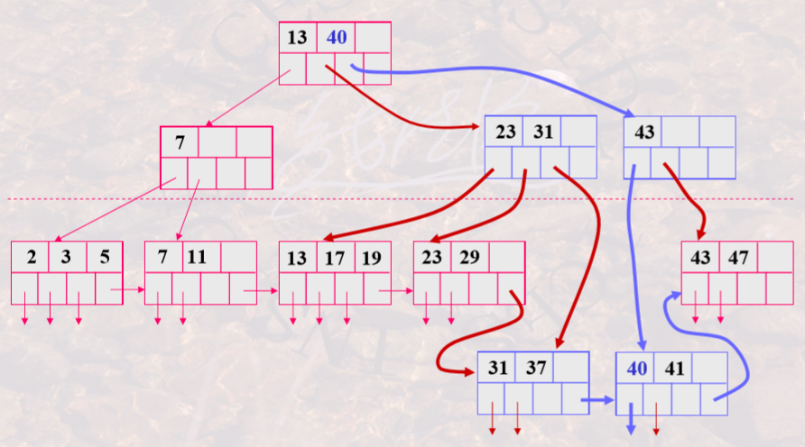
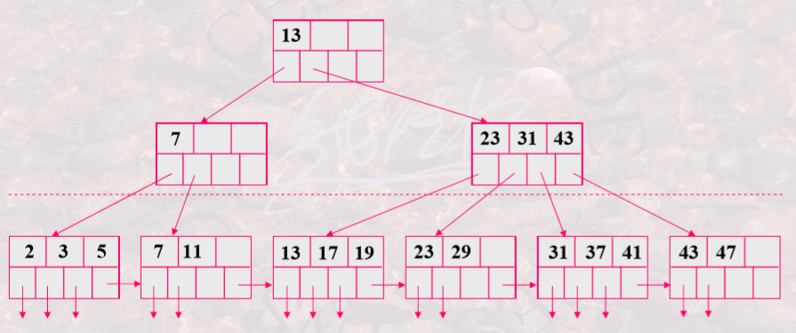
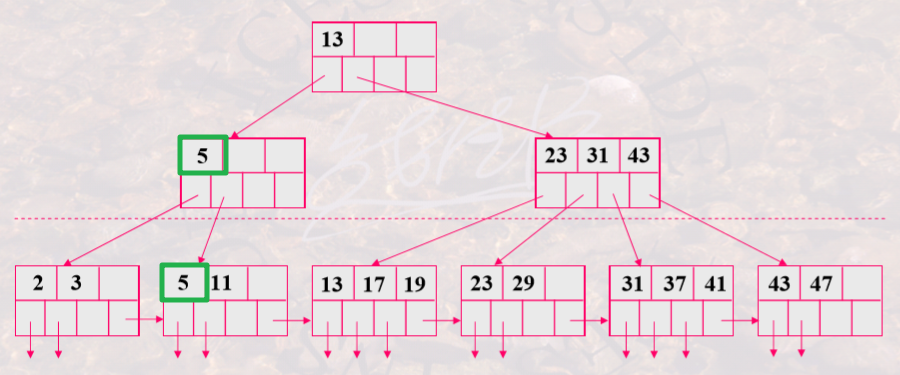
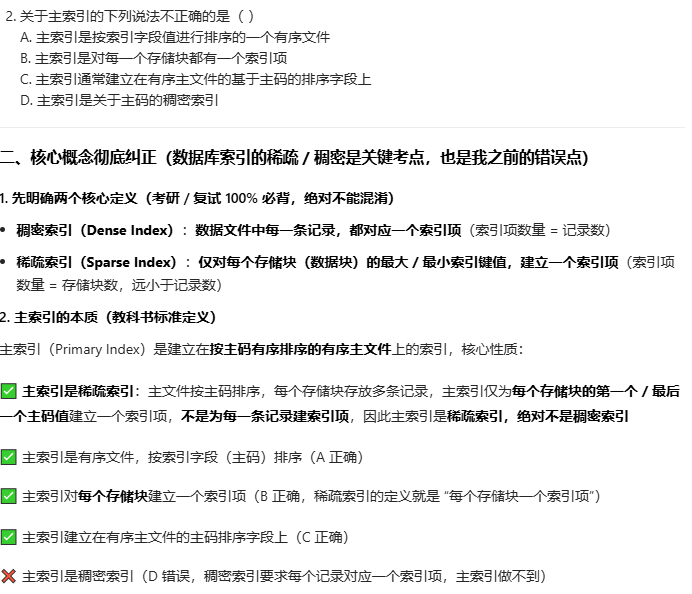
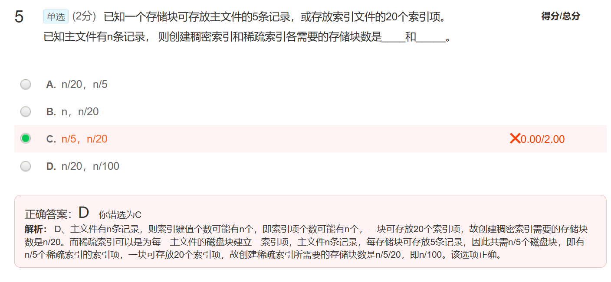
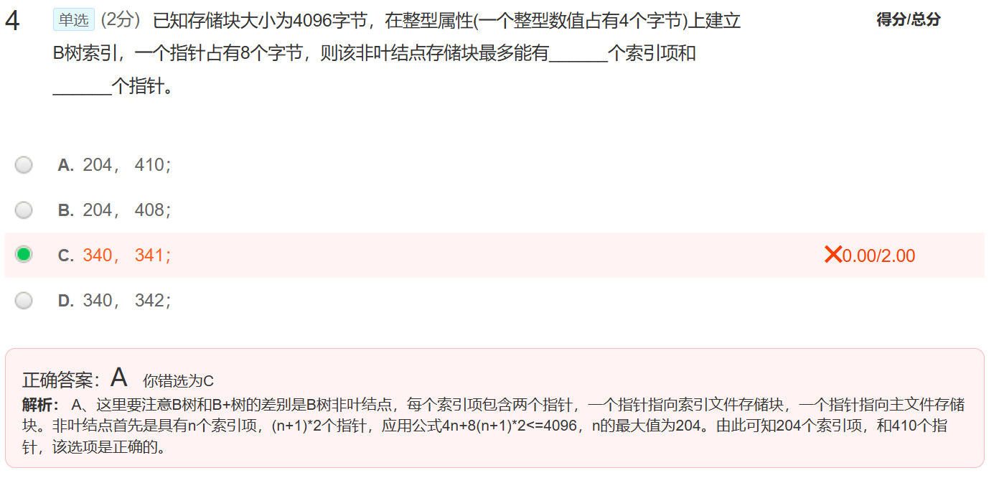
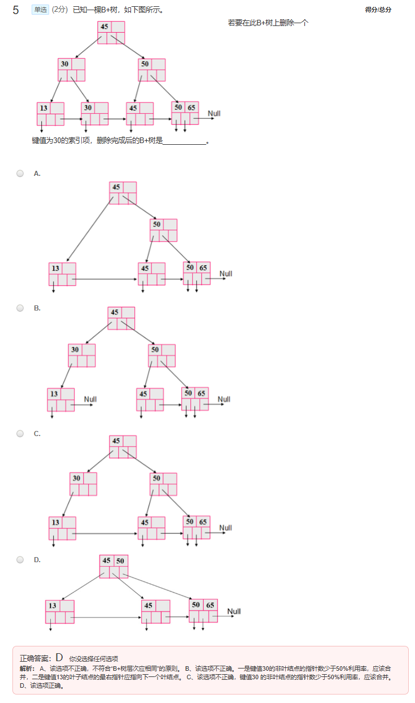

# 数据库索引

---

🎯 **题型**

1. 索引概念
2. 各种类型索引的特点
3. B+树（插入删除操作、容纳数据项和指针数量）

## 📋 概念和类型

**概念：**

- **索引**：定义在存储表 (**主文件**) 的基础上，无须检查所有记录就能快速定位所需记录，由一系列 **索引项** (**索引文件**)组成，索引项又由 **索引字段** (由某一列的值串接而成) 和 **行指针** (包含索引字段的记录的存储位置)组成。

- **索引文件的特点：**
  - 是一种 **辅助存储结构**，存在与否不影响主文件的物理存储。
  - **文件组织** 方式有两种：<mark>排序索引</mark>、<mark>散列索引</mark>。
  - 可针对同一个表的不同属性组合建立 **多个索引**。
  - 更新主文件时要 **同步更新** 索引。

**相关 SQL：**

- 创建：`create index 索引名 on 表名(列名)`
- 删除：`drop index 索引名`

**类型：**

- <mark>稠密 & 稀疏</mark>
  - 稠密索引：主文件中 **每个不一样的记录** 都有索引项。无论基于 **候选键** 还是 **非候选键**，都 **可以不排序** 存储。特别的：**非键属性上的稠密索引**，搜索码的值在稠密索引上存在一个，其在主文件中可能存在多个。 
  - 稀疏索引：只有 **部分记录** 有索引项。主文件按照索引字段的值 **排序存储**。为了查找属性值为 K 的记录，要先找到小于 K 但最接近 K 的那个索引项，从那条记录开始顺序查找。**占用空间少，速度较慢。**
- <mark>主索引 & 辅助索引</mark>
  - **主索引**：是一种 **稀疏索引**，按索引字段(通常为主键)的值有序排列。对 **每一个存储块有一个索引项**，每一存储块的第一条记录叫做锚记录，**索引字段的值就是各个锚记录**。主索引是稀疏索引，仅对存储块的边界主码建索引，不是对所有存储块都建索引项。
  - **辅助索引**：是一种 **稠密索引**，对 **某一个非排序字段上的每一个不同的值有一个索引项**，索引字段就是该字段各个不同值。
  - **比较：**
    - 一个主文件可以有 **一个主索引**，但可以有 **多个辅助索引**。
    - **主索引** 通常基于 **主码/排序码**，**辅助索引** 基于 **其他属性**。
    - 可利用 **主索引重新组织文件数据**，辅助索引不可。
- <mark>聚簇 & 非聚簇</mark>

  - **聚簇索引**：索引中 **临近的记录** 在主文件中也是 **临近存储** 的。通常基于 **聚簇字段**——某一 **排序字段不是主码**，则该字段每个值就不唯一，称该字段为聚簇字段——**对聚簇字段上每一个不同值有一个索引项**。
  - **比较：**
    - 一个主文件只能有 **一个聚簇索引**，但可以有多个 **非聚簇索引**。
    - **主索引通常是聚簇索引**，辅助索引通常是非聚簇索引。

---

## 🎄 B+ 树

**概念**：以树形结构组织的多级索引。

- 一个块中有 **n-1 个索引项和 n 个指针**。
- 非叶结点指向 **索引块**，叶子结点指向主文件的 **数据块**/数据记录。(索引块vs.数据块：索引块包含索引字段值和指针，数据块包含主文件记录)
- **索引字段值** 在叶结点和非叶结点中都出现。
- 叶结点包含所有信息——所有键值的索引。
- 叶结点中的索引字段值 **顺序排列**。

🏹 **叶结点 & 非叶结点的指针指向：**

 

- **非叶结点** 指向另一个 **索引块**，**叶结点** 指向 **主文件记录**。
- 非叶结点 **最左侧指针** 指向所有关键字都 **小于** 当前块最小关键字的下一级索引块；**中间的指针** 指向所有关键字都 **介于(左闭右开)** 当前两个关键字之间的下一级索引块；**最右侧指针** 指向所有关键字都 **大于等于**<mark>(左闭右开)</mark> 当前块最大关键字的下一级索引块。
- **叶结点** 某索引项X的左侧指针，指向键值=X记录所在的主文件存储块；**右侧指针** 指向键值=X+1记录所在的主文件存储块。（<mark>索引块≠主文件存储块</mark>）

⭐ **B+ 树插入新结点：**(增加键 40)

1. 寻找目标 **叶子结点**。
2. 若该结点关键字已满，则 **分成两个结点**，并使原键值和要插入的 **键值均衡放入两个叶结点**。
3. 在父结点中增加索引项，指向分裂开的两个结点。（增加的索引值为分裂之后 **右侧结点的第一个值**）
4. 向上调整。

⭐ **B+ 树删除结点：**（删除键值 7）

1. 在叶结点中找到要删除的键值，删除对应的指针和主文件中对应的记录。
2. 若删除后当前节点关键字太少，则需要 **<mark>合并</mark>**：
   - 若相邻结点的键值够借则借一个，同时更新父结点对应索引值。
   - 若不够借，则合并当前结点和相邻结点，同时更新父结点索引值。
3. 进一步向上调整。

---

📑 **习题**

1. 稠密索引，对于Table中索引字段的 **每一个不同值**，总是有一个索引项。 稀疏索引，只有部分记录有索引项。

2. B+ 树如果发生合并，则不一定增加索引存储块（够借）；但若发生分裂，则一定增加。

3. 结点利用的指针利用率少于 **50%** 时，需要合并该结点。

4. 稀疏 & 稠密：

   - 稀疏索引可能是按索引项 **排序且无冗余** 存储的，一个索引项只出现一次，在主文件中可能存在多个。
   - 稠密索引如果基于 **非键属性**，则属性值可以相同，在索引中只出现一次，主文件中可能有多个。

5. **主索引由 DBMS 自动建立** ，**其他索引可以由用户或 DBA** 建立，但 **索引都是 DBMS 自动维护** 的。<mark>主索引</mark>的索引字段值为块锚的索引字段值，而指针指向其所在的存储块，是<mark>稀疏索引</mark>。

6. DBMS 会依据检索条件确定是否使用索引，而非所有索引都一定被首先使用。例如，当表很小、或查询条件选择性很低（如返回大量数据）、或索引列无统计优势时，优化器可能选择全表扫描而非索引查找。

7. B+ 树的根结点不必满足 指针利用率>=50% 的条件(因为根结点是最高层，合并时不会考虑根结点的指针利用率)。

8. 选择B+树插入或删除后树形的排除方法：

   ✅ 左右 **指针指向** 是否正确；

   ✅ 树的 **层次** 是否正确；

   ✅ 结点 **指针利用率** 是否超过 50%(根结点除外)；

   ✅ **叶结点** 是否 **顺序连接**。

9. 主索引通常确定表的物理顺序。（因为主索引的索引字段值为<mark>块锚</mark>的索引字段值，而指针指向其所在的存储块，稀疏索引）,一个主文件上可以建立多个索引（如多个非聚簇索引），但更新主文件时，所有相关的索引都需要同步更新，以保证数据一致性，并非只更新一个。聚簇索引（Clustered Index） 决定了数据行在磁盘上的物理存储顺序，一个表中只能有一个聚簇索引，即只能有一个索引决定物理存储。

10. 
    - **并非所有查询都更快**：全表扫描类查询（如访问大部分数据）时，索引开销可能更大，速度更慢。
    - **并非总是使用索引**：DBMS 查询优化器会根据代价估算选择执行计划，不一定优先走索引。
    - **主索引**：由 DBMS 自动建立（通常对应主键约束），并在数据增删改时自动维护。
    - **辅助索引**：需 DBA 或用户手动创建，用于优化特定查询；数据变更时由 DBMS 自动维护一致性。
    - **错误认知**：索引并非全部由系统自动管理，非主键索引需要人工规划创建。

11. 

12. 一个索引到的块可以存5个记录

 
 13. <mark>B-Tree和B+Tree区别是B-Tree的叶结点存储记录（n个索引项，2 ×（n+1）个指针），B+Tree的叶结点存储记录的指针（n个索引项，n+1个指针）</mark>
 

 14. 合并可能会调整左右相邻结点的索引项，不一定会减少索引存储块的数目，仅当如下低于50%时，才会合并块。
 