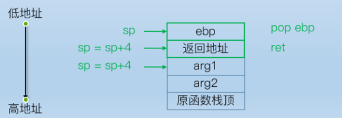
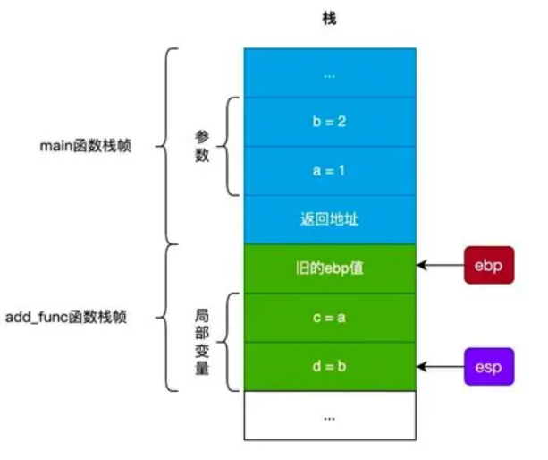

## 堆栈 BSS 注入攻击 ROP 攻击 溢出原理 防护
### 内存布局与段结构  :pear:【重要】
内存布局从高地址到低地址依次为：

- 内存高端
- 环境变量
- **堆栈**：向下生长（向内存低端），向上复制；栈的溢出创造条件
- ↓
- ↑
- **堆**
- **BSS 段**：未初始化全局数据，先声明的在低端
- 数据段：初始化全局/静态数据
- 文本段：只读，不会溢出

---

### 缓冲区溢出概述 :pear:【重要】
向缓冲区输入**超长数据**，覆盖合法数据，**改变程序执行流程**。
可导致系统崩溃或执行非授权指令，从而获取系统特权。

### 溢出攻击模式 :pear:【重要】

#### 模式 1：代码注入攻击

向缓冲区写入包含攻击代码（可执行二进制代码，**shellcode**），溢出数据覆盖**可执行的程序入口地址**：

- 栈溢出：覆盖**函数返回地址**
- 堆溢出：覆盖**函数指针变量**

使程序执行时指向 **shellcode**，以受害者身份执行。

#### 模式 2：Ret2Libc/ROP 攻击
目标程序的攻击代码（如 `system()`、`exec()`）已存在于内存中，无需注入新代码。
攻击核心是为这些已存在的函数**传递攻击所需的参数**，并改变程序执行流程。

!!! Warning "Tips"
    无论是代码注入还是 ROP 传参，核心目的都是 **改变程序的执行流程**。

---

### shellcode 作用 :blueberries:【重要·常考】
shellcode 是一段二进制代码，通常用于：

- 在目标主机上为攻击者**开放远程控制端口**
- 打开 **shell** 执行系统命令
- 下载病毒、安装木马

通常用**汇编**编写或在 C 中嵌入汇编再编译，从可执行文件中**提取二进制代码**得到。

---

### 函数调用与栈帧结构 :pear:【重要】
函数调用时，计算机首先将参数压栈，然后执行以下栈帧操作：

1.  将**指令寄存器（EIP）** 内容压栈（作为返回地址）

2.  将**基址寄存器（EBP）** 压栈

3.  将当前**栈指针（ESP）** 复制到 **EBP** 作为新的基地址

4.  ESP 减去适当值，为本地变量预留空间

函数计算结束后，调用者/函数本身修改栈，恢复栈平衡。

!!! Warning "Tips"
    

    - **ESP** 始终指向栈顶，随数据入栈出栈移动。
    - 栈从内存**高地址**向**低地址**延伸，栈顶地址低于栈底。
    - 32位系统指针为 **4 字节**，64位系统指针为 **8 字节**。
    - 栈遵循 **LIFO（后进先出）** 原则，堆则无此限制。
    - 示例：`char *input = malloc(4); strcpy(input, "888833337777")` 会触发缓冲区溢出。
        
---

### 栈溢出原理 :blueberries:【重要·常考】
**栈**是一种**后入先出**的数据结构，在线程创建时已分配，包含连续内存块、栈指针（ESP）、基址指针（EBP）及局部变量/函数参数。

- **增长方向**：从**内存高端**向**内存低端**增长
- **溢出本质**：程序向栈中变量写入的字节数超过其申请的空间，导致**相邻栈帧的变量/ebp/返回地址（eip）被覆盖**
- **攻击核心**：若覆盖了函数返回地址，并将其指向 **shellcode** 的起始位置，程序跳转执行 shellcode。

!!! Warning "Tips"
    64位机器中，`buff[4]` 占用4字节，但返回地址、EBP、SP 均占用8字节。

---

### 堆溢出原理 :pear:【重要】
**堆**和 **BSS 段**的增长方向是从**内存低端**向**内存高端**增长。

- **攻击原理**：向堆缓冲区写入超出其边界的数据，覆盖**相邻堆块**的控制结构（特别是 **fd/bk 指针**）。
- **触发机制**：当程序调用 `free()` 并执行 `unlink` 宏时，被篡改的指针会被写入任意内存地址，从而改变程序运行流程。

!!! Warning "Tips"
    `unlink` 宏会执行 `fd->bk` 和 `bk->fd` 的脱链操作。攻击者精心构造数据，可实现 **write-anything-anywhere**（任意值写入任意位置），最终完全控制程序执行流程。

---

### BSS 段溢出原理 :pear:【重要】
BSS 段溢出基于堆溢出原理：

- 程序对字符串复制操作**未做边界检查**，可覆盖**函数指针**的值。
- 程序执行指针指向的函数时，会**转到被覆盖的 shellcode 地址**处执行。

---

### 防护措施 :pear:【重要】

- **修改堆栈机制**：如地址空间布局随机化（ASLR）、DEP（数据执行保护）
- **修复缓冲区溢出漏洞**：使用安全的字符串处理函数（如 `strncpy` 替代 `strcpy`）
- **对内存复制做严格长度控制**：避免越界访问
- **使用安全的语言**：如 Rust、Go 等内存安全语言
