## 分类算法 K-Means 密度聚类 DBSCAN 层次聚类 决策树 NativeBayes  :strawberry:【重要·必考】
### 决策树  :pear:【重要】

!!! danger "考前记忆"
    一些考前应急的最核心概念

    - **信息熵**：`-xlogx - ylogy`，衡量随机变量的平均不确定度
    - **ID3**：基于**信息增益**（`gain(D,A) = H(D) - H(D|A)`），选择信息增益最大的属性作为分裂属性。
    - **C4.5**：基于**信息增益率**（`gain(D,A) / H(A)`），克服特征数目偏重问题
    - **GINI不纯度**：`1 - x² - y²`，加权后不纯度越小越好

#### 决策树相关问题

##### 决策树的结构和决策过程
决策树的**内结点**代表用于测试输入样本的一个**属性**，每个**分支**代表该测试属性的一个**取值**，**根节点**表示一个预测结果。
对于未知类别样本 X，将其放置在决策树的**根节点**上，重复以下过程：

- 如果所处结点为**内结点**，选中该节点对应的测试属性，根据样本属性的实际取值，将样本 X 移动到相应的下一个结点。
- 如果下一个结点仍是**内结点**，重复上述过程；如果是**叶节点**，则样本的预测结果为该结点对应的结果。

##### 决策树构造算法流程（Top-down）

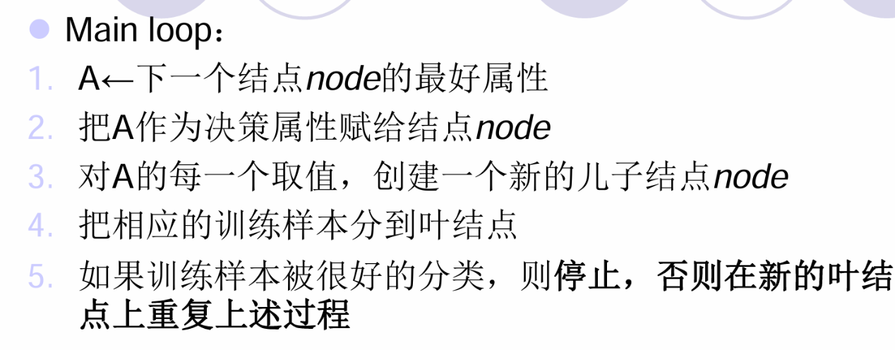

1.  A ← 下一个结点 node 的最好属性
2.  把 A 作为决策属性赋给结点 node
3.  对 A 的每一个取值，创建一个新的儿子结点 node
4.  把相应的训练样本分到叶结点
5.  如果训练样本被很好的分类，则停止，否则在新的叶结点上重复上述过程

##### 熵的定义与计算
**信息熵**定义：`H(X)` 表征了随机变量 X 所有情况下的平均不确定度。
公式：

$H(X) = -\sum_{i=1}^{N} P(x = i) \log_2 P(x = i)$

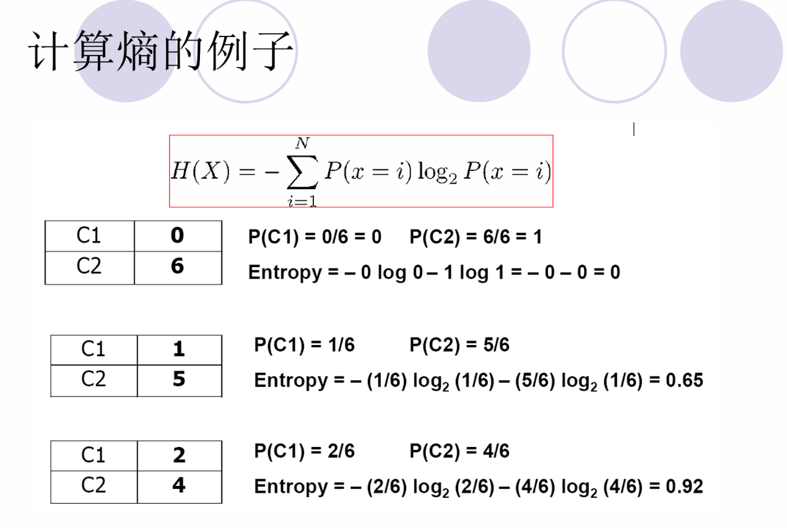

##### 信息增益与互信息

**信息增益**：反映由于属性 A 的切分造成样本集混杂度的减少量，选择使信息增益最大的属性作为切分属性。
公式：

$GAIN_{avg} = Entropy(p) - \left( \sum_{i=1}^{k} \frac{n_i}{n} Entropy(i) \right)$

- 父结点 P 被切分成 k 部分；$n_i$ 是每一切分的样本数
- 即目标类变量与属性 A 变量在 S（样本集）上的**互信息**

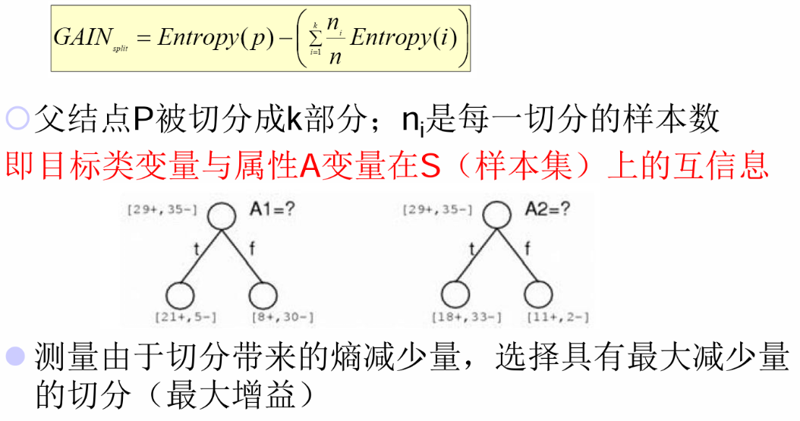

**互信息**：衡量两个随机变量之间相互依赖程度的信息论量度

$GAIN(labels\ of\ D, A) = H(labels\ of\ D) - H(labels\ of\ D|A) = I(labels\ of\ D;A)$

即：**信息增益**反映了目标类变量与切分属性 A 变量在样本集 S 上的**互信息**。

##### 分类问题的本质是函数近似问题
分类问题假设对于给定的示例集合 X，存在未知目标函数 $f:X \to Y$，以及假设集合 $H = \{h | h: X \to Y\}$。
机器学习是在训练样本 $\{<x_i, y_i>\}$ 下，从 H 中找到函数 h，最好地近似 f。因此，分类问题可理解为**函数近似问题**。

##### 如何确定测试条件（切分属性）
依赖于**属性类型**：

- 离散值（名词）划分、连续值划分、有序值划分
- 根据切分的分支个数：二路切分、多路切分

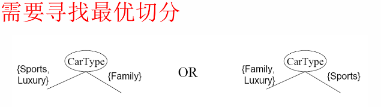
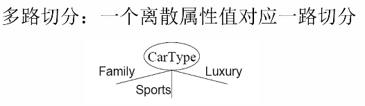

- **离散值属性**：多路切分 → 一个属性值对应一路切分；二路切分 → 将离散值划分为两个子集，寻找最优切分方法
- **连续值属性**：离散化构造有序类属性，可静态（根节点一次离散化）或动态（等区间、等频率、聚类等方法确定）
- **有序属性**：多路切分 → 一个属性值对应一路切分；二路切分 → 切分为两个子集，寻找最优切分方法

##### 决策树的表示能力
决策树可以表示自变量为输入属性的任何函数。例如对于布尔函数，其真值表的一行就是决策树上从根到叶的一条路径。

##### 决策树的函数假设集合 H
每个函数假设 h 就是一棵决策树，H 是不同决策树（决策过程）的集合。

##### 为什么需要决策树构造算法
对于同样的训练数据集，可以有多棵决策树与之一致。若对每个样例都建立根到叶的路径，会得到一棵一致的决策树，但可能**不具有泛化能力**。因此需要构造算法，寻找**规模更小更紧凑**的决策树。

##### 为什么说决策树是贪心的
基于可最优化某项准则的属性来切分示例集合。选择划分结点的属性时，总是倾向于让结点上的数据具有**同质类别的分布**。

##### 使用信息增益选择切分属性的缺点
倾向选择具有**切分分支多**的属性，因为每份样本少但混杂度低，容易获得更大的信息增益量。

##### 决策树假设空间大小
即使假设训练数据的特征中仅有 n 个布尔属性，则不同决策树的可能个数 = 具有 $2^n$ 行的真值表的个数，即 $2^{n^n}$，因此不能做穷尽搜索。

##### 决策树构造归纳的停止准则

- 当一个结点上所有**样本属于同一个类别**，停止扩展
- 当一个结点上所有**样本有相似的属性值**，停止扩展

##### 决策树分类算法的优点

1.  构建过程的**计算资源开销小**
2.  分类未知样本的**速度极快**
3.  小规模决策树**容易解释**
4.  简单数据集上性能与其它方法相近

##### 决策树的分界面
决策树形成的分类**边界是轴平行的**，由若干个与坐标轴平行的分段组成。

- 优点：学习结果有良好的可解释性
- 缺点：遇到复杂边界会变得相当复杂
- 改进：使用多变量决策树，让每个结点对属性的线性组合进行测试，实现斜的分类边界，简化决策树

##### 过拟合
从最小描述长度 MDL 的角度，优化目标为寻找使得 $Cost(Model, Data) = Cost(Data | Model) + Cost(Model)$ 最小的 model。

- $Cost(Data | Model)$：分类的错误率
- $Cost(Model)$：模型本身的复杂度（结点编码和分裂条件的编码）

##### 决策树如何缓解过拟合
**预剪枝**：在形成完全长成的决策树之前提前停止，包括：

- 当分支结点下的所有**样本属于同一个类**时停止
- 当分支结点下的所有样本具有**相同属性值**时停止
- 当结点的**样本数量小于某个阈值**时停止
- 当结点的样本**标签分布与可选的特征独立**时停止
- 当分裂结点**不能提高样本纯度**时停止

**后剪枝**：在形成完全长成的决策树之后，自下而上地修建某些结点，包括：

- 如果**泛化误差**在删除后能够提高，就将这个结点替换为叶结点
- 其标签值设置为原结点中出现频率最大的那个
- 可以使用 **MDL** 进行后剪枝（基于信息论中的 MDL 原理，即选择最短描述长度来描述数据）

##### 缺失值对决策树算法的影响

- 如何计算样本的混杂程度
- 如何将训练样本分配到子节点
- 如何预测含缺失值的测试样本

##### 决策树如何处理样本具有缺失属性值的情况

- **计算信息增益**：使用未缺失样本计算完信息增益之后，乘以未缺失该属性样本所占比例，作为最后的信息增益。
- **分配训练样本**：对未缺失属性值的样本，分配到相应位置，权重为 1。对于缺失该属性值的样本，按照各个属性取值出现的频率分配到所有的子节点中。
- **分类测试样本**：按照该结点的属性值和训练过程中的权重分配该样本的权重，根据不同类别的权重大小判断。

##### 如何在训练集、验证集、测试集上合理地调参
在**训练集上训练模型，在验证集上评估模型**，一旦找到最佳的参数，就在测试集上最后测试一次，测试集上的误差作为**泛化误差的近似**。

---

#### ID3 算法

- 分类标准：**信息增益**
- 停止准则：获得最小可接受的决策树时停止
- 理论基础：**奥卡姆剃刀原理**（选择适合训练集合数据的最简单假设）
- 缺点：没有剪枝策略，容易过拟合；只能处理离散分布的特征；倾向于切分特征多的属性

!!! Warning "Tips"
    奥卡姆剃刀原理（Occam's Razor）是由14世纪逻辑学家、圣方济各会修士威廉·奥卡姆（William Ockham，约1285-1349年）提出的思维原则，别称简单性原则。其核心内容为“如无必要，勿增实体”，主张在解释现象时应选择假设最少的理论。

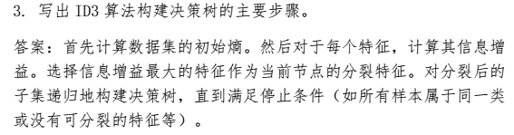

---

#### C4.5 算法

- 分类标准：**信息增益率**

- 核心改进：

  - 将**连续特征离散化**
  - 引入**悲观剪枝策略**进行后剪枝（欠拟合风险小，泛化性能优于预剪枝决策树）
  - 引入**信息增益率**作为划分标准（克服了 ID3 对特征数目的偏重这一缺点）

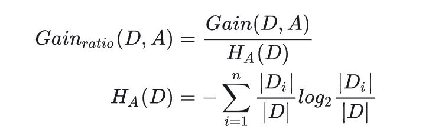

- **固有信息 / 分裂信息**

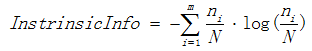

- **信息增益率**

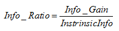

- 信息增益率对可取值较少的特征有所偏好（分母是 A 固有的信息熵 H(D)，值越小，整体越大）
- 缺点：C4.5 用的是多叉树，用二叉树效率更高

C4.5 的特点：

1.  使用**深度优先**构造方法

2.  采用了**信息增益率**（也算是使用了信息增益）

3.  每个节点需要对示例按照**连续属性排序**

4.  数据需要**全部装入内存**

5.  不适合大规模数据

#### C4.5 vs ID3  :pear:【重要】
**优点**：

- 改进了 ID3 的特征选择偏差问题；（克服了 ID3 对特征数目的偏重这一缺点）
- 能够处理连续型特征；（将连续特征离散化，C4.5 用的是多叉树，ID3 只能处理离散特征）
- 提供了**缺失值处理**机制；
- 包含了剪枝功能以减少过拟合的风险。

**缺点**：

- 相对于 ID3，算法实现更加复杂；
- 处理大规模数据集时效率较低。

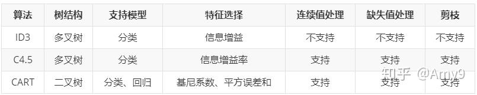

!!! Warning "Tips"
    例题（目前真题暂未考察）
    [CSDN](https://blog.csdn.net/qq_56103253/article/details/144847696)
    [CSDN](https://blog.csdn.net/weixin_52027058/article/details/127599425)
    [原创力文档](https://max.book118.com/html/2025/0902/6152211031011223.shtm)

    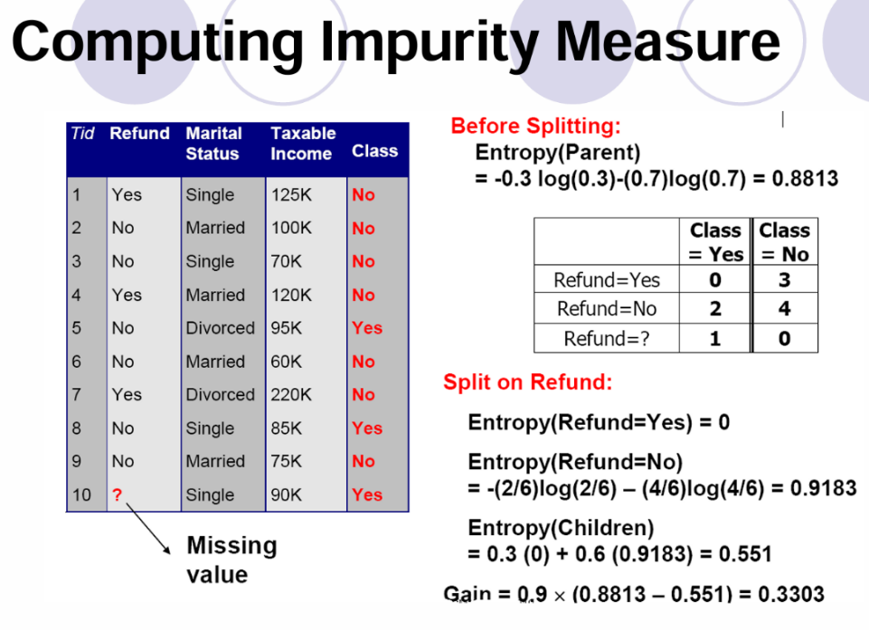
    留意上图中缺失值在计算加权信息熵未被计入 refund 属性的任何一个取值 yes/no 的一部分，而是作为最后信息增益 Gain 的权值 1-0.1=0.9，这也体现了决策树容许训练集缺失值。

#### GINI 不纯度  :pear:【重要】

- **基尼值（GINI不纯度）**：

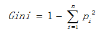

!!! Warning "Tips"
    例题（目前真题暂未考察）

    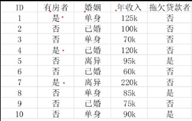
    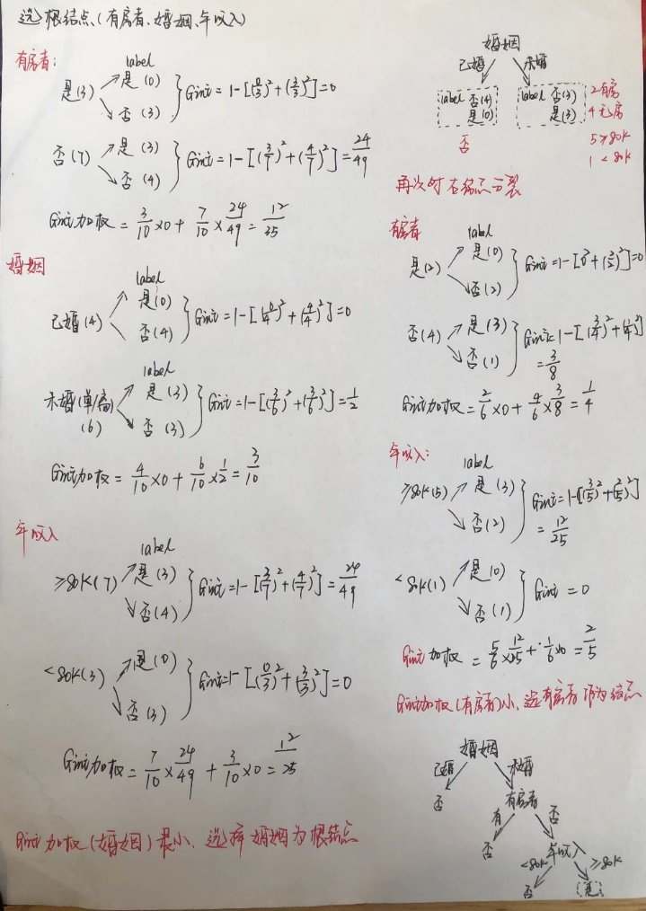

---

### K-Means 算法 :blueberries:【重要·常考】

- **初值敏感**：已知 K
- 不断重复 2、3 直到均值不变，迭代结束

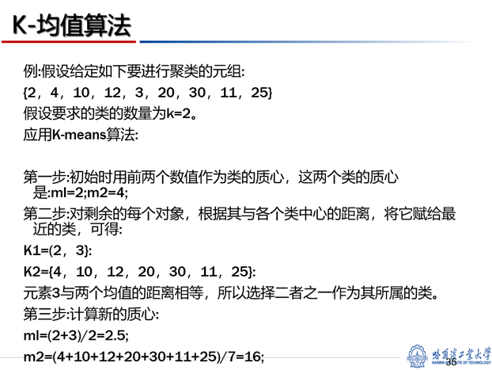

!!! Warning "Tips"
    真题

    2024 计算
    
    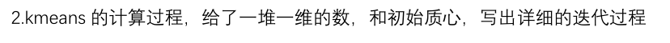
    
    2025 选择

    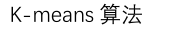

---

### 层次聚类
#### 凝聚型 (Agglomerative) 自下而上

- 开始：每个数据点都是一个聚类，因此有 N 个聚类（其中 N 是数据点的数量）。
- 迭代：在每一步，找到最近的两个聚类并合并它们，因此聚类的数量减少一个。
- 结束：最后只剩下一个包含所有数据点的聚类。

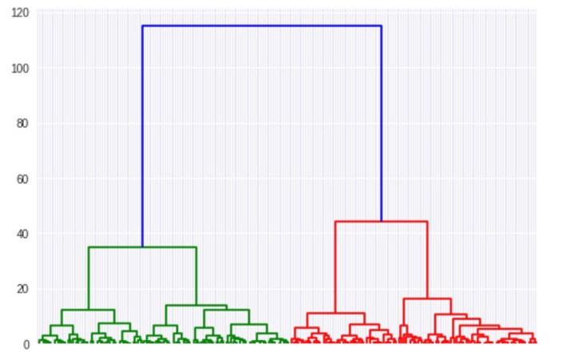

#### 分裂型 (Divisive) 自上而下

- 开始：所有数据点都属于一个大的聚类。
- 迭代：在每一步，选择一个聚类并将其分割为两个子聚类。
- 结束：最后每个数据点都成为自己的聚类。

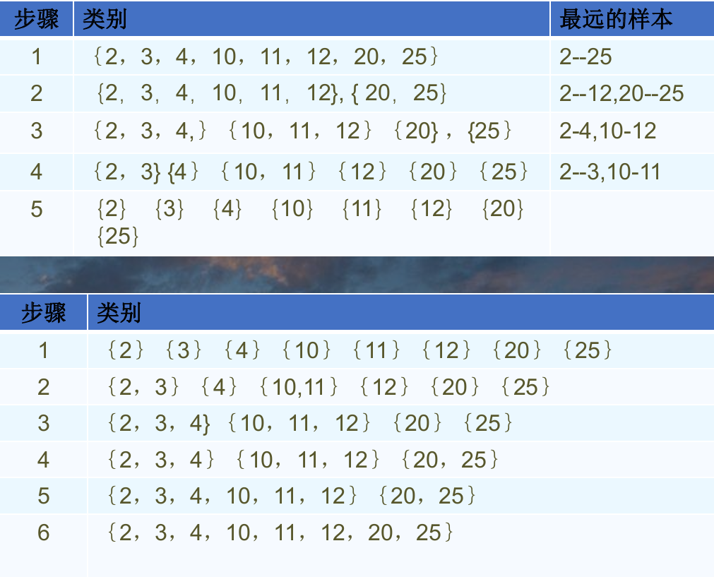

- 凝聚聚类擅长识别**小**聚类。
- 分裂聚类擅长识别**大**集群。

**优点**：

- 动态聚类数：不需要预先指定聚类数，可以根据树状图切割得到任意数量的聚类。
- 解释性：通过层次结构在不同粒度水平上对数据进行探测，研究者可以更加直观地看到数据的层次和结构，从而获得更深入的洞察。

**缺点**：

- 计算复杂度：尤其是凝聚型方法，随着数据点数量的增加，计算复杂度急剧上升。
- 大数据集不友好：单纯的层次聚类算法终止条件含糊且高计算复杂度，不推荐在大数据集上使用。

---

### DBSCAN 算法
算法主要有两个参数：

- **邻域半径**：ε
- 成为**核心对象**在邻域半径内需要的最少点数：MinPts

#### 核心概念

- **Eps 邻域 (Eps-neighborhood of a point)**：点 p 的 Eps 邻域，记为 $N_{Eps}(p)$，定义为 $N_{Eps}(p) = \{q \in D | dist(p,q) \leq Eps\}$。
- **核心对象 (core points)**：如果给定对象 Eps 邻域内的样本点数大于等于 MinPts，则称该对象为核心对象。
- **直接密度可达 (directly density-reachable)**：

    若 

    1)  $p \in N_{Eps}(q)$ 

    2)  $|N_{Eps}(q)| \geq MinPts$
    
    则称对象 p 从核心对象 q 是直接密度可达的。
    
- **密度可达 (density-reachable)**：对于对象 $p_1,p_2, \dots, p_n$；令 $p_1= q, p_n = p$。若 $p_{i+1}$ 是从 $p_i$ 直接密度可达的，则称 p 是从 q 密度可达的。
- **密度相连 (density-connected)**：对于点 p 和点 q，若点 p 点 q 都是从点 o 密度可达的，则称点 p 和点 q 密度相连。
- **簇 (cluster)**：对于数据集 D，若 C 是其中一个簇，C 中的点需要满足：
    1) $\forall p, q$，如果 $p \in C$ 且 q 是从 p 密度可达的，则 $q \in C$。
    2) $\forall p, q \in C$，p 和 q 是密度相连的。
- **噪音 (noise)**：不属于任何簇的点为噪音数据。

#### 算法流程

1.  给定邻域半径 ε 和成为核心对象的在邻域半径 ε 内的最少点数 MinPts。
2.  从任意点 p 开始，将其标记为“visited”，检查其是否为核心点（即 p 的 ε 邻域至少有 MinPts 个对象），如果不是核心点，则将其标记为噪声点。否则为 p 创建一个新的簇 C，并且把 p 的 ε 邻域中的所有对象都放到候选集合 N 中。
3.  迭代地把 N 中不属于其它簇的对象添加至 C 中，在此过程中，对于 N 中标记为”unvisited“的对象 p'，把它标记为“visited”，并且检查它的 Eps 邻域，如果 p' 也为核心对象，则 p' 的 ε 邻域中的对象都被添加至 N 中。继续添加对象至 C 中，直到 C 不能扩展，即直到 N 为空。此时，簇 C 完全生成。
4.  从剩余的对象中随机选择下一个未访问对象，重复 2) 3) 的过程，直到所有对象都被访问。

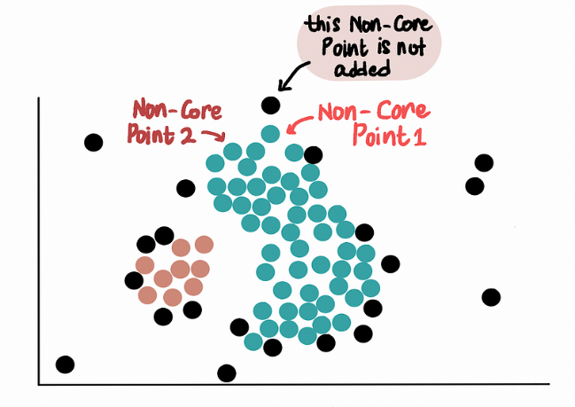

### 基于密度聚类
数据集：{2, 4, 8, 6, 5, 3, 14, 18, 16, 20, 25, 26}
已知 ε=2，minpts=3，聚类结果：{2,3,4,5,6,8}{14,18,16,20} 噪音：25,26（其中 14 在 2 轮临时标记为噪音但被第 3 轮吸收进聚类）

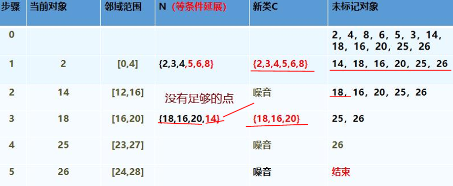

### 对比：DBSCAN 层次聚类 K-Means 

- K-Means 和分层聚类适用于**结构紧凑、分离度高的聚类**，但也会受到数据中噪声和异常值的严重影响；
- DBSCAN 可以捕捉形状复杂的聚类，并能很好地识别异常值，对参数选择敏感，特别是簇的密度不同时。
- 此外 DBSCAN 的另一个优点是，与 K-Means 不同，我们不需要指定簇的数量（k），算法会自动为我们找到簇。

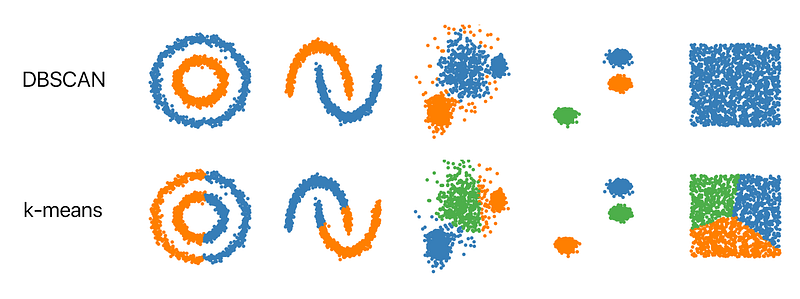
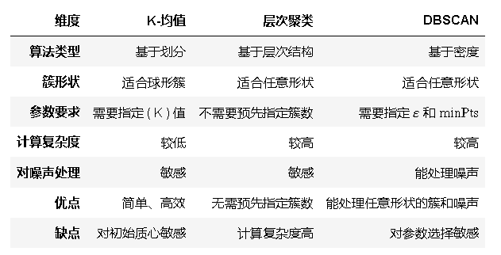

---

### Native Bayes（朴素贝叶斯） :blueberries:【重要·常考】
朴素贝叶斯分类能够奏效的前提是，$P(X|H)$ 相对比较容易计算。
$P(Y|X) = \frac{P(X|Y)P(Y)}{P(X)}$
理论上，与其他所有分类算法相比，贝叶斯分类具有最小的出错率。然而，实践中并非总是如此。这是由于对其应用的假定（如**类条件独立性**）的不准确，以及缺乏可用的概率数据造成的。然而，种种实验研究表明，与判定树和神经网络分类算法相比，在某些领域，该分类算法可以与之媲美。

计算时因为分母一样所以只要比较分子即可。

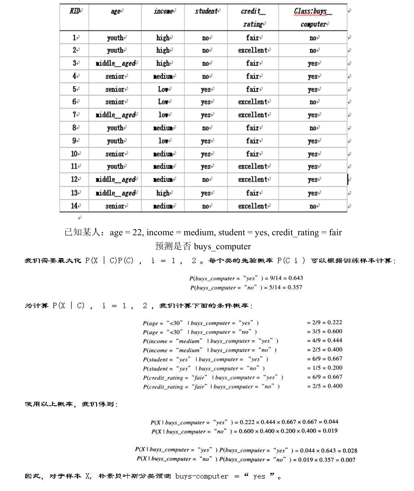
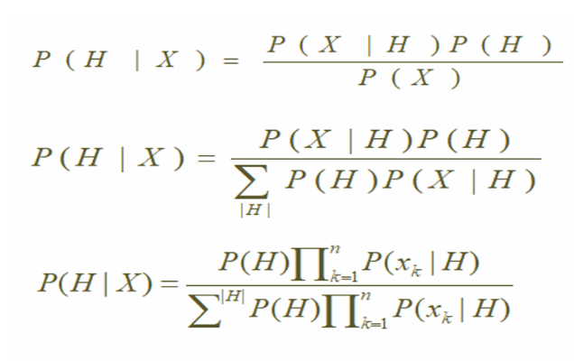

!!! Warning "Tips"
    真题

    2023 计算

    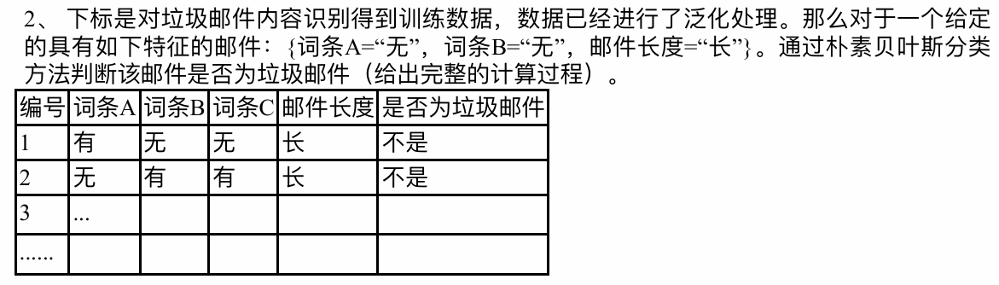

    2025 计算

    

    上面图片里 buys_computer 的例子就是来自 ppt