## 字符匹配算法 AC WM BM KMP  :strawberry:【重要·必考】

### KMP

!!! danger "考前记忆"
    初始 `i=0` 的 `next(0) = -1`
    移动位数 = 成功匹配数量 - `KMPNEXT(i)`
    `kmpNext` 需要标注最后一个空位，当左到右比较完最后一位时按空位失配移动

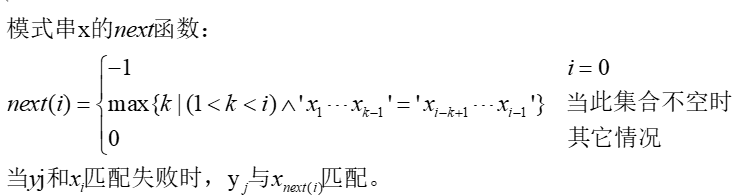

!!! Warning "Tips"
    中间那部分看上去吓人，实际上意思很明晰：正序统计前缀与后缀相同的长度

KMP Next 表例：

| i       | 0 | 1 | 2 | 3 | 4 | 5 | 6 | 7 | 8 |
|---------|---|---|---|---|---|---|---|---|---|
| x[i]    | G | C | A | G | A | G | A | G |   |
| kmpNext[i] | -1 | 0 | 0 | -1 | 1 | -1 | 1 | -1 | 1 |

避免了重复比较，同时也实现了文本指针的无回溯。（**i只往前不后退**，移动后i前面的肯定已经匹配，**前缀无需重新比较，但是当前i本身可能在移动后再比较一次**）全部匹配时KMP移动 `len-kmpnext[len]` (eg. `i=len=8`)

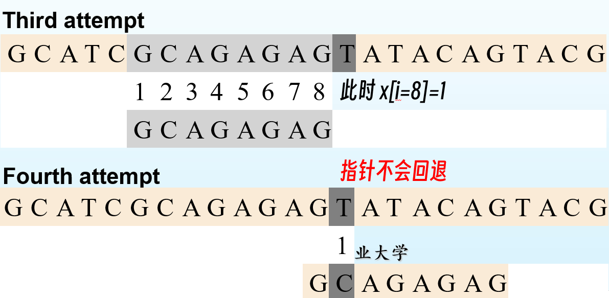

!!! Warning "Tips"
    仓库里提供了（算法/KMP.py）包含案例可以自己执行验证思路，代码无需掌握。

    说来惭愧，计算KMPnext表这个点我从误解到理解横跨三个月用了>8h 是我备考837最大的坎儿 说不定也有人和我一样陷入莫名其妙又痛苦的误区里。

    一言以蔽之：PPT里存在两个版本的KMP，分别是优化前后，优化前如上式MAX{当前字符前面从前往后和从后往前所能匹配的最长子串长度}；优化的KMP算法总结如下：**如果a位字符与它的next值(即next[a])指向的b位字符相等（即p[a] == p[next[a]]）,则a位的next值就指向b位的next值即（next[ next[a] ]）**（详见[博客园](https://www.cnblogs.com/cherryljr/p/6519748.html)） 考试考优化后，KMP 算法有很多种版本和解释方法，但执行结果一定是一致的。

    例题：[知乎](https://zhuanlan.zhihu.com/p/649645822) [PPT](https://github.com/mcxiaoxiao/wangan.online/tree/HIT837-Book-of-Answer/%E7%AE%97%E6%B3%95)

    **ATATA** 的 KMP Next 表: [-1, 0, -1, 0, -1, 3] 前后缀都是**取正序**

    真题：

    - 2021 计算

    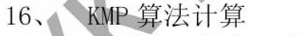

    - 2024 计算

    

    - 2025 选择

    

文本串的长度为n，模式串的长度为m，那么匹配过程的时间复杂度为O(n)，算上计算next的O(m)时间，**KMP的整体时间复杂度O(m + n)**。

---

### BM

!!! danger "考前记忆"
    自右向左匹配 BC\GS选大的
    BC表是撇去最后一个从右数第几个是这个字符，移动 `BC-(M-1-i)`，找不到就m个
    GS表先找好后缀
    找不到好后缀时的默认值就找好前缀（前后匹配1个就默认m-1，2个就默认m-2）
    好后缀好前缀都找不到就默认m个
    **全部匹配时**就用默认的值
    当右到左比较完最后一位时按0位失配移动

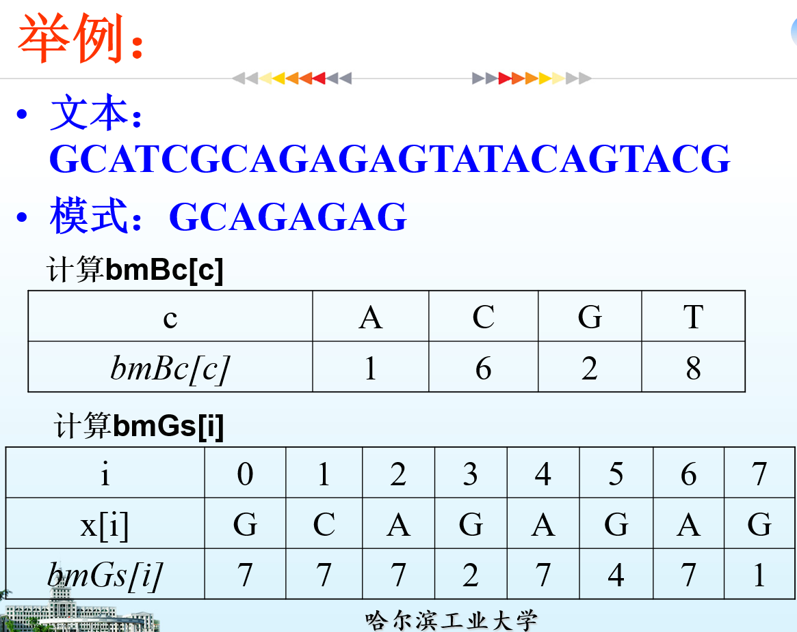

BM算法被盛誉为速度最快的算法。
算法对模式从最右端自右向左扫描。在不匹配（或完全匹配）时，用两个预先计算的函数 `bad character`（正在比较的主串中的坏字符想在模式串中匹配需要后移多少，如果即便后移也没有那就后移直到避开该位）和 `good suffix`（正在比较的主串中的字符在模式串不存在，但存在后缀suffix部分匹配） 来确定指针在正文中移动的距离。

BM算法的关键是**找出不必要的比较**。进行比较时从字符串的右端而不是左端开始比较

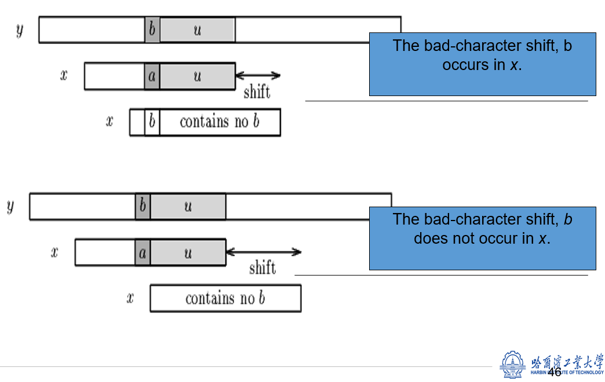

!!! Warning "Tips"
    仓库里提供了（算法/BM.py）包含案例可以自己执行验证思路，代码无需掌握。

    参考：[CSDN](https://blog.csdn.net/kexuanxiu1163/article/details/99688080) [PPT](https://github.com/mcxiaoxiao/wangan.online/tree/HIT837-Book-of-Answer/%E7%AE%97%E6%B3%95)

    对于BC的移动大小可以直接按着上图的逻辑数数，形式化的表达如下：

    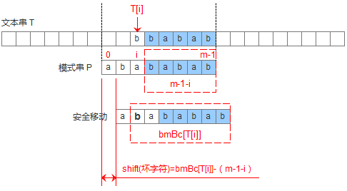

    结合PPT

    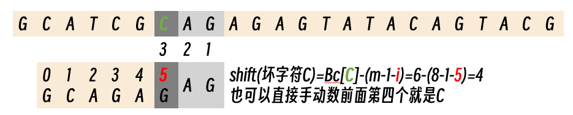

    **gs好后缀**：

    1. 如果模式串中存在已经匹配成功的好后缀，则把目标串与好后缀对齐，然后从模式串的最尾元素开始往前匹配。ppt里能有好后缀ag且移动后的新指针指向的不能还是g（毕竟这是错配了才触发的还是g那还是得移动）所以应该是移动到后面为ag且当前非g的4位，即c上

    2. 如果无法找到匹配好的后缀，找一个匹配的最长的**前缀**，让目标串与最长的前缀对齐（如果这个前缀存在的话）。所以ppt里最后的g因为能和前缀第一个g匹配所以移动7，而非8，如果这个都没有的话就看第三步

    3. 如果完全不存在和好后缀匹配的子串，则为m（ppt里的例子就是m=8）

    当比较到最后一位（KMP模式串的最右一位，BM模式串的最左一位），并且成功匹配时，
    本次更新，KMP使用 `len-kmpnext[len]` 进行，**而BM算法当做第0位失配的情况进行，即使用max(gs[0],bc[0]-(len-1-0))更新**

    记录对齐次数时，移出明文界限的那一次不计入

    - 2019 简答

    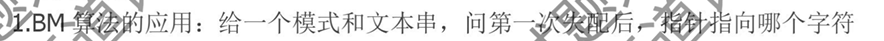

    - 2025 计算

    

文本串的长度为n，模式串的长度为m

- BF算法时间复杂度为O(n*m)

- **KMP算法时间复杂度为O(n+m)**

- **BM算法时间复杂度为O(n*m)**，但实际运行效果最快

### KMP vs BM

比较KMP和BM算法的核心思路，其提高匹配性能的本质是什么？

- **KMP算法**通过构建**部分匹配表**KMPnext来利用模式串的内部信息，减少不匹配情况下的回退次数。
- **BM算法**通过**坏字符**规则和**好后缀**规则来利用模式串和文本的外部信息，尽可能地向右移动模式串，跳过不可能包含模式串的位置。

!!! Warning "Tips"
    KMP的优点: 对正文扫描一遍，不回溯。且每一次比较后，有明确的信息记录下一次比较的位置。

    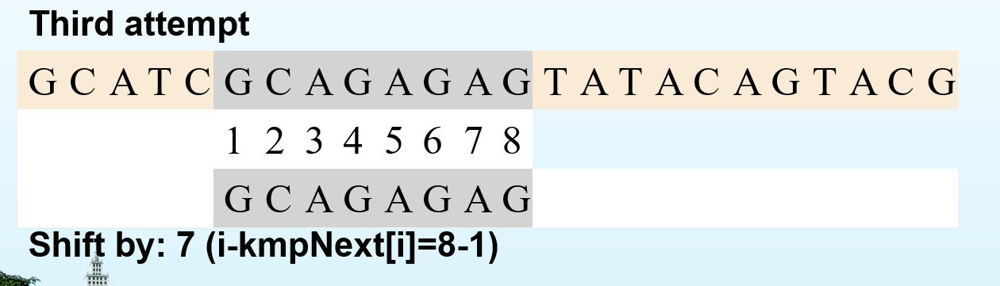
    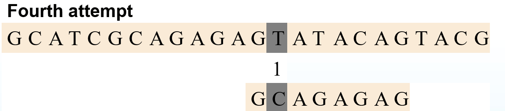

    ↑这里面的第四次位于T的指针不回退，不用重新判断G=G

    KMP算法更适合于**模式串长度较长**且**文本长度远大于模式串长度**的情况，
    而BM算法在模式串较长且包含**重复字符**时表现更好。

---

### AC

!!! danger "考前记忆"
    转向g的第一个编号为**0**且转向函数g为：
    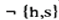
    深度1的失效函数f=0 新f参照上一结点的f的结点接着续
    输出函数output结合f的和自己的输出

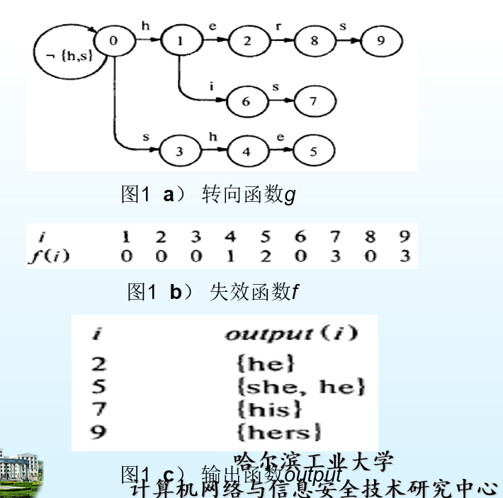

该算法的基本思想是这样的：
在预处理阶段，AC自动机算法建立了三个函数，**转向函数g，失效函数f和输出函数output**。

1.  初始化：构建模式树，计算失效函数。
2.  匹配：从根节点开始，按转向函数移动。
3.  失配：若转向函数无对应节点，按失效函数回退后继续匹配文本。
4.  输出：到达叶节点，输出匹配结果。

由此构造了一个树型有限自动机。
此算法有两个特点：

- **扫描文本时完全不需要回溯**
- **时间复杂度为O(n)，时间复杂度与关键字的数目和长度m无关**

广泛应用于敏感词汇的匹配中

!!! Warning "Tips"
    KMP AC都避免了回溯；BM虽然用BC和GS显著减少比较次数，但是还是有时候要回溯
    失效函数f，体现了KMP算法中利用重复出现前缀的思想，且保证了部分串的前缀包含于其他串时，串匹配算法的正确性。

    例题：[博客园](https://www.cnblogs.com/kongbursi-2292702937/p/12031259.html)

    - 2019 计算

    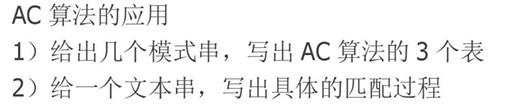

    - 2022 简答

    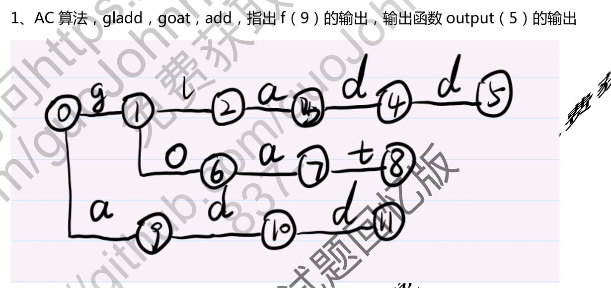

    - 2023 简答

    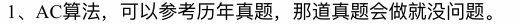

    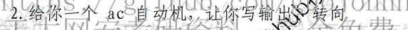

---

### WM

!!! danger "考前记忆"
    移动 `SHIFT=` 这B个字符距离m有几位，如果没匹配到则默认**m-B+1**
    `SHIFT=0` 时首先计算当前的和PREFIX表中当前位←m后的B’位前缀的hash值，HASH表入口指针指向模式和前缀列表且先匹配前缀，**前缀和模式表交集**出来再和文本串逐一比较找有没有匹配。之后无论是否命中，窗口都向前滑动 1 位

Wu-Manber 算法不仅匹配速度快,**而且匹配时间不随模式串长度的增加而有明显的增长,性能很稳定。**一般情况下,**模式串长度m越大,算法的匹配速度越快。**

在预处理阶段，算法主要使用了**三个数据结构：SHIFT表、HASH表、和PREFIX表**

**SHIFT表用于在扫描文本串的时候,根据读入字符串决定可以跳过的字符数**,如果相应**shift[]值=0,**则说明可能产生匹配,就要用到HASH表和PREFIX表进一步判断,以决定有哪些匹配候选模式,并验证究竟是哪个或者哪些候选模式完全匹配

SHIFT表和BM算法的bad-character表相似，搜索文本时用来决定文本指针移动（跳过）多少个字符；但又不完全相同：其移动的距离是基于模式最**后B个**字符，而不是一个字符（BM BC表根据当前的实际字符向前找移动几字符可以对上，找不到就默认**m-1+1=m**个字符）。如果没查到均未出现，可以将文本指针向前移动**m-B+1**个字符。

Shift初始化：**所有初始值均为m-B+1和m-q(到达这个子串所需的距离)中较小的。**

只要SHIFT表移动值大于0，就可以安全的向前移动文本指针，继续扫描。
为了避免将子串和模式列表中每一个模式都比较一次，算法使用了哈希技术将要比较的模式个数减到最小。此即HASH表。将B个字符映射为一个整数作为SHIFT表的索引（哈希值为i）同时又是HASH表的索引。HASH表的第i个入口，HASH[i]，包含了一个模式列表的指针，算法重用了哈希函数的结果

PREFIX表，映射所有模式开始的**B’个字符**。当发现SHIFT值为0，到HASH表入口所指的模式列表中检查是否存在匹配时**，首先检查PREFIX表中的值**。对于每一个后缀，**HASH表入口指针**不仅指向有此后缀的所有模式的列表，还**指向子串前缀**在PREFIX表中的哈希值。在搜索阶段，首先计算当前文本子串的前缀哈希值，来过滤那些后缀哈希值相同而前缀哈希值不同的模式

!!! Warning "Tips"
    “HASH 表入口指针”就是指向HASH 表第一条记录的地址

    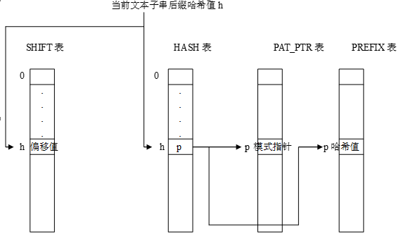

总步骤：

1) 计算这B个字符的hash值,得到h;

2) 查SHIFT表找到SHIFT[h]:如果大于0,则根据这个值向后移动文本相应的长度,并转到1);否则继续;

3) 计算当前指针往左的m个字符串长度为B′的前缀hash值;

4) 查HASH表,找到HASH[h]的指针p,遍历模式链表,找到前缀hash值也相同的模式串;再将文本串和模式串逐一比较,判断是否匹配.如果匹配,则输出匹配模式串,并将文本向后移动一位,转1),直到文本结束。

- 时间复杂度平均**O(B*n/m)**。B块字符长度，n文本的长度，m模式最短长度
- SHIFT函数的最大值受最短模式长度的限制
- 该算法对最短模式长度m敏感
- 如果最短模式长度很短，则移位的值不可能很大，因此对匹配过程的加速有限。

!!! Warning "Tips"

    真题 2022

    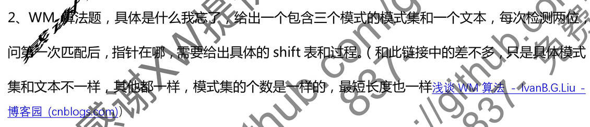

    例题：[博客园](https://www.cnblogs.com/ladawn/p/9281509.html)

    真题 2023

    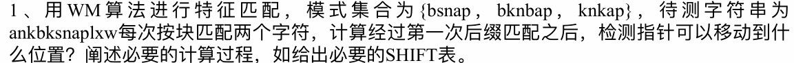
    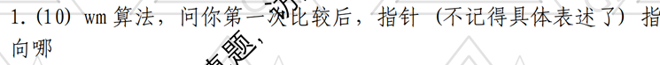

    答案是i=i+SHIFT[bk]=4+3=7

    真题 2025 简答

    

    **答案是WM**

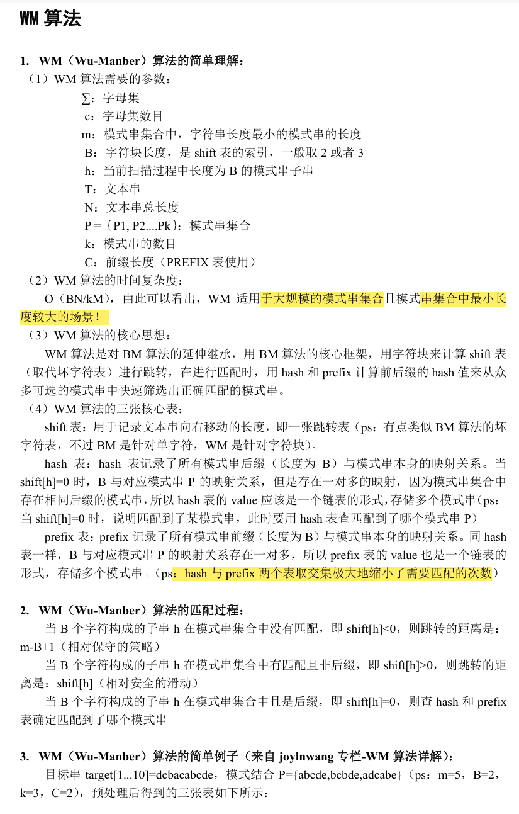

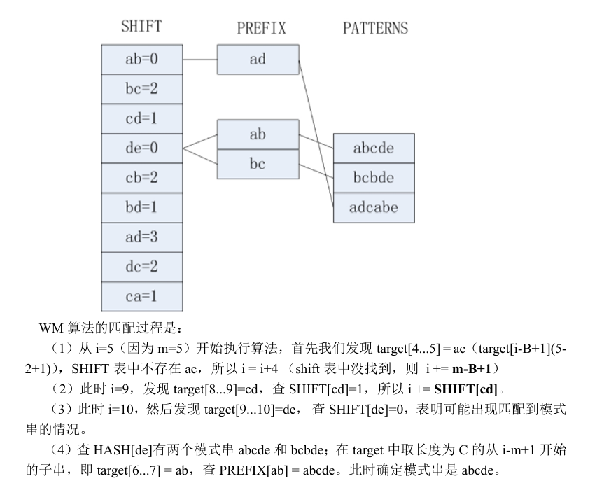

---

### 对比（应对xxx情况适用xxx的简答、选择）

| 算法 | 复杂度 | 适用 | 特点 | 可能的对比 |
|------|--------|------|------|-------------------|
| AC | O(n) | 多模式匹配 少量长模式 | 无回溯，适合实时系统，时间复杂度与模式串关键字的数目和长度无关；预处理时间随模式串数量的增加呈指数级增长，不适合大量短模式串，失配概率高 | **AC vs. WM/BM/KMP** AC适合实时匹配（如网络入侵监测） |
| WM | O(n*B/m) | 多模式匹配 大量短模式 | 块大小可调，对模式串敏感，越大越好，但匹配时间不随模式串长度的增加明显的增加，适合大量短模式，对最短模式长度敏感。如果最短模式长度很短则加速有限 | **AC vs WM** AC适合少量长模式，占用内存大 WM适合大量短模式，占用内存小 |
| BM | O(n*m) 最好情况O(n/m) | 单模式匹配 模式串重复 | 避免不必要比较，从右向左扫描，步长可以比KMP大（GS&BC），包含重复字符时表现更好 | **AC/WM vs. KMP/BM** AC/WM适合多模式 KMP/BM适合单模式 |
| KMP | O(n+m) | 单模式匹配 文本串较长 | 避免重复比较，文本指针无回朔，适合文本串远长于模式串的情况 | **BM vs. KMP** KMP避免重复永不回溯 BM避免不必要比较，适合匹配重复字符多的文本 内存占用 BM > KMP |