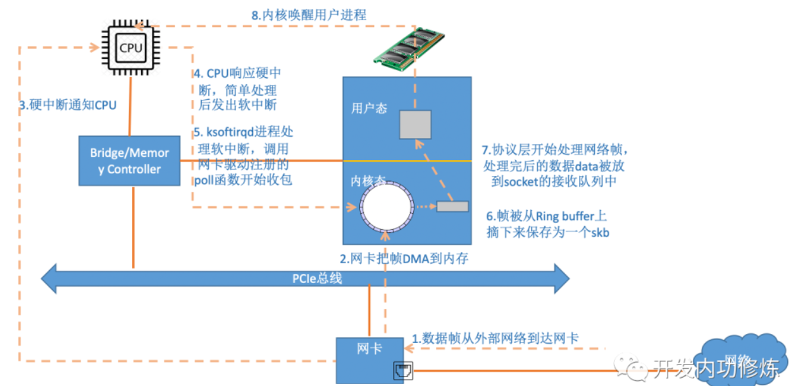

## 网卡的工作原理 Sniffer 包捕获机制【重要】
网卡工作在**数据链路层**，地址是**MAC**地址6字节（前3个分配给厂商，后三个厂商自己分）48b用`ipconfig`可以看。数据帧头有**源MAC和目的MAC**的信息，网卡**读入数据帧**。

网卡驱动可设置的**接收模式**：广播（广播数据）、组播（组播数据）、单播（仅目的网卡，默认）、混杂（一切通过）。

!!! Warning "Tips"
    E类(1110)保留地址中224.0.0.0 - 239.255.255.255 为**组播地址**，**只能作为目的地址**；D类(1111)多播地址，也**只能作为目的地址**

**非混杂模式下**：如果**MAC目的地址**是**自己**或者是**广播地址**（广播MAC地址：全1的MAC地址（FF-FF-FF-FF-FF-FF））则产生**硬件中断**（CPU执行）把帧传给**协议栈**处理。

**混杂模式下**：产生**硬件中断**（CPU执行）把帧传给**系统协议栈**处理。一台机器如果接口处于混杂模式，即成为sniffer。

操作系统会根据**网卡驱动程序**中设置的**网卡中断程序地址**调用驱动程序接收数据，放入**信号堆栈**让**操作系统**处理。

### DMA机制收包流程

| 步骤 | 动作 | 说明 |
|:---|:---|:---|
| ① | 数据帧到达网卡 | 外部网络数据包到达 NIC |
| ② | **DMA 到内存** | 网卡通过 DMA 直接写入 Ring Buffer，**无需 CPU 参与** |
| ③ | 硬中断通知 CPU | 数据就绪，触发硬件中断 |
| ④ | CPU 响应硬中断 | 简单处理后发软中断，快速释放硬中断 |
| ⑤ | ksoftirqd 处理 | 内核线程调用 poll 函数收包 |
| ⑥ | 生成 skb | 从 Ring Buffer 摘下帧，封装为 sk_buff |
| ⑦ | 协议栈处理 | 逐层解封装，数据放入 socket 接收队列 |
| ⑧ | 唤醒用户进程 | 内核通知应用程序取数据 |

---

**DMA 核心作用**：网卡 ↔ 内存 直接传输，**绕过 CPU**，解放算力。

### Sniffer 嗅探【重要·常考】
**Sniffer**嗅探是一种常用的**数据捕获方法**，需要将网卡设置为**混杂模式**，捕获整个网络的**数据流量**并进行**过滤**，将**感兴趣的信息**发送给上层。Sniffer其工作在网络环境的底层，拦截所有网络上正在传送的数据，并通过相应软件处理，实时分析数据内容。

在**共享环境下**，Sniffer可直接捕获整个网段的通信。**需要将网卡设置为混杂模式**，接受目的地址不是自身的帧，然后直接访问数据链路层，**获取数据并交于上层过滤处理**。**可使用libpcap或winpcap等**。

在**交换式网络环境下**，Sniffer必须结合MAC地址欺骗等技术。网络设备无法监听其他端口和其他网段的数据，可采用如下方法：

1、将**捕获程序放在网关**上。

2、进行**端口<u>映射</u>、端口<u>盗用</u>**。

3、在**交换机与路由器之间连接hub**。

4、实现**ARP欺骗**。

5、**MAC地址欺骗**（也可以是**MAC Flooding** **MAC**泛洪攻击 **MAC**攻击，填满转发表，导致无处可发只会广播，把交换机攻击成集线器）。

!!! Warning "Tips"
    MAC地址欺骗通过伪造MAC地址误导交换机转发，而MAC地址泛洪则通过填满交换机CAM表，使交换机变为广播模式，从而监听网络通信。
    端口映射是监听前就已经准备了一个端口，端口盗用会抢端口让原连接要么RST，要么新SYN被重定向，导致原服务收不到握手。

### Sniffer 防范【重要】

**检测嗅探器**：检测混杂模式的网卡

**安全拓扑**：越细能采集的信息越少 (虚拟局域网VLAN)

**地址绑定**：<u>交换机</u>的**端口**与**MAC**地址绑定（防止端口盗用，MAC攻击）；<u>路由器</u>的**IP**与**MAC**静态绑定（**静态的ARP**代替动态ARP 防止ARP欺骗)

**会话加密**：加密数据后传输（HTTPS/SSL/IPSEC）是**最好最常用的防窃听办法**

!!! Warning "Tips"
    HTTPS/SSL/IPSEC 分别对应了**应**用、**传**输、**网**络三层
    Hub把所有端口放在同一个共享冲突域，收到数据后向所有端口广播；攻击者插在Hub任一端口即可被动捕获交换机和路由器之间的全部流量，实现嗅探

    - Hub（集线器，会冲突，无法像交换机一样允许同时通信）：**物**理层（第 1 层）
    - 交换机（多端口的网桥，只能隔离冲突域，不隔离广播域）**链**路层（第 2 层）
    - 网桥（两个端口的交换机）**链**路层（第 2 层）
    - 路由器 **网**络层（隔离广播域、冲突域）（第 3 层）

    构建网络内核的两种基本途径是**转发**和**路由**，交换机只转发（直通式/存储转发），路由器二者兼得，常用的三层四层交换机可以包含路由或负载均衡之类的功能

    广播帧指的是目标MAC地址为FF:FF:FF:FF:FF:FF的链路层帧，路由器至少有两个位于不同网段的IP。路由器可以把一个网段内的广播风暴被限制在其中一个网段内，不会对其他网段造成影响