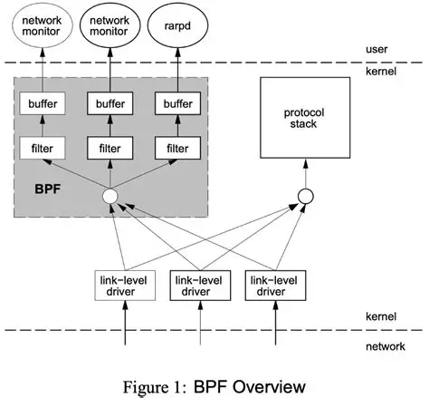

## 网络数据包捕获机制 BPF 模型  :pear:【重要】
网络数据包捕获机制包含三个主要部分：

- 最底层：针对操作系统的包捕获机制
- 中间部分：包过滤机制
- 最高层：针对用户程序的接口

包捕获机制是在**数据链路层**增加一个旁路处理，把数据包看成字节数组进行谓词过滤。

BPF 工作在**操作系统内核层**，由两部分组成：

- **网络分接头**：负责收集、复制网络数据包
- **数据过滤器**（核心）：根据用户规则决定是否接收数据包，通常用于实现 sniffer

通常网卡驱动接收数据包后会交给协议栈；若有进程用 BPF 进行网络侦听，网卡驱动会先调用 BPF 复制一份给它，过滤器根据用户规则判断是否接收：

- 若判定接收：BPF 将包复制到内核缓冲区暂存，收集足够数据后一起提交给用户进程（如 libpcap）以提升效率
- 若为发往本机的包：仍交给系统协议栈处理

!!! Warning "Tips"
    BPF 是现代网络数据包嗅探器（Sniffer）的核心技术和基石，sniffer 通常调用 `libpcap` 或 `winpcap` 实现。

    传统 Linux 套接字路径（PF_PACKET，无优化）：
    网卡 → 内核 DMA 缓冲区 → 内核协议栈 skb → 套接字接收缓冲区 → 用户空间缓冲区
    = **2 次拷贝**（内核→skb 一次，套接字→用户一次）

    启用 PACKET_MMAP（libpcap 零拷贝模式）：
    网卡 → 内核 DMA 环形缓冲区 → 用户空间通过 mmap 直接读同一物理页
    = **0 次拷贝**（数据始终在同一物理页，仅传递指针/偏移量）