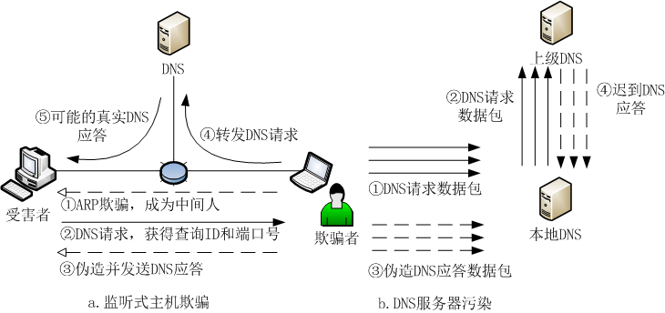

## 重定向拒绝服务攻击（DNS欺骗 监听式主机欺骗 DNS服务器污染 中间人攻击） :red_square: :blue_circle:【重要·常考】
### 监听式主机欺骗
伪造 **DNS 响应** 发给受害者。在交换网络环境中，需先通过 **ARP 欺骗** 冒充 DNS 服务器，欺骗者作为中间人在 DNS 服务器和受害者之间配合 sniffer 软件监听，获取 **DNS 查询 ID 和端口号**，抢先构造并发送包含恶意地址的 DNS 应答包。真实 DNS 应答因晚于伪造包被丢弃，从而实现 **缓存投毒**，使受害者将域名解析到恶意地址。

### DNS 服务器污染
发送大量 **DNS 请求包** 并伪造 **DNS 应答包**（若计算的端口号和 ID 正确），使 DNS 服务器以错误的域名信息更新缓存，导致服务器无法提供正确的域名解析服务。在缓存周期内，所有访问该域名的客户机都会被解析到错误地址。

### 根本原因
DNS 基于无连接的 **UDP** 协议，**缺乏认证机制**，仅通过 **ID 和端口号** 验证应答真实性，容易被攻击者伪造和利用。
