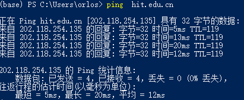
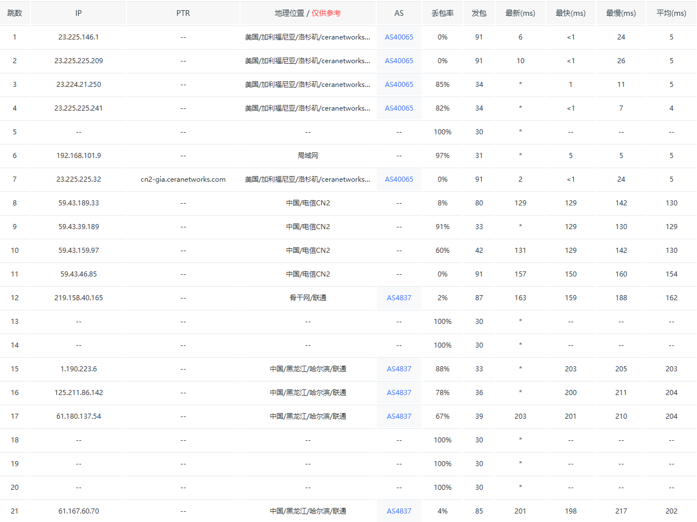

## Ping 分组网间探测 Traceroute 的作用及其原理 :blueberries:【重要·常考】

测试网络连通性和时延，`ping` 命令会发送一份 ICMP 回显请求报文给目标主机，并等待目标主机返回 ICMP 回显应答。因为 ICMP 协议会要求目标主机在收到消息之后，必须返回 ICMP 应答消息给源主机，如果源主机在一定时间内收到了目标主机的应答，则表明两台主机之间网络是可达的。

**ICMP Echo Request 回送请求（类型 8）**，目标收到后返回 **ICMP Echo Reply 回送回答报文（类型 0）**，并据此计算**往返时延**和**丢包率**。

**Traceroute** 通过逐跳递增 IP 报文的 TTL（1,2,3…）迫使路径上每台路由器返回 **时间超过（类型 11）** ICMP 控制消息，从而记录沿途跳点 **IP** 与**往返时间**，直至目标返回回送回答报文 **ICMP Echo Reply**（发回送请求 **ICMP Echo Request** 实现）/ 端口不可达（发 UDP 实现），完成**路由跟踪**，显示数据包经过的每个路由器的 **IP 地址**和**延迟时间**。

!!! Warning "Tips"
    ping 工作在应用层直接调用 raw socket 发 ICMP; Traceroute 工作在网络层。二者都需要构造/解析网络层报文，因此都“看起来”在网络层干活，只是 Ping 还额外提供了命令行小程序而已。

    ping 的结果包括字节（Bytes）、时间（Time）和 TTL，其中 IP 报的 8 位 TTL 作用：

    1.  防止数据包无限循环：在网络中，数据包可能会因为不正确的路由表等原因进入环路。TTL 值可以确保数据包在网络中传输一段时间或经过一定数量的路由器后被丢弃，避免**数据包无限循环**，从而防止网络资源被占用。

    2.  **测量**数据包**传输路径**：通过观察数据包在传输过程中 TTL 值的变化，可以大致判断出数据包从源到目的地经过的路由器数量，进而了解网络的延迟和稳定性。

    Traceroute 的实现一共有三种方法，即向目标发送的 IP 报是什么，分别是：

    - TCP traceroute（使用 tracetcp 程序可以实现）
    - UDP traceroute（Cisco 和 Linux 默认情况下使用）
    - ICMP traceroute ( MS Windows 默认情况下使用）

    所以其实不一定是 UDP+ICMP，也可以是 ICMP+ICMP，如果非要选那就 UDP，`tracert` 是 Windows 下常用的命令行工具，UNIX 下的是 `traceroute`。这两个常用的都是**基于 UDP+ICMP**，不同的是最后目的主机返回什么，**共同点**是用了 **TTL 逐级跳增和 ICMP 时间超过**的差错报告。