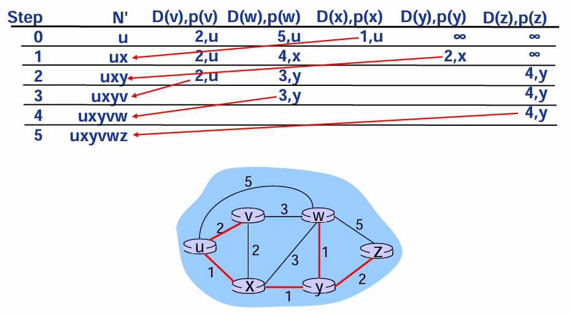
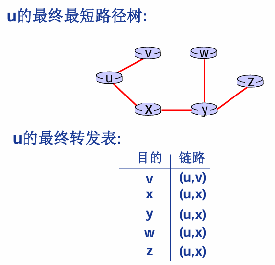
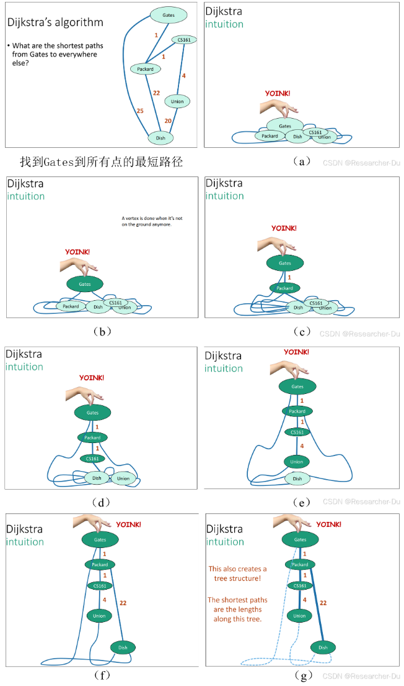

## OSPF（开放式最短路径优先）链路状态路由算法 LS 算法  :blueberries:【重要·常考】

### 核心算法与流程 :pear:【重要】
OSPF 基于**链路状态（LS）算法**，通过**洪泛法**同步网络拓扑，再使用 **Dijkstra 最短路径算法** 计算最短路径树，最终生成路由表。

### Dijkstra 算法（悬挂法理解） :pear:【重要】

- **核心思想**：从源节点出发，逐步将“最短路径已确定”的节点加入集合 $N'$，并更新其他节点的最短距离估计值。
- **示例**：以节点 $u$ 为源，计算到各节点的最短路径：

    1.  初始：$N' = \{u\}$，各节点距离为 $D(v)=2, D(w)=5, D(x)=1, D(y)=\infty, D(z)=\infty$
    2.  迭代：每次将当前最短距离的节点加入 $N'$，更新邻居距离（如 Step 1 加入 $x$，更新 $D(y)=2$；Step 2 加入 $y$，更新 $D(w)=3, D(z)=4$ 等）
    3.  最终：生成**最短路径树**和**转发表**

