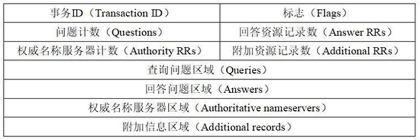
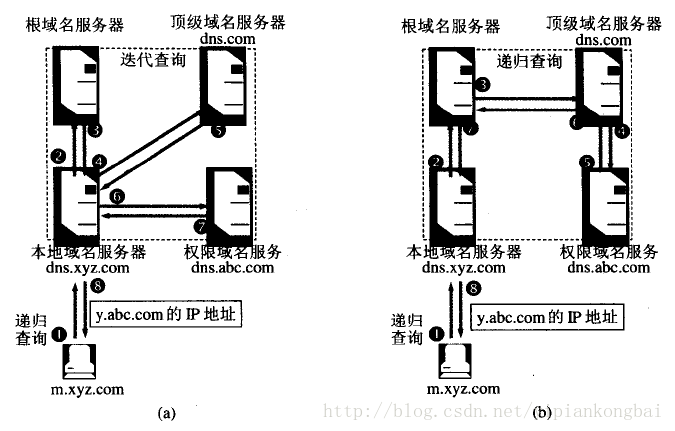
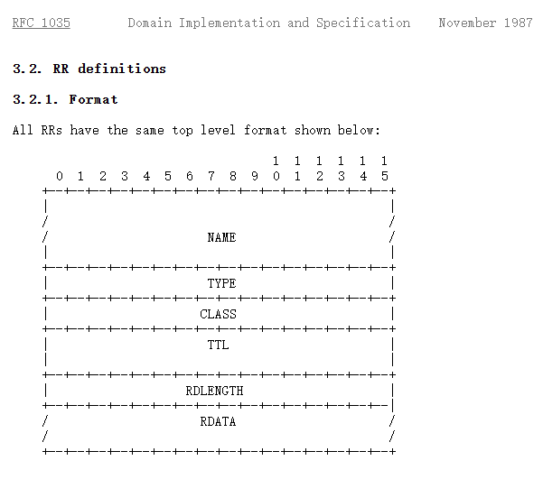

## DNS（域名系统）递归查询/迭代查询 :blueberries:【重要·常考】

查询（query）和回复（reply）消息格式相同

### 迭代查询

1.  主机向**本地域名服务器**发出 DNS 请求报文
2.  本地域名服务器收到请求，查**本地缓存**无果，**以迭代方式**向**根域名服务器**发出请求
3.  根域名服务器不代其转发，**直接返回** `.com` **顶级域名服务器** 的记录

!!! Warning "Tips"
    此时返回 **NS & A** 记录

4.  本地域名服务器再向 **顶级域名服务器** `dns.com` 发出迭代请求
5.  `dns.com` **直接返回** `abc.com` 的 **权限域名服务器** 的记录
6.  本地域名服务器再向**权限域名服务器** `dns.abc.com` 发出迭代请求
7.  `dns.abc.com` **直接返回**最终答案，**本地域名服务器**将该结果**写入缓存**，**发回到本地主机**

### 递归查询

1.  向**本地域名服务器**发出 dns 请求报文
2.  **本地域名服务器**收到请求后，查询**本地缓存**，若没有，则向**根域名服务器**发出请求
3.  **根域名服务器**判断属于 `.com` 域，向**顶级域名服务器** `dns.com` 发出请求
4.  **顶级域名服务器**收到请求，判断属于 `abc.com` 域，向对应的**权限域名服务器** `dns.abc.com` 发出请求
5.  **权限域名服务器**收到请求，将查询结果发回**顶级域名服务器**，依次发回直到本地主机，**本地域名服务器**将该结果**写入缓存**

---

!!! Warning "Tips"
    DNS记录内容方面**真题与大黑书的定义有歧义**，需要注意，837 估计是参照 RFC1035 的原文的定义：**NAME TYPE CLASS TTL RDATA RDLENGTH**（没有 value）
    
    

    形如 `.edu.cn/.org.eu` 的域名严格意义上不算顶级域名（`gov.cn` 网站和 `gov.cn` 域名的 `miit.gov.cn` 网站的关系）

    根区授权的服务器负责 `.cn`（由 CNNIC 运维）；`.cn` 的**权威**服务器（RFC 原文：**Authoritative DNS Server** / 或者叫权限服务器）里再委派一条 `.edu.cn` 区（zone），由 CERNET 网络中心另设一组 NS 负责解析。（考试大概不会这么考）

    主机名：`abc.edu.cn`中，`abc` 是主机名，`edu.cn` 是域名