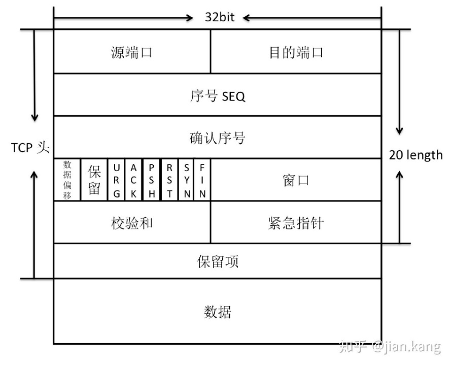
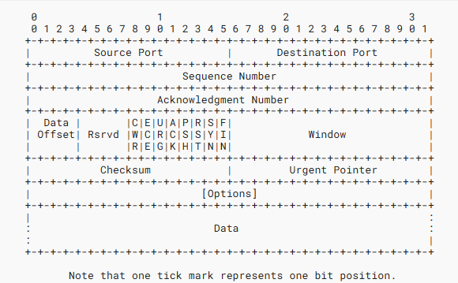

## TCP（传输控制协议）结构 :pear:【重要】

四元组是：**源 IP 地址、目的 IP 地址、源端口、目的端口**

TCP 四元组可以**唯一确定一个链接**，原地址和目的地址在 IP 报文中，是将报文发送或接收到对应主机。原端口和目的端口是 TCP 报文头部，用于发送给对应主机的相应进程。

### 标志位

- **SYN**：同步序号，发起建立连接（三次握手第 1/2 次）。
- **FIN**：发送方已无数据，请求优雅四次挥手关闭连接。
- **RST**：立刻复位/拒绝连接，异常强制断开。
- **ACK**：确认号有效，表示已收到对方序号之前所有字节。
- **SEQ**：本报文段首字节在整个字节流中的序号，用于排序与重传。
- **PSH**：提示接收端立即把数据递交给应用，不再缓存等待。
- **URG**：紧急指针字段有效，指示其中有“插队”紧急数据需优先处理。

!!! Warning "Tips"

    

    **数据偏移**（其实 TCP 里的这个直接叫**首部长度**比较好，不然容易和 IP 的片偏移混淆，不过 RFC 9293 原文是 **DATA OFFSET**）的单位是 **4B**。由于 4 位二进制数能够表示的最大十进制数字是 15，因此数据偏移的最大值是 60 字节。这意味着 TCP 首部的最大长度为 60 字节，其中包括固定的 20 字节和最多 40 字节的选项字段。

    例如，如果数据偏移字段的值为 5，则表示 TCP 首部的长度为 `5 * 4 = 20` 字节。这是 TCP 首部的最小长度，不包含任何选项字段。

    隔壁 IP 数据报也有一个 4 位的首部长度，单位**也是 4B**（(5~15)*4B）。

    **“端到端”之间可以同时建立多条 TCP 连接**——只要 TCP 四元组（源 IP、源端口、目的 IP、目的端口）里至少有一项不同（比如端到端但端口不同，**“端到端”指的是两台主机的 IP 之间，不是固定某两个端口之间**）。