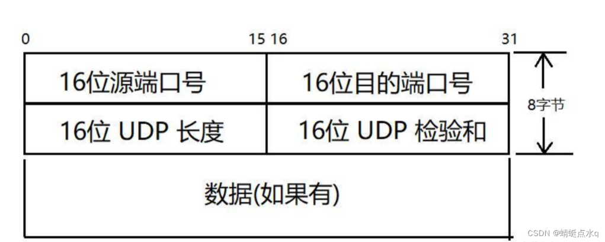
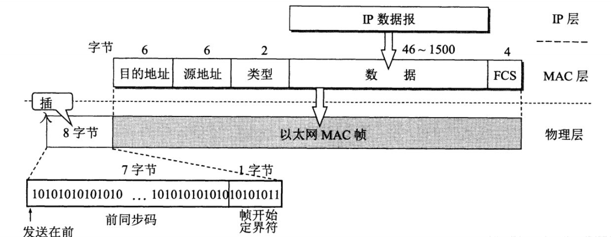

## UDP（用户数据报协议）结构 :pear:【重要】

### UDP 报文结构
UDP 头部固定 **8 字节**，格式如下：

| 字段 | 说明 |
|------|------|
| 16位源端口号 | 通信源端口，需要回信时填写，不需要回信时**可以是 0** |
| 16位目的端口号 | 通信目的端口，唯一标识目的进程 |
| 16位 UDP 长度 | 包含首部和数据，因此值 **> 8** |
| 16位 UDP 检验和 | 用于差错检测，计算范围包含伪首部、首部和数据 |

### 核心要点

- **唯一标识**：**目的 IP + 目的端口号** 二元组能唯一标识一个 UDP 套接字接口。
- **检验和规则**：UDP 检验和计算需包含 **12B 伪首部** + UDP 首部 + 数据。按 16 位堆叠相加后**取反码**，接收方只需将所有字段（含检验和）相加全为 1 即判定无差错。不校验时检验和字段填 **0**。
- **对比校验**：IP 首部校验和仅校验首部；TCP/UDP 校验和校验首部+数据。

!!! Warning "Tips"
    UDP 不是 CRC 校验，链路层 MAC 帧的检验和是 32b CRC，作为帧尾。MAC 帧除去前导码（8B）和 VLAN 标签（4B，不考虑）后，首尾共 18B。以太网 MAC 帧总长范围为 **64B ~ 1518B**（48+18 至 1500+18）。以太网默认 MTU 为 1500 字节，即 IP 数据报最大长度为 1500 字节。

    IP 数据报封装结构：
    

    补充对比：

    - IP 首部校验和：仅校验 IP 首部
    - TCP/UDP 检验和：校验 伪首部 + 首部 + 数据