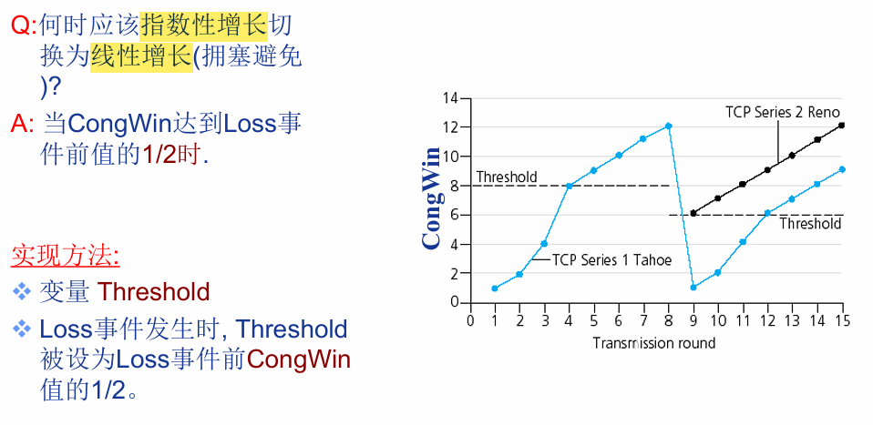

## TCP 可靠传输 慢开始 网络超时 拥塞避免 冗余确认 重复确认 快重传 快恢复 的原理机制 :blueberries:【重要·常考】

### 网络拥塞的定义
网络拥塞（congestion）是指在**分组交换网络**中传送分组的数目太多时，由于存储转发节点的资源有限而造成网络传输性能下降的情况。当网络发生拥塞时，一般会出现**数据丢失、时延增加、吞吐量下降**。

!!! Warning "Tips"
    电路交换技术在通信双方之间建立一条专用的物理通道，通常用于电话网络（PSTN）和某些专用网络连接。由于是专用通道，通信过程中不会发生数据冲突，也就不存在拥塞问题。

---

### TCP 可靠传输基础机制
TCP 面向连接的可靠传输机制包括：**确认、重传、校验和、定时器、序号**等。

!!! Warning "Tips"
    报文出错时，UDP 直接丢弃；TCP 会要求发送方重传某个序号的报文。UDP 字段里没有序号，只有长度、校验和；而 TCP 依靠序号实现可靠传输。

---

### 核心状态转换

1.  **Timeout（超时）**：触发慢开始 + 拥塞避免
2.  **3 个冗余 ACK**：触发快重传 + 快恢复
3.  **到达 ssthresh（慢开始门限）**：转为拥塞避免

---

### 完整原理流程

#### 1. 慢开始阶段
发送方收到一个新报文的 ACK 就把 `cwnd`（拥塞窗口）加 1，当 `cwnd` 到达 `ssthresh`（慢开始门限）时，改用**拥塞避免算法**，`cwnd` 开始线性增长。

#### 2. 网络超时处理
网络超时时，设置 `ssthresh` 为当前 `cwnd` 的一半，并重新开始**慢开始算法**；当 `cwnd` 再次到达 `ssthresh` 时，改用**拥塞避免算法**，`cwnd` 线性增长。

#### 3. 快重传
发送方一旦连续收到 **3 个冗余 ACK（重复确认）**，就立即**快重传**相应报文段，而非等待超时计时器超时再重传，之后进入**快恢复**。

#### 4. 快恢复
把 `ssthresh` 和新 `cwnd` 一起调整为当前 `cwnd` 的一半，并从新 `cwnd` 开始执行**拥塞避免算法**。

---

### 结束慢开始的三种事件

1.  出现超时
2.  到达慢开始门限 `ssthresh`
3.  检测到 3 个冗余 ACK

---

### 拥塞控制的核心策略

- **拥塞避免**：加性增（线性增长）
- **快恢复**：乘性减（窗口减半）

!!! Warning "Tips"
    在 TCP 刚连接好并开始发送报文段时，令 `cwnd = 1`，每收到一个对报文段的 ACK 便 `cwnd += 1`（总体表现为：经过一个 RTT，`cwnd` 加倍），直到 `cwnd` 增大到 `ssthresh`，之后使用拥塞避免算法。慢开始的“慢”不是指 `cwnd` 增长速率慢，而是指一开始将 `cwnd` 设置为 1，再逐渐增大。

    TCP 实际发送窗口 = `min{rwnd（接收窗口）, cwnd（拥塞窗口）}`。

    - `ssthresh` 就是 threshold（慢开始门限）
    - `Congwin` 就是 `cwnd`（拥塞窗口）