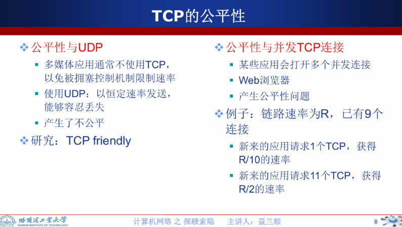
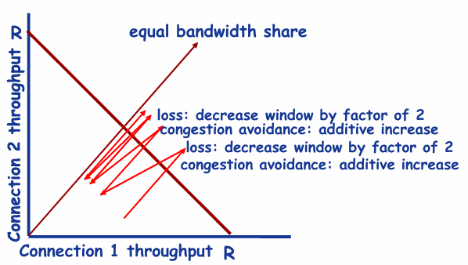

## TCP 流量控制 接收窗口的原理 :blueberries:【重要·常考】

TCP 利用**接收窗口 `rwnd`（TCP 报文中的“窗口”）**实现**流量控制**，接收端只允许另一端发送接收端缓冲区所能接纳的数据，防止较快主机致使较慢主机的**缓冲区溢出**。

---

!!! Warning "Tips"
    链路层的滑动窗口大小不能动态变换，而传输层 TCP 的 `cwnd`（拥塞窗口）和 `rwnd`（接收窗口）都可以动态调整。
    TCP 的窗口机制是实现**流量控制和拥塞控制**的核心手段，主要包括：
    - **滑动窗口**：基础的可靠传输窗口机制
    - **接收窗口 `rwnd`**：通过 TCP 报文首部的窗口字段告知发送方，限制发送速度以匹配接收能力
    - **拥塞窗口 `cwnd`**：由发送方自主维护，用于控制发送速率以避免网络拥塞

    TCP 实际发送窗口 = `min{rwnd（接收窗口）, cwnd（拥塞窗口）}`

---

### TCP 公平性问题

#### 公平性与 UDP

- 多媒体应用通常不使用 TCP，以免被拥塞控制机制限制速率
- 使用 UDP 时以恒定速率发送，能够容忍丢失，产生了不公平性
- 研究方向：TCP friendly（TCP 友好型协议）

#### 公平性与并发 TCP 连接

- 某些应用会打开多个并发连接（如 Web 浏览器），产生公平性问题
- 例子：链路速率为 R，已有 9 个连接

    - 新应用请求 1 个 TCP 连接，获得 `R/10` 的速率
    - 新应用请求 11 个 TCP 连接，获得 `R/2` 的速率

!!! Warning "Tips"
    “三个冗余 ACK” 指的是「再收到 3 个」重复 ACK，加上最早触发重复 ACK 的那 1 个，TCP 发送方一共会看到 **4 个** 序号相同的确认报文。