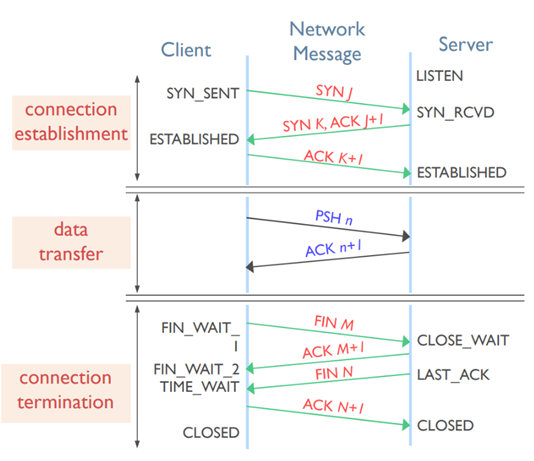

## TCP 三次握手 四次挥手 :pear:【重要】

### 三次握手
共 **3 个包**，流程为：
**SYN**(不携带数据，<u>消耗一个序号</u>) → SYN-ACK(不携带数据，<u>消耗一个序号</u>) → ACK（携带数据）。

**原因**：三次握手通过额外的确认步骤（客户端收到 ACK 后回复 ACK），可以让服务器验证客户端是否真的有意建立连接，从而避免**旧 SYN 和 SYN-ACK 丢失**造成的仅一方认为连接存在的问题。

---

### 四次挥手
共 **4 个包**，流程为：
**FIN**(不携带数据，<u>消耗一个序号</u>) → ACK （可以携带数据，不携带数据也<u>消耗一个序号</u>；携带数据就是正常 ACK）→ FIN-ACK → ACK。

**原因**：TCP 存在半连接和半关闭状态，两次挥手可以关闭一方连接，另一方还能发送数据；需两次关闭双方连接才算彻底挥手。
