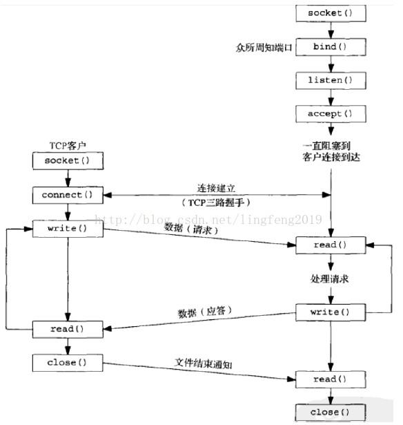
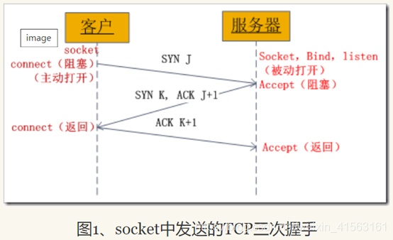
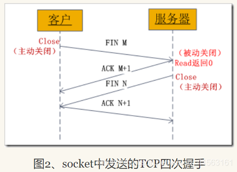

## Socket编程 原始套接字 :blueberries:【重要·常考】

### Socket 编程

### 原始套接字（Raw Socket）

允许应用程序直接处理**IP**数据包，包括**IP**头部和数据载荷。它绕过了传输层协议（如**TCP/UDP**），直接在**IP**层进行数据的发送和接收。这使得应用程序可以完全控制**IP**数据包的内容，包括**IP**头部的字段。

socket编程中**需要root权限**的是**raw_socket原始套接字编程**。在Linux系统中，**Raw Socket**是一种直接操作网络数据包的强大工具，通常用于网络编程和安全领域。它允许程序员绕过操作系统的传输层接口，直接访问底层协议来监听和发送低级别的网络数据包。**原始套接字允许开发者访问IP层的数据包**，而不是更高级别的**TCP**或**UDP**数据包。

!!! Warning "Tips"
    raw_socket可以用来修改片偏移、长度实现**ping of death**或者偏移重叠实现**tear drop**，目前真题仅要求会辨别什么是**raw_socket**。

    发送方靠**sendto()/connect()**定目的地址；接收方靠**bind()**定本地监听地址。

### Socket 编程中的三次握手和四次挥手

