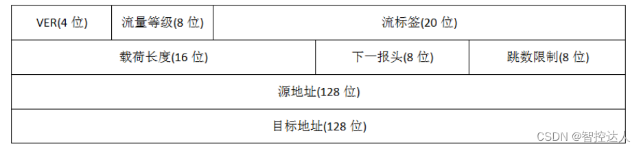
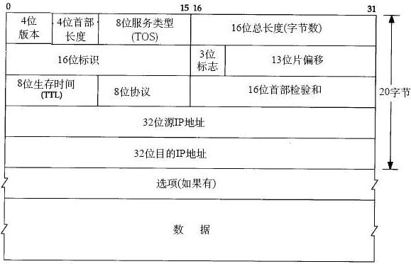
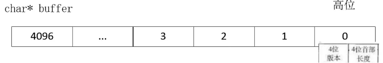

## IP（互联网协议） :blueberries:【重要·常考】

### IPv4 vs IPv6 头部对比

- **IPv4**：头部固定部分 **20 字节**，可通过选项扩展到 **60 字节**
- **IPv6**：头部固定 **40 字节**，**无扩展字段**；路由器禁止分片，仅允许发送方分片，无法分片时直接丢弃报文
- **地址类型**：IPv6 包含 **单播、多播、任意播**，**取消了广播**；任播（Anycast）地址用于让“一组主机中的某一个”接收报文

---

### IPv4 头部字段详解

1.  **版本号（4 位）**：标识 IPv4 或 IPv6
2.  **首部长度（4 位）**：`(5~15) * 4B`，表示 IP 头部长度（最小 20B，最大 60B）
3.  **服务类型（8 位）**：用于区分服务优先级（TOS）
4.  **标识符（16 位）**：范围 0~65535，用于长报文分片标识；TCP/UDP 超时重传时新 IP 报会启用新标识符，无法与原 IP 层报文重组
5.  **标志位（3 位）**：
      - 第 1 位保留
      - 第 2 位 **DF（Don't Fragment）**：`DF=1` 表示路由器禁止分片，超过 MTU 时直接丢弃
      - 第 3 位 **MF（More Fragments）**：`MF=1` 表示后面还有分片，`MF=0` 表示最后一片
6.  **片偏移（13 位）**：以 **8 字节** 为单位，标识分片在原始数据区的偏移量；**除最后一片外，其他分片数据长度必须是 8 的整数倍**（如 MTU=800B 时，非最后一片最大数据长度为 776B，总长度 796B）
7.  **TTL（8 位，IPv6 称 Hop Limit）**：防止报文无限循环，每经过一台路由器减 1，减到 0 时丢弃并返回 ICMP“超时”消息
8.  **协议类型（8 位）**：`6` 代表 TCP 协议，`17` 代表 UDP 协议
9.  **首部检验和（16 位）**：仅校验 IP 头部，保证头部完整性
10. **源 IP 地址（32 位）**
11. **目的 IP 地址（32 位）**
12. **选项（可变长度）**：最多 40 字节

!!! Warning "Tips"
    主机字节序是 **小端模式**，网络字节序是 **大端模式**。

    IP 包实际组帧格式示例：
    