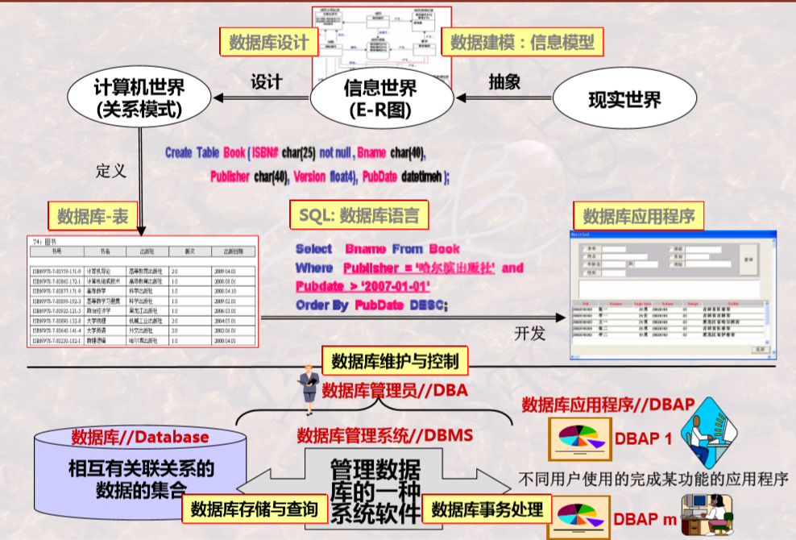

# 数据库系统

中国大学 MOOC 哈工大战德臣数据库系统：课件+习题笔记+习题。

知识结构：

课程习题地址：

- [哈工大战德臣数据库系统（上）MOOC课程+习题](https://www.icourse163.org/course/HIT-1001516002?tid=1470930448)
- [哈工大战德臣数据库系统（中）MOOC课程+习题](https://www.icourse163.org/learn/HIT-1001554030?tid=1470918446)
- [哈工大战德臣数据库系统（下）MOOC课程+习题](https://www.icourse163.org/learn/HIT-1001578001?tid=1470929443)
