# 代数结构速查例（极简版）

几个概念的简单例子：

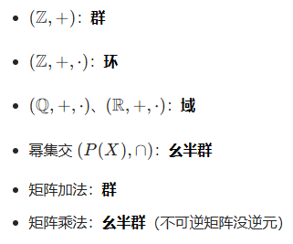

# 1 基本概念

• 定义 —— 是什么（概念） —— 如何表示
• 性质 —— 怎么样（特点）
• 运算 —— 如何处理（原则性过程）
• 定理 —— 有什么规律（规律总结）

## 1.1 集合

Q：对于集合 A，|A| 指的是什么？A：集合 A 的基数。

Q：集合的基数是指什么？A：集合中包含的元素个数。

## 1.2 映射与变换

Q：两有限集 A，B 之间可以建立双射的充分必要条件是什么？A：|A|=|B|。

Q：什么是集合 A 的一个变换？A：集合 A 到其自身的映射，可以是单射、满射或双射。

Q：任意 n 元有限集共几个双射变换？A：n! 个。

Q：什么是单射、满射、双射？A：单射是指从集合A到集合B的映射，满足对任意元素a，存在且仅有一个元素b，使得f(a)=b。满射是指从集合A到集合B的映射，满足对任意元素b，存在且仅有一个元素a，使得f(a)=b。双射是指从集合A到集合B的映射，满足对任意元素a，存在且仅有一个元素b，使得f(a)=b。

例题：复合映射的结论如下

f、g 都是双射	充分条件：g∘f 一定是双射（但反过来不成立）
g∘f 是单射	必要条件：f 是单射
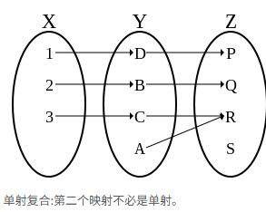
g∘f 是满射	必要条件：g 是满射
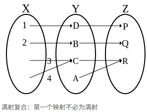
g∘f 是双射	必要条件：f 单射，g 满射
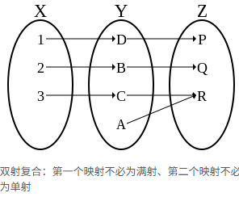

## 1.3 代数运算

Q：什么是代数运算？A：在集合(M)上的法则($\circ$)，$\forall a,b \in M,\exists!d\in M:a\circ b=d$。

Q：T(M)是什么？A：集合M上所有变换构成的集合。

Q：S(M)是什么？A：集合M上所有双射变换构成的集合。

## 1.4 运算律

## 1.5 同态与同构

Q：$M\sim \bar M$表示什么？A：代数系统$M$与$\bar M$同态。

Q：代数系统$M$与$\bar M$同态的条件是什么？A：存在一个从代数系统$M$到$\bar M$的同态映射，且为满射。

Q：什么是同态映射？A：集合M到集合($\bar{M}$)的一个映射($\varphi$)，$\exists \varphi:M\to \bar M$满足$\varphi(a\circ b)=\varphi(a)\bar \circ \varphi(b)$。

Q：$M\cong\bar M$表示什么？A：代数系统$M$与$\bar M$同构。

Q：代数系统$M$与$\bar M$同构的条件是什么？A：存在一个从代数系统$M$到$\bar M$的同构映射。

Q：什么是同构映射？A：是一个双射的同态映射($\varphi$)

同态满足：$\varphi(a\circ b)=\varphi(a)\bar \circ \varphi(b)$ + 满射。

同构满足：$\varphi(a\circ b)=\varphi(a)\bar \circ \varphi(b)$ + 双射。

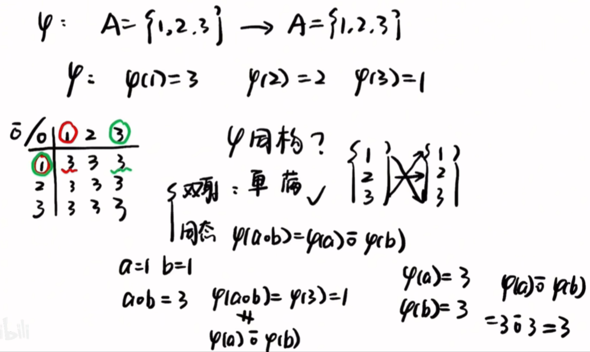
上图案例中123映射321满足双射；
$\circ$和$\bar \circ$运算结果一直为3，$\varphi(a\circ b)=\varphi(a)\bar \circ \varphi(b)$ 不满足，不是同构映射；

所以代数系统$M$与$\bar M$不同构。

Q：Cayley定理是什么？A：Cayley 定理（凯莱定理）的核心内容是：任何群 G 都同构于 G 上的左变换群（左正则表示），即群 G 与集合 G 上的一个置换群同构。

## 1.6 等价关系与集合的分类

# 2 群

## 2.1 群的定义和初步性质（群、半群、半幺群、交换群）

Q：群是什么？A：集合对代数运算满足结合律，且有单位元和逆元，则集合对代数运算成群。

举例1：$M=\{1,2,3\}$，$\circ$为乘法运算，则$M$对代数运算成群。

因为：

（1）结合律：$(a\circ b)\circ c=a\circ (b\circ c)$。

（2）单位元：$e\circ a=a\circ e=a$。（单位元e是乘法运算的单位元，a是M中的元素，具体e=1）

（3）逆元：$a^{-1}\circ a=a\circ a^{-1}=e$。（a^{-1}是a的逆元，a是M中的元素，具体e=1）

**但如果M为R（包括0），则不是群：因为0没有逆元（1/0不存在定义）**

举例2：$M=\Z$，$\circ$为加法运算，则$M$对代数运算成群。

因为：

（1）结合律：$(a\circ b)\circ c=a\circ (b\circ c)$。

（2）单位元：$e\circ a=a\circ e=a$。（单位元e是加法运算的单位元，a是M中的元素，具体e=0）

（3）逆元：$a^{-1}\circ a=a\circ a^{-1}=e$。**（$a^{-1}$是a的逆元即$a^{-1}=-a$，a是M中的元素，具体e=0）**

Q：**半群**是什么？A：：**运算封闭** + **结合律**，不需要有单位元，也不需要每个元素有逆元。例如：（{0，1}，min）是半群。因为：

（1）运算封闭：$0\circ 1=0$，$1\circ 0=0$。

（2）结合律：$(0\circ 1)\circ 0=0$，$0\circ (1\circ 0)=0$。

所以（{0，1}，min）是半群。

Q：什么是有限群/半群？A：群/半群中元素的个数是有限的。

Q：左乘、右乘是指什么？A：左边那个元素，自己去乘右边的，就叫左乘。右边那个元素，自己去乘左边的，就叫右乘。

Q：什么是左/右消去？A：在群中，如果存在一个元素a，使得 ab = ac，那么称a是左消去元素。如果存在一个元素a，使得 ba = ca，那么称a是右消去元素。

例题：
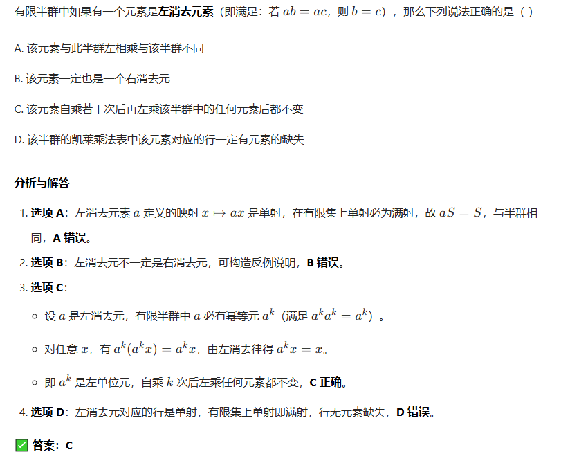

Q：什么是半幺群？A：半群中，存在单位元 e（对任意 a，有 e∘a = a∘e = a）不要求每个元素都有逆元。

案例：

- (N+,+)：不是，没单位元（正自然数集N+没有0这个元素）

- (N,×)：是半幺群，单位元 1

- ({0,1},×)：是半幺群，单位元 1

Q：交换群（Abelian Group，**阿贝尔群**）是什么？A：群的代数运算满足交换律的群：比如乘法群、加法群。

Q：对于群 G，|G| 指的是什么？A：群 G 的阶。

Q：群的阶是什么？A：群中包含的元素个数。

## 2.2 群中元素的阶

Q：对于群中元素 a，|a|指的是什么？A：元素 a 的阶。

Q：群中元素 a 的阶是什么？A：使$a^n=e$： 使得$a^n$=单位元的最小正整数 n。

比如在（Z,·）中，e为1，$a^n$，对于元素a=2来说，$2^1=1$，所以2的阶为1。-1的阶为2。-2的阶不存在，则称-2的阶为**无限**。

比如在G={1，-1，i，-i}中，e为1，$a^n$，对于元素a=i来说，$i^4=1$，所以i的阶为4。-i的阶为4。1的阶为1。-1的阶为2。

Q：什么是周期群？A：群中每个元素的阶都有限的群。

Q：什么是无扭群？A：群中除单位元e外，其余元素的阶均无限的群。

## 2.3 子群

Q：设G，H是群，$H\leq G$指的是什么？A：H是G的子群。

Q：群G的子群H需要满足哪些条件？A： H 是 G 的一个非空子集，且对G的代数运算也作成一个群。

Q：|G|>1，G的平凡子群是什么？A：只由单位元e做错的子群{e}。

Q：什么是中心元素？A：令 G 是一个群， G 中元素 a 如果同 G 中每个元素都可换，则称 a 是群G的一个 中心元素。

Q：什么是群G的中心？A：群G的中心元素作出的一个集合C(G)，也是G的一个子群。

## 2.4 循环群

Q：什么是循环群？A：每一个元素都是由一个元素（生成元）生成的群。

Q：什么是生成系？A：设M是群G的一个非空子集，G中包含M的子群总是存在，\<M\>是所有包含M的子群的交，则M是子群\<M\>的生成系。

Q：什么是循环群的生成元？A：生成循环群的那个元素。

例如：
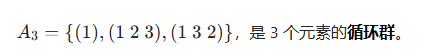

生成元的要求：
能通过幂运算生成群里**所有元素**的元素，才叫生成元。

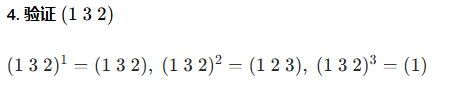

覆盖了全部 3 个元素，满足要求，是一个生成元。

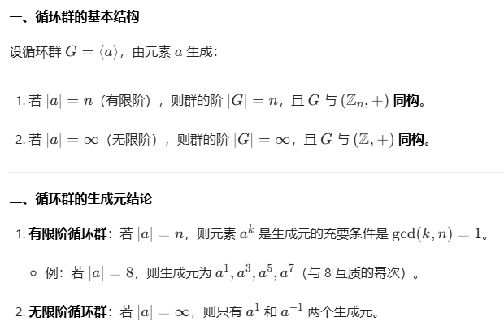

Q：循环群的子群需要满足哪些条件？A： 循环群的子群一定是循环群，且阶数必是原群阶数的正因数

例题：

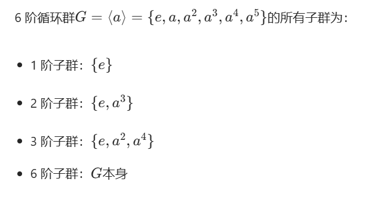

本题中∣G∣=6，其正因数为1,2,3,6，因此子群的阶只能是1,2,3,6。

## 2.5 变换群

Q：什么是变换群？A：一个集合上的一些变换为元素，关于这些变换的代数运算所成的群。

Q：什么是对称群？A：集合M上的双射变换群S(M)为M上的对称群。

## 2.6 置换群

Q：n元对称群$S_n$是指什么？A：n个元素的集合上的所有双射变换。

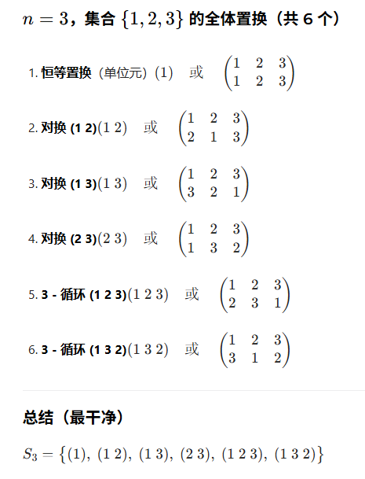 
数量是：n!

Q：什么是置换群？A：n元对称群$S_n$的任意一个子群。

Q：什么是k-轮换？A：将数码$i_1$变成$i_2$，$i_2$变成$i_3$，…，$i_{k-1}$变成$i_k$，$i_k$变成$i_1$，其余数码不变的置换$\sigma$。

Q：什么是对换？A：2-轮换。

例如:

（1 2 3）→ （3 2 1）为**轮换**（1 2 3）的3-轮换
（1 2 3）→ （2 1 3）为**对换**（1 2）的2-轮换。

Q：什么是不相连轮换？A：没有公共数码的轮换。

Q：什么是奇置换和偶置换？A：能分解为奇数/偶数个对换的乘积的置换。

## 2.7 陪集、指数和 Lagrange定理 (拉格朗日定理)

Q：什么是左陪集/右陪集？A：G的子集$aH=\{ax|x\in H\}$和$Ha=\{xa|x\in H\}$，H为G的一个子群，$a\in G$。

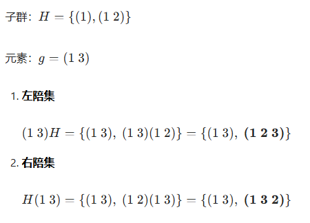
从左往右:（（1）（13））（12）则（1）->（3）

Q：H是G的子群，(G:H)是指什么？A：H在G里的指数。

Q：什么是子群H在群G里的指数？A：群 G 中关于子群 H 的互异的左（或右）陪集的个数。

Q：Lagrange 定理的内容是什么？A：|G|/|H|=(G:H)，即任何子群的阶和指数都是群 G 的阶的因数。

比如：

若$S_3$的阶为 3 * 2 * 1 = 6 ，$H$({1},{1,2}) 的阶为 2 (群的阶为群元素个数)

则 |S_3|=|H|(G:H)=6/2=3

意味着指数(G:H)为3，即有三个陪集。

# 3 正规子群和群的同态与同构

## 3.1 群同态与同构的简单性质

Q：群 G 到群 $\bar G$的同态映射 $\varphi$ 是单射的充分必要条件是什么？A：群 $\bar G$的的单位元$\bar e$ 的逆象只有 e。

Q：什么是Klein四元群？A：有4个元素，除了单位元外其阶均为2，最小的非循环群。

## 3.2 正规子群和商群

Q：N$\unlhd$G是指什么？A：N是G的正规子群。

Q：什么是正规子群？A：对G中每个元素a都有aN=Na的子群N。

Q：G/N是指什么？A：G关于N的商群。

Q：什么是商群？A：群 G 的正规子群 N 的全体陪集对于陪集乘法作成一个群。

Q：什么是哈密顿群？A：每个子群都是正规子群的非交换群。

Q：有限交换群 G 为单群的充要条件是什么？A：|G|为素数。

## 3.3 群同态基本定理

Q：任何群和其什么群同态？A：商群，$G \sim G / N$。

Q：设$\varphi$是群 G 到群$\bar G$的一个同态映射，$Ker\varphi$ 是什么？A： $\varphi$ 的核。

Q：什么是同态映射 $\varphi$ 的核？A：$\bar G$ 的单位元在 $\varphi$ 之下的所有逆像作成的集合。

Q：设$\varphi$是群 G 到群$\bar G$的一个同态映射，$Im\varphi$ 是什么？A： $\varphi$ 的像集。

Q：什么是同态映射 $\varphi$ 的像集？A：$G$ 中所有元在 $\varphi$ 之下的像作成的集合。

Q：群同态基本定理揭示了什么规律？A：设$\varphi$是群 G 到群$\bar G$的一个同态满射，则$N=\operatorname{Ker} \varphi \unlhd G,G / N \cong \bar{G}$。

Q：循环群的同态像必为什么群？A：循环群。

Q：循环群的商群是什么群？A：循环群。

## 3.4 群的同构定理

Q：第一同构定理：设$\varphi$是群G到群$\bar G$的一个同态满射，又$Ker\varphi \subseteq N \unlhd G$，$\bar N = \varphi(N)$，则？A：$G / N \cong \bar{G} / \bar{N}$。

Q：第二同构定理：设G是群，又$H\leq G,N \unlhd G$，则？A：$H\cap N \unlhd H,HN/N\cong H/(H\cap N)$。

Q：第三同构定理：设G是群，又$N\unlhd G,\bar H\leq G/N$，则？A：$\exists!H\leq G:H\supseteq N \wedge \bar H = H/N$。

## 3.5 群的自同构群

Q：对于群G，AutG 是什么？A：群G的自同构群。

Q：什么是自同构群？A：群M的全体自同构关于变换的代数运算作成的群。

Q：无限循环群的自同构群是一个几阶循环群？A：2。

Q：n 阶循环群的自同构群是一个几阶群？A：$\varphi(n)$，$\varphi(n)$为 Euler 函数。

Q：对于群G，InnG 是什么？A：群G的内自同构群。

Q：什么是内自同构？A：对于群G，$a\in G,\tau_{a}: x \rightarrow a x a^{-1}\qquad (\forall x \in G)$ 是 G的一个内自同构。

Q：什么是不变子群？A：正规子群也被称为不变子群。

Q：为什么正规子群被称为不变子群？A：对群G的正规子群N来说，总有$\tau_{a}(N)\subseteq N$。

Q：什么是特征子群？A：对群G的所有自同构$\sigma$都不变的子群N，$\sigma(N)\subseteq N$。

Q：什么是全特征子群？A：对于群G的所有自同态映射$\varphi$都不变的子群H，$\varphi(H)\subseteq H$。

Q：全特征子群、特征子群、正规子群之间的关系是什么？A：$全特征子群 \subseteq 特征子群 \subseteq 正规子群$。

# 4 环与域

## 4.1 环的定义

Q：什么是加群？A：对R的加法作成一个群，满足结合律和交换律、有单位元和逆元的群。

Q：什么是半群？A：对R的乘法作成一个半群，满足结合律。

Q：什么是零元？A：加群的单位元。

Q：什么是负元？A：加群的逆元。

Q：什么是环？A：设非空集合R有两个代数运算，一个叫做加法（一般用+表示），另一个叫做乘法，R 对加法作成一个群，对于乘法满足结合律，乘法对加法满足左右分配律，则称R对这两个代数运算作成一个环。环未必有单位元。

Q：什么是环的左 or 右单位元？A：环R中有元素e，对环中每个元素a都有ea=a or ae=e，则称e为环R的一个左or右单位元。

例题：
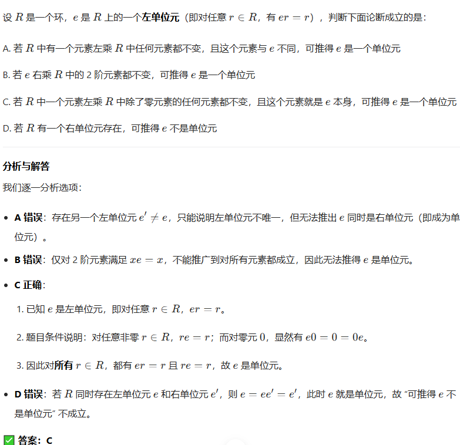

Q：什么是偶数环？A：既无左单位元又无右单位元的环。

Q：什么是环R的子环？A：对R的加法域乘法也作成一个环的R的非空子集。

Q：环R的非空子集S作成子环的充要条件是？A：$\begin{array}{l}a, b \in S \Rightarrow a-b \in S \\ a, b \in S \Rightarrow a b \in S\end{array}$。

Q：什么是环R的加群？A：环R关于其加法作成一个加群(R,+)。

Q：什么是循环环？A：环R的加群(R,+)是一个循环群，则环R是一个循环环。

Q：什么样的环必为循环环？A：阶为互异素数之积的有限环。

## 4.2 环的零因子和特征

Q：环 R 的零因子 a 需要满足什么条件？A：存在元素 $b\neq 0$，使 $ab=0$，称 a 为 环 R 的一个 左零因子。

Q：数环以及数域上的多项式环，有无零因子？A：无。

Q：在无零因子的环中，关于乘法的什么律成立？A：消去律。

Q：在环 R 中，若 不是左零因子，则？A：$ab=ac,a\neq 0 \Rightarrow b = c$。

Q：环中有左零因子就有右零因子？A：对。

Q：什么是整环？A：阶大于 1 、有单位元且无零因子的交换环。

Q：环 R 的特征是什么？A：环 R 的元素（对加法）的最大阶 n。

Q：char R 是啥？A：环 R 的特征。

Q：只含有零元素的环，其特征是？A：1。

Q：在数环中除了{0}外，其他环的特征有和特点？A：都无限。

Q：设R是一个无零因子环，且|R|>1，则 R 中所有非零元素（对加法）的阶有什么特点？A：都相同。

Q：设R是一个无零因子环，且|R|>1，R 的特征有限，则 R 的特征有何特点？A：为素数。

Q：若环R有单位元，则 R 的特征与单位元有什么关系？A：单位元在加群(R, +)中的阶就是R的特征。

## 4.3 除环和域

Q：R 是除环需要满足什么条件？A：|R|>1，又R有单位元且每个非零元都有逆元。

Q：除环又叫做什么？A：体。

Q：可换除环称为什么？A：域。

Q：除环和域没有什么？A：零因子。

Q：阶数大于1的有限环若有非零因子元素，则其有什么？A：单位元。

Q：阶数大于1的有限环若有非零因子元素，则每个非零因子元素都是什么？A：可逆元。

Q：设R是一个有单位元的环，则R的可逆元也称为R的什么？A：单位。

Q：R的全体可逆元（单位）作成的群，称为R的什么？A：乘群或单位群。

Q：R 的乘群或单位群用什么表示？A：$R^*$ 或 $U(R)$。

