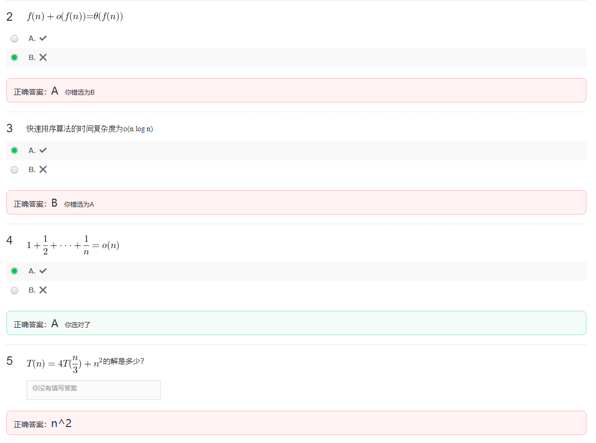

### 第2题解析
**题干**：时间复杂度是衡量算法性能的最重要标准。
**正确答案**：B（×）

**解析**：
算法性能的衡量是多维度的，除了**时间复杂度**，还有**空间复杂度**、可读性、可维护性、健壮性等。在不同场景下，这些指标的重要性是不同的。

### 第3题解析
**题干**：能够在计算机上运行的计算过程即是算法。
**正确答案**：B（×）

**解析**：
一个严格意义上的算法，必须满足以下5个重要特性：
1.  **有穷性**：算法必须在有限的步骤内结束。
2.  **确定性**：每一步骤的含义都是明确的，没有歧义。
3.  **可行性**：每一步操作都可以通过基本运算在有限次内完成。
4.  **输入**：有0个或多个输入。
5.  **输出**：有1个或多个输出。

“能够在计算机上运行的计算过程”可能不满足这些特性，例如一个无限循环的程序可以运行，但它不是一个算法。因此，该说法是错误的。

---

T2

 \( f(n) + o(f(n)) \) 与 \( f(n) \) 同阶，即 \( f(n) + o(f(n)) = \Theta(f(n)) \)。

T3

 **答案**：B（×）✅

**解析**：
快速排序的时间复杂度需要分情况讨论：
- **平均情况**：时间复杂度为 **O(n log n)**。
- **最坏情况**：当每次划分都极不均衡时（例如，对已经有序的数组排序），时间复杂度会退化为 **O(n²)**。

题目中使用的符号是小o记号 `o(n log n)`，它表示严格小于 `n log n` 的增长量级，这与快速排序的实际复杂度不符。即使使用大O记号 `O(n log n)`，也只描述了平均情况，而忽略了最坏情况，因此该表述不准确。

T5

---

---

### 第3题：分治法必须用递归程序实现
- **正确答案**：B（×）
- **错因分析**：
  分治法是一种**思想**，核心是“分解-解决-合并”，递归只是实现它的一种常见方式，并非唯一方式。很多分治算法（如归并排序、快速排序）也可以通过显式栈等迭代方式实现。因此“必须用递归”的表述过于绝对。

---

### 第5题：在一个长度为n的数组中选择第10大的数可以用O(n)的算法实现
- **正确答案**：A（✓）
- **错因分析**：
  可以使用**快速选择（Quickselect）算法**，它基于分治思想，平均时间复杂度为 **O(n)**，最坏情况为O(n²)，但通过随机化选择 pivot 可以将期望时间复杂度控制在O(n)。对于“第10大”这种固定小常数的选择，完全可以在O(n)时间内完成。

---
