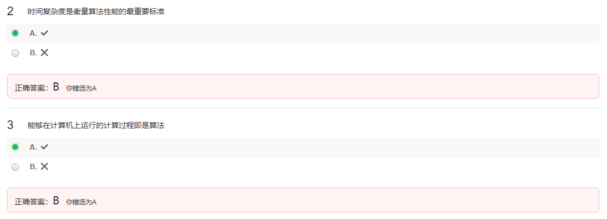

### 第2题解析
**题干**：时间复杂度是衡量算法性能的最重要标准。
**正确答案**：B（×）

**解析**：
算法性能的衡量是多维度的，除了**时间复杂度**，还有**空间复杂度**、可读性、可维护性、健壮性等。在不同场景下，这些指标的重要性是不同的。

### 第3题解析
**题干**：能够在计算机上运行的计算过程即是算法。
**正确答案**：B（×）

**解析**：
一个严格意义上的算法，必须满足以下5个重要特性：
1.  **有穷性**：算法必须在有限的步骤内结束。
2.  **确定性**：每一步骤的含义都是明确的，没有歧义。
3.  **可行性**：每一步操作都可以通过基本运算在有限次内完成。
4.  **输入**：有0个或多个输入。
5.  **输出**：有1个或多个输出。

“能够在计算机上运行的计算过程”可能不满足这些特性，例如一个无限循环的程序可以运行，但它不是一个算法。因此，该说法是错误的。

---

