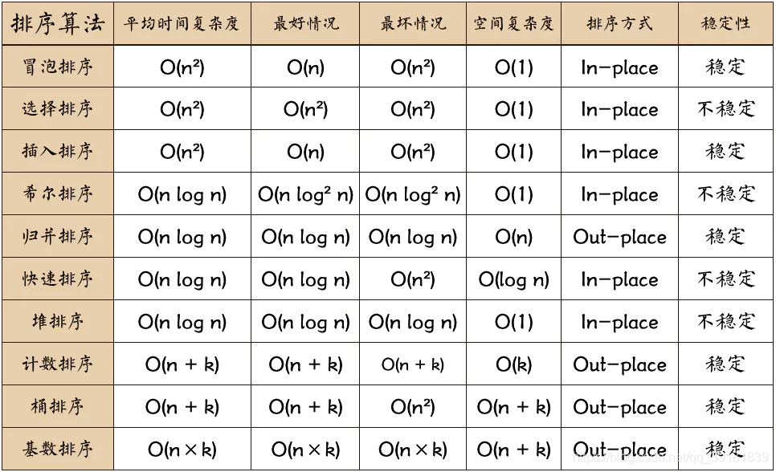
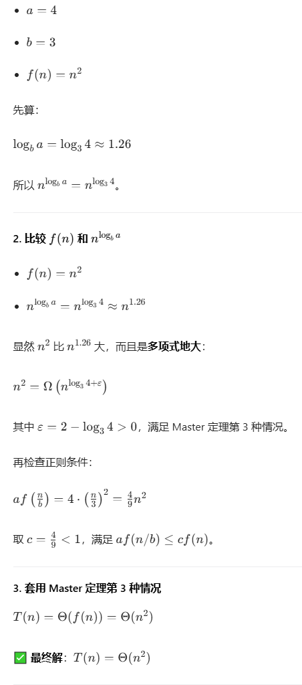
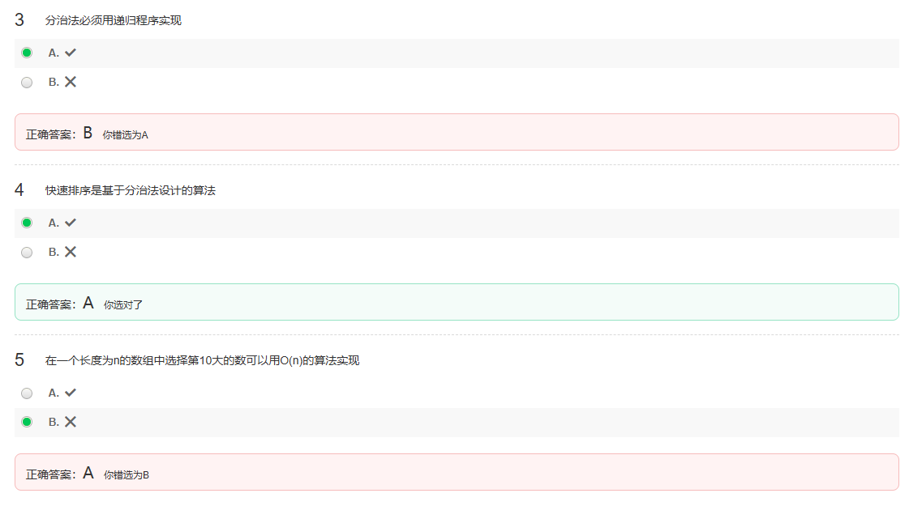
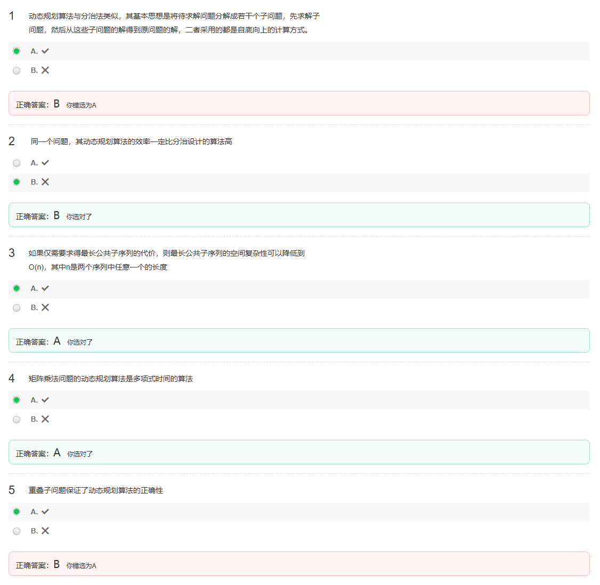
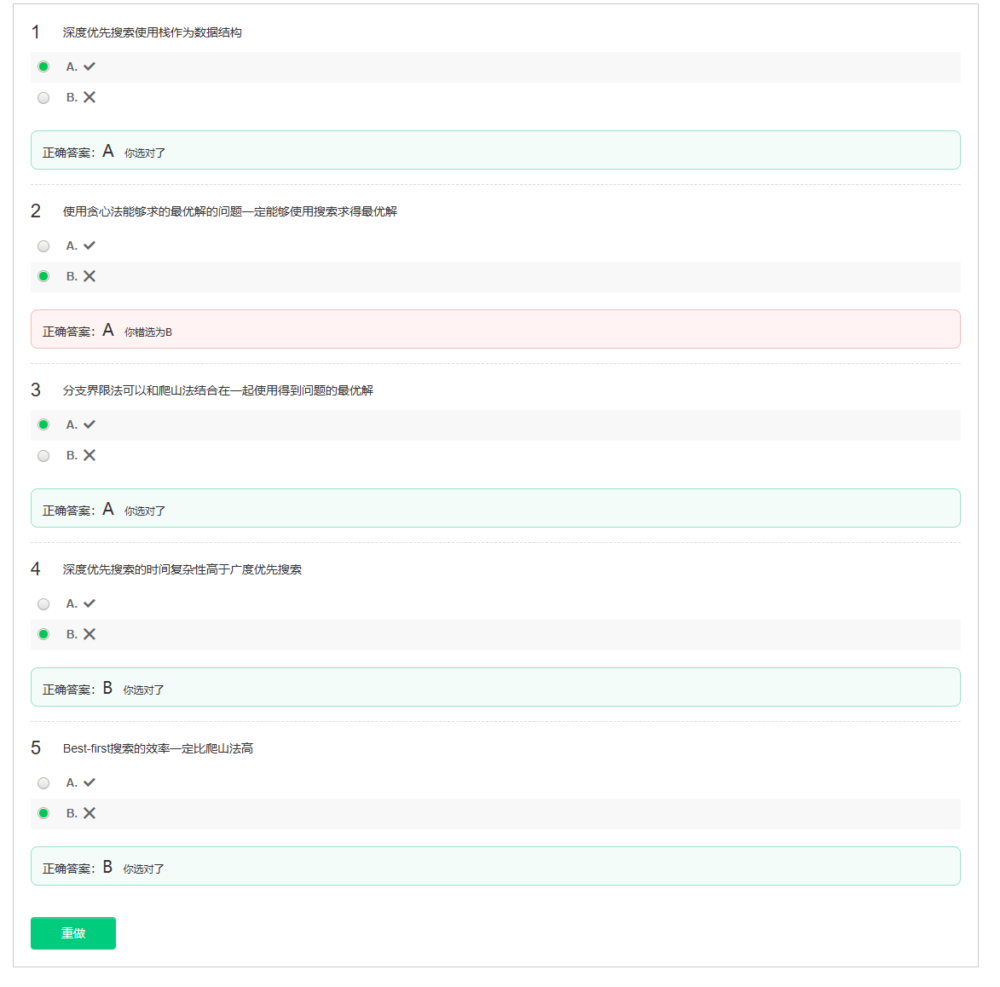
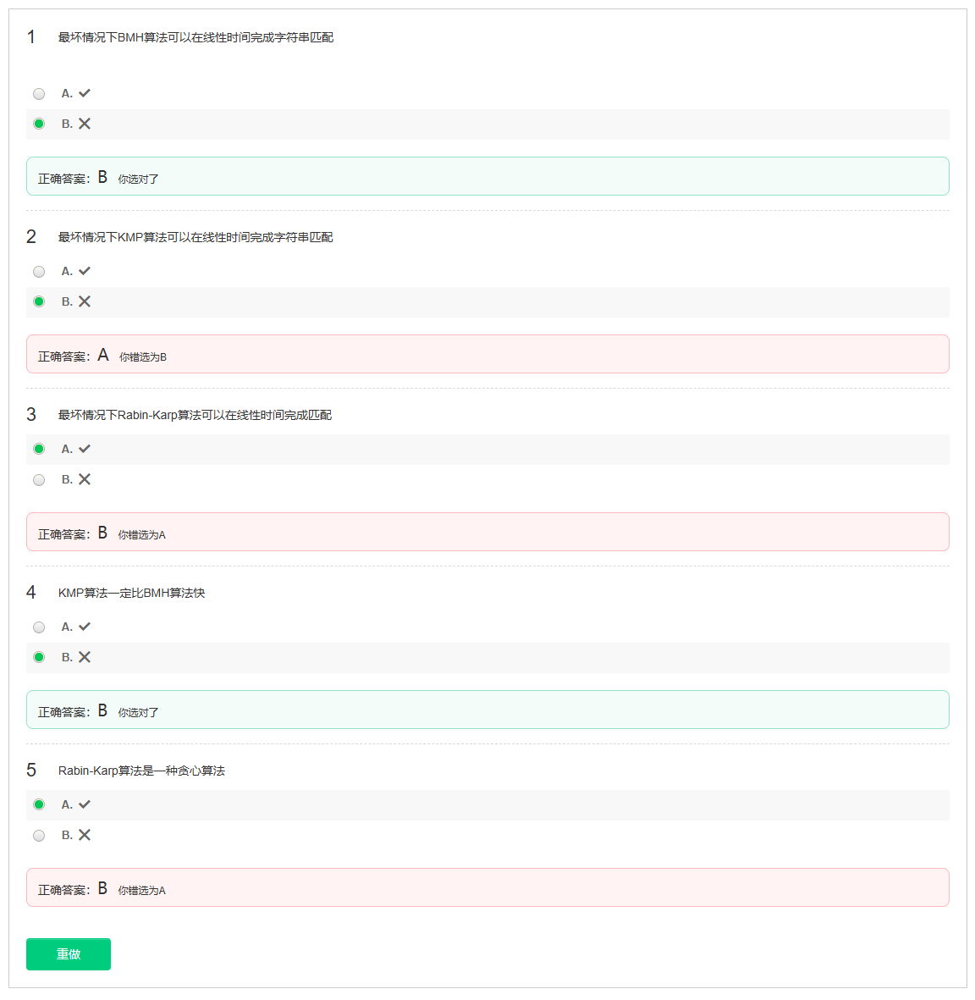

---

### 第2题解析
**题干**：时间复杂度是衡量算法性能的最重要标准。
**正确答案**：B（×）

**解析**：
算法性能的衡量是多维度的，除了**时间复杂度**，还有**空间复杂度**、可读性、可维护性、健壮性等。在不同场景下，这些指标的重要性是不同的。

### 第3题解析
**题干**：能够在计算机上运行的计算过程即是算法。
**正确答案**：B（×）

**解析**：
一个严格意义上的算法，必须满足以下5个重要特性：
1.  **有穷性**：算法必须在有限的步骤内结束。
2.  **确定性**：每一步骤的含义都是明确的，没有歧义。
3.  **可行性**：每一步操作都可以通过基本运算在有限次内完成。
4.  **输入**：有0个或多个输入。
5.  **输出**：有1个或多个输出。

“能够在计算机上运行的计算过程”可能不满足这些特性，例如一个无限循环的程序可以运行，但它不是一个算法。因此，该说法是错误的。

---

### T2

 \( f(n) + o(f(n)) \) 与 \( f(n) \) 同阶，即 \( f(n) + o(f(n)) = \Theta(f(n)) \)。

### T3

 **答案**：B（×）✅

**解析**：
快速排序的时间复杂度需要分情况讨论：
- **平均情况**：时间复杂度为 **O(n log n)**。
- **最坏情况**：当每次划分都极不均衡时（例如，对已经有序的数组排序），时间复杂度会退化为 **O(n²)**。

题目中使用的符号是小o记号 `o(n log n)`，它表示严格小于 `n log n` 的增长量级，这与快速排序的实际复杂度不符。即使使用大O记号 `O(n log n)`，也只描述了平均情况，而忽略了最坏情况，因此该表述不准确。

### T5

---

### 第3题：分治法必须用递归程序实现
- **正确答案**：B（×）
- **错因分析**：
  分治法是一种**思想**，核心是“分解-解决-合并”，递归只是实现它的一种常见方式，并非唯一方式。很多分治算法（如归并排序、快速排序）也可以通过显式栈等迭代方式实现。因此“必须用递归”的表述过于绝对。

---

### 第5题：在一个长度为n的数组中选择第10大的数可以用O(n)的算法实现
- **正确答案**：A（✓）
- **错因分析**：
  可以使用**快速选择（Quickselect）算法**，它基于分治思想，平均时间复杂度为 **O(n)**，最坏情况为O(n²)，但通过随机化选择 pivot 可以将期望时间复杂度控制在O(n)。对于“第10大”这种固定小常数的选择，完全可以在O(n)时间内完成。具体实现逻辑是：

---

我来逐题解释你错的和对的题，帮你彻底搞懂动态规划的核心考点：

---

### 1. 动态规划与分治法的计算方式
**题干**：动态规划算法与分治法类似，其基本思想是将待求解问题分解成若干个子问题，先求解子问题，然后从这些子问题的解得到原问题的解，二者采用的都是自底向上的计算方式。
**正确答案**：B（❌）
**解析**：
- 分治法：通常采用**自顶向下**的递归方式，将问题分解为独立子问题，递归求解后合并结果，例如归并排序、快速排序。
- 动态规划：通常采用**自底向上**的迭代方式，通过表格存储子问题的解，避免重复计算，例如矩阵链乘法、最长公共子序列。
- 因此，“二者都是自底向上”的说法是错误的。

---

### 2. 动态规划效率一定比分治高
**题干**：同一个问题，其动态规划算法的效率一定比分治设计的算法高。
**正确答案**：B（❌）
**解析**：
- 动态规划的优势在于解决**有重叠子问题和最优子结构**的问题，通过避免重复计算来提高效率。
- 但如果问题的子问题完全独立，没有重叠，分治法（如快速排序）的效率可能更高，动态规划反而会因存储子问题解而产生额外开销。
- 因此，“一定更高”的说法过于绝对，是错误的。

---

### 3. LCS空间复杂度优化
**题干**：如果仅需要求得最长公共子序列的代价，则最长公共子序列的空间复杂度可以降低到O(n)，其中n是两个序列中任意一个的长度。
**正确答案**：A（✅）
**解析**：
- 标准LCS算法使用二维表 `dp[i][j]`，空间复杂度为 **O(mn)**。
- 但计算 `dp[i][j]` 时，只需要上一行 `dp[i-1][...]` 和当前行已计算的部分，因此可以用一维数组滚动更新，将空间复杂度优化到 **O(min(m, n))**，即O(n)。
- 注意：此优化仅适用于求长度，若要恢复具体子序列，仍需二维表。

---

### 4. 矩阵乘法的时间复杂度
**题干**：矩阵乘法问题的动态规划算法是多项式时间的算法。
**正确答案**：A（✅）
**解析**：
- 矩阵链乘法的动态规划算法时间复杂度为 **O(n³)**，这是一个关于n的多项式函数。
- 因此，它属于**多项式时间算法**，这也是动态规划能有效解决该问题的原因。
- 另外nlogn 不是多项式时间，因为它不是关于n的多项式函数。

---

### 5. 重叠子问题与算法正确性
**题干**：重叠子问题保证了动态规划算法的正确性。
**正确答案**：B（❌）
**解析**：

- <mark> **重叠子问题**：保证了动态规划的**效率**，通过存储子问题的解避免了重复计算。</mark>
- <mark> **最优子结构**：才是保证动态规划**正确性**的关键，它确保了子问题的最优解可以组合成原问题的最优解。</mark>
- 因此，题干的说法混淆了效率和正确性的来源，是错误的。
---

### 1. 贪心算法的两个关键性质：
- <mark> **最优子结构**：问题的最优解包含其子问题的最优解。</mark>
- <mark> **贪心选择性**：通过局部最优选择，最终得到全局最优解。</mark>

---

贪心算法：在每一步都做出当前看来最优的选择，不回溯，直接得到一个解。
搜索算法（如深度优先、广度优先、A * 等）：会遍历 / 探索问题的状态空间，可以穷举或剪枝（分支定界等）后找到全局最优解。
能被贪心算法找到最优解的问题，说明其满足**最优子结构**和贪心选择性质，这类问题的状态空间一定是**有限、可被有效搜索**的，因此一定可以通过搜索（哪怕是暴力搜索）找到最优解。

爬山法（Hill Climbing）是贪心局部搜索
最佳优先搜索（Best-First Search）是全局启发式搜索，维护一个优先队列，可以回溯，跳出局部最优。

---

KMP 最经典的结论：
预处理：O(m)
匹配过程：O(n)
总时间：O(n + m)

所以
 <mark> **KMP 最坏一定是线性时间，题目完全正确。**</mark>

<mark> KMP 最坏就是 **O (n+m)**，线性；</mark>

<mark> BMH 最坏是 **O(n⋅m)**（n 是文本长度，m 是模式串长度），和暴力匹配一样慢，非线性；</mark>

<mark> Rabin-Karp 基于哈希的字符串匹配算法，核心是滚动哈希、预计算、重复利用哈希值。期望是 O (n+m)，但最坏退化成 **O (n*m)**（哈希冲突导致逐个位置重新比较），非线性。</mark>